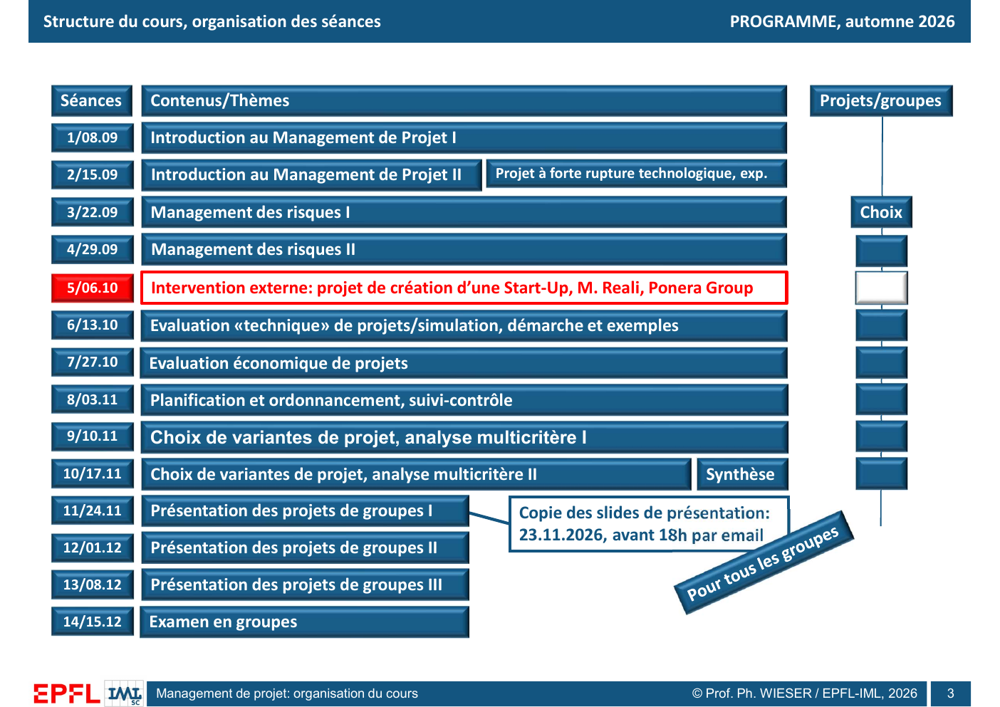
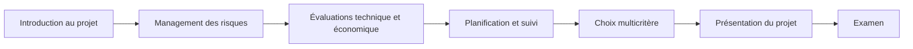
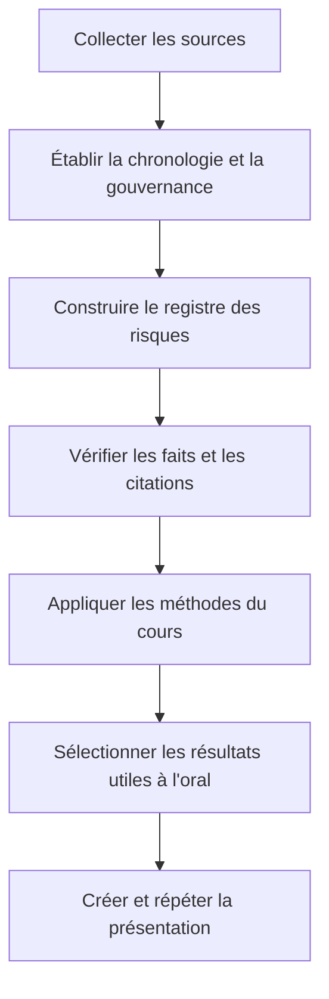

# Organisation du cours MGT-427

## Rôle de cette fiche

Cette fiche rassemble les règles d'organisation visibles dans les deux versions du support `0_MGT_427_organ`. Elle ne remplace pas une annonce ultérieure de l'enseignant. Lorsque les deux versions divergent, la version `organ2`, datée du 21 septembre 2026 dans les métadonnées du PDF, est considérée comme la version de travail la plus récente.[^1]

## Structure générale du cours

Le cours comporte quatorze séances de trois heures. Le support prévoit environ deux heures de cours et une heure consacrée au projet de groupe pendant chaque séance. La note finale se partage à parts égales entre le projet et l'examen. L'examen se déroule lui aussi en groupe.[^2]

| Élément | Organisation annoncée | Conséquence pratique |
|---|---|---|
| Nombre de séances | 14 | Le cours suit une progression allant des fondements à l'analyse de variantes, puis aux présentations |
| Durée d'une séance | 3 heures | Le projet doit avancer pendant le semestre et pas seulement avant la remise |
| Répartition indicative | 2 h de cours, 1 h de projet | Les méthodes vues en cours peuvent être intégrées progressivement au cas étudié |
| Projet | 50 % de la note | La qualité de l'analyse et de la présentation compte autant que l'examen |
| Examen en groupe | 50 % de la note | La préparation doit couvrir les concepts et leur application collective |
| Présentations | Séances 11 à 13 dans la version récente | Le dispositif prévoit trois dates de présentation, ce qui remplace la répartition en deux dates de la première version |

> **Interprétation probable de la diapositive.** Le découpage de chaque séance suggère que le projet sert de terrain d'application continu. Une bonne présentation ne devrait donc pas juxtaposer une histoire de l'événement et quelques outils appris en classe. Elle devrait montrer comment les outils structurent le diagnostic, les choix, le traitement des risques et le retour d'expérience.

## Calendrier de l'automne 2026

La version récente donne le calendrier suivant.[^3]

*Source : support `0_MGT_427_organ2_26.pdf`, diapositive 3.*

| Séance | Date | Contenu annoncé |
|---:|---:|---|
| 1 | 08.09 | Introduction au management de projet I |
| 2 | 15.09 | Introduction au management de projet II et exemple de projet à forte rupture technologique |
| 3 | 22.09 | Management des risques I |
| 4 | 29.09 | Management des risques II |
| 5 | 06.10 | Intervention externe sur un projet de création de start-up |
| 6 | 13.10 | Évaluation technique de projets, simulation, démarche et exemples |
| 7 | 27.10 | Évaluation économique de projets |
| 8 | 03.11 | Planification, ordonnancement et suivi-contrôle |
| 9 | 10.11 | Choix de variantes et analyse multicritère I |
| 10 | 17.11 | Choix de variantes et analyse multicritère II, puis synthèse |
| 11 | 24.11 | Présentation des projets de groupes I |
| 12 | 01.12 | Présentation des projets de groupes II |
| 13 | 08.12 | Présentation des projets de groupes III |
| 14 | 15.12 | Examen en groupes |

Le support indique une remise des slides le **23 novembre 2026 avant 18 h par courriel**, pour tous les groupes.[^3] Cette date doit être contrôlée contre toute annonce plus récente avant l'envoi final.

Le diagramme montre la logique pédagogique plutôt qu'une simple succession de dates. Le cours commence par définir le projet et son organisation. Il introduit ensuite les risques, puis les méthodes de décision, de planification et de comparaison. La présentation de groupe peut donc reprendre cette même progression.

## Différences entre les deux versions du support

Les deux fichiers ne sont pas identiques. Les différences visibles concernent surtout le calendrier et doivent rester traçables.

| Point | Première version `organ` | Version récente `organ2` | Règle de travail |
|---|---|---|---|
| Introduction | Trois séances indiquées | Deux séances indiquées | Utiliser `organ2` |
| Management des risques I | 29.09 | 22.09 | Utiliser `organ2` |
| Management des risques II | 13.10 | 29.09 | Utiliser `organ2` |
| Intervention externe | 06.10, Ponera | 06.10, Ponera Group | Le créneau ne change pas |
| Évaluations et planification | Évaluation technique le 27.10, économique le 03.11, planification le 10.11 | Évaluation technique le 13.10, économique le 27.10, planification le 03.11 | Utiliser `organ2` |
| Analyse multicritère | 17.11 et 24.11 | 10.11 et 17.11 | Utiliser `organ2` |
| Présentations | Deux séances | Trois séances | Utiliser `organ2` |
| Remise des slides | 30.11.2026 avant 18 h | 23.11.2026 avant 18 h | Retenir provisoirement le 23.11 |

> **Point à confirmer.** Le support ne précise pas la durée de chaque présentation, le nombre de slides attendu, les critères détaillés du barème ou le temps réservé aux questions. Ces paramètres devront être obtenus avant la conception du diaporama final.

## Familles de sujets proposées

Le support classe les exemples de projets en quatre familles. Cette classification montre l'étendue du cours et les angles sous lesquels un sujet peut être abordé.[^4]

### Méthodes de management de projet

Les exemples cités comprennent PRINCE2, HERMES, les méthodes agiles, MERISE, TOPSIS, les normes et standards, les formations PMI et IPMA, ainsi que la gestion d'un portefeuille de projets.[^5]

Ces sujets portent sur une méthode ou un référentiel. Un groupe qui choisit cette voie doit normalement expliquer le contexte d'emploi, les rôles, le processus, les livrables, les limites et les différences avec des approches voisines. Le sujet Paris 2024 n'appartient pas directement à cette catégorie, mais il peut mobiliser plusieurs de ces méthodes comme grilles d'analyse.

### Méthodes d'analyse des risques

Le support cite les méthodes suivantes : AMDEC, MOSAR, MADS, HAZOP, LOPA et HACCP. Il propose aussi des sujets transversaux sur l'identification, l'enchaînement, la prévention et l'analyse organisationnelle des risques.[^6]

| Méthode ou thème | Question générale |
|---|---|
| AMDEC | Quels modes de défaillance peuvent affecter une fonction et comment les prioriser ? |
| MOSAR | Comment représenter et maîtriser les scénarios d'accident d'un système complexe ? |
| MADS | Comment modéliser les dangers, les flux et les cibles exposées ? |
| HAZOP | Quelles déviations par rapport au fonctionnement prévu peuvent créer un danger ? |
| LOPA | Les couches de protection indépendantes réduisent-elles suffisamment le risque ? |
| HACCP | Quels points critiques doivent être maîtrisés dans une chaîne de production ou de service ? |
| Enchaînement des risques | Comment un premier événement modifie-t-il la probabilité ou l'impact des suivants ? |
| Prévention | Quelles actions diminuent la probabilité avant l'événement ? |

Le support d'organisation ne développe pas ces méthodes. Leurs explications détaillées appartiennent à la fiche consacrée à l'analyse des risques.

### Organisation et facteurs humains

La troisième famille comprend l'organisation de projet, la conduite du changement, l'audit, les causes d'échec, la qualité, les ressources humaines, les conflits, le brainstorming, Delphi, la communication, la clôture, la capitalisation des connaissances et le financement.[^7]

Cette famille rappelle qu'un projet ne se réduit pas à un planning et à un budget. Il dépend aussi de la structure de décision, de la circulation de l'information, des compétences, des intérêts des acteurs et de la manière dont les leçons sont conservées.

### Applications

Les exemples d'application couvrent les événements sportifs et culturels, les grands événements, les projets industriels, informatiques, sanitaires ou internationaux, les lancements de produits et les transformations numériques.[^8]

La cérémonie d'ouverture des Jeux olympiques de Paris 2024 se situe au croisement de plusieurs catégories du support :

- organisation d'un événement sportif ;
- organisation d'un événement culturel ;
- avant-projet et réalisation d'un grand événement ;
- projet international ;
- projet lié à la sécurité et à la sûreté ;
- projet comportant une forte composante numérique et audiovisuelle ;
- démarche de communication et de réputation ;
- coordination d'un grand nombre d'organisations.

Ce croisement justifie une analyse systémique. Une seule méthode ne peut pas couvrir correctement les dimensions artistiques, opérationnelles, financières, humaines, politiques et sécuritaires.

## Ce que le projet de groupe doit démontrer

> **Interprétation probable de la diapositive.** La liste des sujets ne constitue pas un plan de présentation. Elle montre plutôt les types d'objets que le cours considère comme analysables par les méthodes de management de projet.

Pour le cas Paris 2024, le travail devrait apporter quatre niveaux de valeur.

1. **Établir les faits.** Reconstituer le périmètre, la gouvernance, les décisions, les contraintes, les incidents et les résultats à partir de sources vérifiables.
2. **Structurer le projet.** Définir les objectifs, les acteurs, les phases, les dépendances, les ressources et les mécanismes de suivi.
3. **Analyser les risques.** Identifier les événements redoutés, leurs causes, leurs impacts, les mesures documentées et les risques résiduels.
4. **Porter un jugement argumenté.** Distinguer ce qui a été bien anticipé, ce qui a été mal maîtrisé et ce qui reste impossible à conclure avec les informations publiques.

La qualité du quatrième niveau dépend des trois premiers. Une opinion forte ne compense pas une base factuelle faible.

## Stratégie de préparation

Le calendrier suggère un ordre de travail qui réduit le risque de produire un diaporama séduisant mais fragile.

Cette séquence place la vérification avant l'analyse finale. Elle évite deux erreurs fréquentes : appliquer une méthode à des faits mal établis et sélectionner trop tôt une narration que les preuves ne soutiennent pas.

## Questions à clarifier avant le diaporama

- Quelle est la durée exacte de l'oral ?
- Combien de personnes composent le groupe ?
- Chaque membre doit-il parler ?
- Existe-t-il un nombre maximal de slides ?
- Les annexes sont-elles autorisées ?
- Le barème évalue-t-il séparément la recherche, les méthodes, la qualité visuelle et la prestation orale ?
- Le fichier doit-il être envoyé en PowerPoint, en PDF ou dans les deux formats ?
- Les sources doivent-elles apparaître sur chaque slide ou uniquement dans une bibliographie finale ?

Ces questions ne bloquent pas la recherche. Elles deviennent nécessaires au moment de transformer l'analyse en présentation.

## Couverture des diapositives

| Diapositive | Contenu | Section de cette fiche |
|---:|---|---|
| 1 | Page de titre | Rôle de cette fiche |
| 2 | Structure générale, notation et accès aux supports | Structure générale du cours |
| 3 | Programme de l'automne 2026 | Calendrier et différences entre versions |
| 4 | Sujets portant sur les méthodes | Méthodes de management de projet |
| 5 | Sujets portant sur les risques | Méthodes d'analyse des risques |
| 6 | Organisation, RH et thèmes associés | Organisation et facteurs humains |
| 7 | Applications et exemples de projets | Applications et choix du sujet Paris 2024 |

## Références

[^1]: Philippe Wieser, *Management de projet : organisation du cours*, `0_MGT_427_organ_26.pdf` et `0_MGT_427_organ2_26.pdf`, diapositives 1 à 7. Les métadonnées PDF indiquent respectivement une modification le 7 septembre 2026 et le 21 septembre 2026.
[^2]: Philippe Wieser, *Management de projet : organisation du cours*, `0_MGT_427_organ2_26.pdf`, diapositive 2.
[^3]: Philippe Wieser, *Management de projet : organisation du cours*, `0_MGT_427_organ2_26.pdf`, diapositive 3. Comparaison avec `0_MGT_427_organ_26.pdf`, diapositive 3.
[^4]: Philippe Wieser, *Management de projet : organisation du cours*, `0_MGT_427_organ2_26.pdf`, diapositives 4 à 7.
[^5]: Ibid., diapositive 4.
[^6]: Ibid., diapositive 5.
[^7]: Ibid., diapositive 6.
[^8]: Ibid., diapositive 7.
