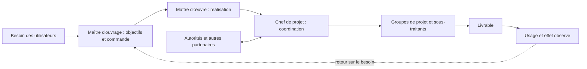
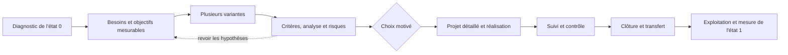
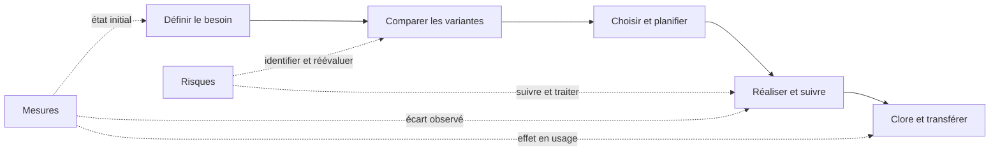

# Introduction au management de projet

Cette fiche suit les 35 diapositives de `1_MGT_427_intro_26.pdf`. Le document porte le millésime 2024 dans ses pieds de page, même si le fichier fourni porte le suffixe `26`. Les mentions « Contenu du cours » décrivent les diapositives. Les mentions « Complément pédagogique sourcé » s'appuient sur les références indiquées en notes. Les exemples et les lectures de schémas signalés comme tels sont des explications de cette fiche, pas des propos attribués au professeur. Les citations du support renvoient aux numéros de diapositives, qui correspondent ici aux pages du PDF.[^1]

## 1. Un projet transforme une situation mesurable

### Projet, activité courante et résultat

**Contenu du cours.** Les trois définitions réunies à la diapositive 2 insistent sur une réalisation unique et temporaire, des tâches liées entre elles, des ressources humaines, matérielles et financières, un but et des contraintes de temps, de coût et de qualité. La définition attribuée à J.-P. Jeannin ajoute le diagnostic initial, le choix collectif des objectifs et le passage d'une situation insatisfaisante à une situation satisfaisante. La diapositive 3 résume ces idées en un « processus unique, complexe, à risques et limité dans le temps » qui répond à des objectifs mesurables.[^2]

**Complément pédagogique sourcé.** Le Project Management Institute définit également le projet comme une entreprise temporaire qui crée un produit, un service ou un résultat unique. « Temporaire » qualifie l'effort organisé, pas nécessairement la durée de vie du résultat. La construction d'un pont est un projet; l'exploitation et l'entretien réguliers du pont relèvent ensuite d'activités continues. L'unicité ne signifie pas qu'aucune tâche ne ressemble à une tâche déjà réalisée. Elle signifie que le résultat, le contexte ou la combinaison de contraintes ne se répètent pas à l'identique.[^10]

Le schéma « État 0 → projet → État 1 » de la diapositive 3 place les *besoins* sous la transformation et les *mesures* sous les deux états. Il invite à définir une situation de départ, un état souhaité et une façon de constater la différence. La formule « On ne gère et on améliore que ce que l'on mesure » exprime la nécessité d'un suivi. Elle ne veut pas dire que tout effet important se réduit à un chiffre. Une appréciation qualitative structurée, comme un test d'usage documenté, peut aussi constituer une preuve utile.[^2]

| Question | Réponse attendue dans un projet | Exemple fictif de bibliothèque universitaire |
|---|---|---|
| Quel problème existe à l'état 0 ? | Un besoin observé et son contexte. | Les usagers attendent longtemps pour obtenir une place pendant les examens. |
| Quel résultat vise l'état 1 ? | Un résultat vérifiable pour les utilisateurs. | Les étudiants trouvent une place disponible en moins de cinq minutes lors des périodes de pointe. |
| Comment mesurer l'écart ? | Une méthode, une période et une valeur de départ. | Relever le temps médian de recherche de place avant et après l'aménagement. |
| Qu'est-ce qui limite le projet ? | Budget, échéance, exigences de qualité, ressources et règles applicables. | Travaux limités aux vacances, budget plafonné et maintien des accès de sécurité. |

**Piège d'examen.** Un livrable livré dans les temps et dans le budget peut manquer le besoin initial. La mesure du résultat d'usage et celle de la réalisation sont deux choses différentes. Inversement, un bon résultat ne dispense pas de vérifier les contraintes et les effets non souhaités. Cette distinction explicite ce que le schéma des états et des mesures permet d'analyser; elle ne prétend pas ajouter une formule absente de la diapositive.[^2]

### Manager le projet, pas seulement son calendrier

**Contenu du cours.** La définition de la diapositive 4 présente le management de projet comme une démarche qui mobilise méthodes, techniques et outils pour atteindre les objectifs à partir des besoins exprimés, sous contraintes. Elle inclut les dimensions humaines et matérielles, l'approche systémique et les risques internes et externes. L'objectif annoncé du chapitre est de présenter des méthodes, outils et compétences utiles au responsable de projet.[^3]

**Lecture pédagogique.** Un planning est nécessaire pour coordonner les tâches, mais il ne décide pas à lui seul si le problème choisi est le bon, si la solution est utilisable ou si les partenaires peuvent coopérer. La définition du cours oblige à relier la décision technique aux personnes, aux ressources, aux limites du projet et aux risques. La norme ISO 21502:2020 confirme qu'une démarche de management de projet peut s'appliquer à des projets de tailles et de domaines variés, avec un mode de réalisation prédictif, itératif, adaptatif ou hybride.[^11]

## 2. Le projet vit dans une organisation et un environnement

### Périmètre, partenaires et responsabilités

**Contenu du cours.** La diapositive 5 dessine un réseau de relations autour d'un périmètre. Des acteurs internes et externes échangent avec le projet et entre eux. La diapositive 6 nomme le maître d'ouvrage, qui définit les objectifs, commande et paie, le maître d'œuvre, qui exécute, le chef de projet, les groupes de projet, la sous-traitance et des acteurs de l'environnement tels que les autorités, les financiers et les concurrents. Les termes « faux amis » et « ennemis » figurent dans le dessin; ils ne constituent pas une typologie formelle à appliquer aux parties prenantes.[^3]

**Lecture pédagogique.** Délimiter le périmètre revient à dire quelles décisions et quels résultats le projet maîtrise, puis quelles dépendances il doit suivre. Une autorité peut imposer une autorisation sans appartenir à l'équipe. Un futur utilisateur peut révéler une exigence décisive sans être le payeur. Un sous-traitant peut réaliser une partie du travail, mais son contrat ne supprime pas la responsabilité de coordination. Les catégories du dessin servent donc à rechercher les interfaces et les attentes, pas à juger moralement les personnes.[^3]

Le dessin ci-dessus est une reformulation pédagogique. Les rôles réels dépendent des contrats et de l'organisation. Il ne faut pas supposer que le maître d'ouvrage finance personnellement tout projet ni que le chef de projet commande directement toutes les équipes. Dans HERMES, la méthode suisse de gestion de projet, les rôles minimaux de mandant, chef de projet et représentant des utilisateurs illustrent une autre manière explicite de répartir les responsabilités.[^3][^12]

### Les compétences et les formes d'organisation

**Contenu du cours.** La diapositive 8 présente une figure IPMA avec trois ensembles de compétences du chef de projet : comportementales, techniques et contextuelles. Les exemples visibles autour de la figure vont du travail d'équipe, de l'éthique et de la psychologie jusqu'à la finance, au droit, au management des risques et à la gestion du temps, de la qualité et du changement. La diapositive 9 place le comité de pilotage, la direction ou le chef de projet et les utilisateurs dans un schéma d'échanges. Un client y apparaît pour le cas du développement informatique. La diapositive 10 oppose graphiquement la structure hiérarchique de l'organisation et une structure transversale par projet; elle y superpose deux projets, `x` et `y`.[^4]

**Complément pédagogique sourcé.** Le référentiel IPMA ICB4 utilise aujourd'hui les domaines *People*, *Practice* et *Perspective*. Cette parenté éclaire la figure de la diapositive 8, sans autoriser à remplacer mot pour mot ses trois libellés historiques par ceux du référentiel actuel. La compétence du chef de projet consiste aussi à savoir quand faire intervenir un expert, pas à maîtriser seul chaque discipline représentée.[^13]

| Forme montrée | Où se situe la coordination ? | Avantage possible | Tension à surveiller |
|---|---|---|---|
| Structure hiérarchique | Dans les métiers et leurs responsables. | Expertise et méthodes propres à chaque métier. | Arbitrages lents entre services si personne ne porte le résultat complet. |
| Structure par projet | Autour du résultat commun et du chef de projet. | Décisions et informations rapprochées du livrable. | Concurrence entre projets pour les mêmes spécialistes. |
| Disposition transversale des diapositives 9-10 | Le projet rassemble des personnes de plusieurs fonctions. | Réunit des compétences et la voix des utilisateurs. | Une personne peut recevoir des demandes du métier et du projet. |

La diapositive 11 illustre ces questions par trois organisations de réalisation en génie civil. Dans l'organisation traditionnelle, le maître d'ouvrage est relié séparément à l'architecte, aux ingénieurs et aux entreprises. Dans l'« entreprise générale », l'architecte reste montré à part et l'entreprise générale regroupe d'autres intervenants. Dans l'« entreprise totale », une entité regroupe les fonctions représentées, et la mention « Budget-Financement » apparaît auprès du maître d'ouvrage. Ce sont des schémas de répartition de rôles, pas une description exhaustive des obligations contractuelles possibles.[^4]

### Le cycle PDCA éclaire l'amélioration

**Contenu du cours.** La diapositive 7 relie les projets à l'amélioration continue, à l'innovation et aux nouvelles réalisations. Elle place la roue de Deming autour de quatre verbes : planifier et organiser, exécuter et réaliser, mesurer et vérifier, puis réagir pour améliorer.[^3]

**Complément pédagogique sourcé.** L'ASQ décrit le cycle Plan–Do–Check–Act comme une suite répétée de planification d'un changement, d'essai, d'examen des résultats et d'action à partir de ce qui a été appris. Dans le cas fictif de la bibliothèque, on prépare un nouvel agencement, on l'essaie dans une zone, on compare les temps de recherche de place et les problèmes de sécurité, puis on adapte ou généralise. Le cycle n'impose pas qu'un projet entier recommence quatre fois. Il peut servir à améliorer un processus pendant le projet ou après sa livraison.[^14]

## 3. Décider tôt, puis réaliser et transférer

### Coûts cumulés et marge de manœuvre

**Contenu du cours.** Les diapositives 12 à 15 superposent deux courbes conceptuelles sur les phases d'étude, de réalisation et d'exploitation. Les coûts cumulés augmentent avec le temps. La « marge de manœuvre » est haute au début, puis diminue fortement autour du passage vers la réalisation. Les avant-projets et les variantes sont situés dans la partie où il reste possible de comparer des solutions. Les diapositives 13 et 14 ajoutent des approches techniques, économiques, organisationnelles, environnementales et sociales, les critères, l'analyse multicritère, le choix et l'analyse du risque.[^5]

**Lecture pédagogique.** Le schéma invite à dépenser de l'effort intellectuel avant d'engager des dépenses difficiles à récupérer. Changer la largeur d'une circulation sur un plan coûte généralement moins que modifier un bâtiment construit. Il ne faut pourtant pas lire la forme des courbes comme une loi chiffrée. Les diapositives ne donnent ni unités, ni données de calibration, ni seuil de décision. La distribution dessinée à la diapositive 14, avec « min », « p.p. », « max » et deux signes σ, indique que les résultats envisagés sont incertains; elle ne démontre pas qu'ils suivent une loi normale. « p.p. » semble indiquer la valeur la plus probable sur le dessin, mais le support ne développe pas cette abréviation.[^5]

La diapositive 15 insère un appel à produire plusieurs idées et variantes. Son message pratique est clair : une seule proposition rend la comparaison fragile et encourage l'attachement prématuré. Dans un projet, des variantes ne se distinguent pas seulement par le coût d'achat. On peut comparer le service rendu, le coût d'exploitation, les risques, les effets environnementaux et la faisabilité. Ces critères doivent être définis avant de noter les solutions, faute de quoi l'analyse multicritère peut devenir une justification du choix déjà préféré.[^5]

### Les phases de la diapositive 17

**Contenu du cours.** La diapositive 16 repart des besoins des futurs utilisateurs. Elle relie le diagnostic de l'état 0 à l'étude, aux variantes, au choix et à la réalisation. La diapositive 17 détaille la progression : besoins, objectifs, idées et concepts, avant-projets, comparaison et évaluation des variantes, choix, projet détaillé, organisation et structure, réalisation, suivi et contrôle, puis clôture avec expertise de conformité ou audit. Le bas du schéma distingue « fin du projet » et « début de l'exploitation ».[^6]

**Lecture pédagogique.** Les phases sont des moments de décision, pas seulement des dates. À la fin de l'étude, la décision consiste à retenir une variante et à justifier ses compromis. Avant la réalisation, il faut une organisation, un budget et une planification. Avant le transfert, il faut savoir qui accepte le livrable et qui en assure l'usage. HERMES fournit un exemple actuel d'une structure de phases qui encadre aussi bien la création classique que la création agile par une initialisation et une clôture. Son manuel précise que la clôture règle le passage vers l'organisation d'utilisation.[^6][^12]

**Piège d'examen.** L'exploitation peut durer longtemps après la clôture du projet. Un défaut observé pendant l'exploitation peut révéler un besoin mal compris ou une défaillance de réalisation, mais cela ne transforme pas automatiquement toute l'exploitation en phase de projet.[^6][^10]

### Un exemple de choix multicritère

Voici une mise en pratique inventée, destinée à comprendre les diapositives 13 à 17. Pour réduire l'attente à la bibliothèque, trois variantes sont proposées : réaménager les tables existantes, ouvrir une salle supplémentaire ou installer une réservation numérique. L'équipe fixe avant la comparaison trois critères pondérés, soit le gain de capacité à 50 %, le coût complet à 30 % et la vitesse de mise en service à 20 %. Une note de 1 à 5 signifie ici qu'une valeur plus élevée est préférable. Les chiffres ci-dessous sont fictifs.[^5][^6]

| Variante | Capacité, poids 50 % | Coût complet, poids 30 % | Délai, poids 20 % | Score pondéré |
|---|---:|---:|---:|---:|
| Réaménager | 3 | 5 | 5 | 4,0 |
| Ouvrir une salle | 5 | 2 | 2 | 3,5 |
| Réservation numérique | 2 | 4 | 3 | 2,8 |

Le calcul pour « Réaménager » est `3 × 0,50 + 5 × 0,30 + 5 × 0,20 = 4,0`. Ce score ne décide pas seul. L'équipe doit vérifier que les notes ont une base observable, que l'aménagement respecte les règles de sécurité et que les résultats ne basculent pas si la pondération de la capacité change. Une analyse de sensibilité et un examen des risques précèdent donc une décision solide. L'exemple illustre l'analyse multicritère citée par le support; les poids et les valeurs ne viennent pas du cours.[^5]

## 4. Le diagnostic relie les besoins aux causes

### Partir de l'état existant

**Contenu du cours.** La diapositive 18 propose une démarche de diagnostic. Les objectifs conduisent à délimiter le périmètre et l'environnement de l'étude. L'équipe décrit l'état existant par les besoins, les activités et les processus. Elle établit ensuite un bilan de qualités et de carences, avec des regards sur les bonnes pratiques, l'organisation et l'évolution probable à court ou moyen terme. Les carences peuvent donner lieu à des projets d'amélioration décrits par un objectif, un gain potentiel, des variantes, un budget et une structure de réalisation.[^7]

**Lecture pédagogique.** Le diagnostic doit distinguer un symptôme d'une cause. « Les usagers attendent » est un constat; « il manque des places » est une hypothèse. Une enquête peut montrer que des places existent, mais que leur occupation n'est pas visible, ou que certaines prises électriques sont défectueuses. Le projet pertinent change selon la cause. Décrire l'état existant avant de défendre une solution réduit ce risque de confusion.[^7]

### Approche système et approche processus

**Contenu du cours.** La diapositive 19 juxtapose un système traversé par des flux entrants et sortants, une chaîne de processus allant de l'input à l'output, une photographie de travail collectif sur papier et un schéma de flux entre responsabilités. Elle souligne que les flux peuvent être physiques ou logiques et que le système évolue.[^7]

**Complément pédagogique sourcé.** Un document d'appui de l'ISO sur l'approche processus définit un processus comme des activités liées qui transforment des entrées en sorties. Il précise que ces entrées et sorties peuvent être matérielles ou immatérielles. Pour la bibliothèque, une demande de place, des règles d'accès et la disponibilité réelle sont des entrées. L'attribution d'une place utilisable est une sortie. Une liste d'attente, un nettoyage ou une maintenance sont des étapes ou des interfaces à représenter. Une carte de processus permet de voir où l'information se perd entre services.[^15]

### « Brown paper », PESTEL, Ishikawa et SWOT

**Contenu du cours.** La diapositive 20 décrit visuellement un atelier « Brown paper ». Les participants produisent d'abord des idées ou problèmes sur des notes, les regroupent par thèmes homogènes, puis choisissent de façon collaborative. Le schéma indique quatre moments numérotés, mais ne fournit ni règle de vote ni protocole statistique. Il faut donc voir cet outil comme un moyen de rendre les constats visibles et discutables, non comme une preuve automatique que le groupe a trouvé la meilleure cause.[^7]

La diapositive 21 présente PESTEL comme aide-mémoire possible avant SWOT. Les lettres recouvrent les dimensions politique, économique, sociologique, technologique, écologique et légale. La même page montre un diagramme d'Ishikawa dans lequel des branches de causes possibles convergent vers un effet. La diapositive 22 répartit SWOT entre forces et faiblesses internes, opportunités et menaces externes. Le support associe les faiblesses au risque interne et les menaces au risque lié à l'environnement.[^7]

| Outil | Question à laquelle il aide à répondre | Sortie utile | Limite à retenir |
|---|---|---|---|
| Carte des processus | Où le flux se bloque-t-il et qui reçoit quelle sortie ? | Étapes, interfaces et responsabilités. | Une carte peut reproduire une procédure officielle sans montrer le travail réel. |
| Brown paper | Quels constats les participants mettent-ils sur la table ? | Regroupements et sujets à examiner. | Les personnes absentes ou moins influentes peuvent être sous-représentées. |
| PESTEL | Quels facteurs du contexte peuvent modifier le projet ? | Hypothèses externes à surveiller. | La liste ne quantifie ni probabilité ni impact. |
| Ishikawa | Quelles causes possibles expliquent un effet précis ? | Hypothèses de causes organisées. | Une branche dessinée n'est pas une cause vérifiée. |
| SWOT | Quelles forces et faiblesses internes rencontrent quelles opportunités et menaces externes ? | Synthèse pour formuler des options. | Une entrée vague, comme « communication », ne guide aucune décision. |

**Complément pédagogique sourcé.** L'American Society for Quality présente le diagramme d'Ishikawa comme un outil qui organise des causes *possibles* en catégories. Après l'atelier, on confronte donc les branches aux observations. Par exemple, si l'effet est « temps d'attente supérieur à dix minutes », les causes proposées peuvent relever de l'aménagement, de l'information, de la maintenance ou des règles d'accès. Une mesure des temps par créneau et un relevé des places inutilisables permettent ensuite d'écarter ou de confirmer les hypothèses.[^16]

**Piège d'examen.** PESTEL et SWOT ne sont pas interchangeables. PESTEL parcourt le contexte externe selon six familles. SWOT croise une lecture interne et externe. Une hausse du prix de l'énergie est un facteur économique externe; la faible efficacité énergétique du bâtiment est une faiblesse interne. Les classer séparément aide à choisir une réponse, par exemple changer l'équipement plutôt que tenter de « supprimer » une évolution de marché.[^7]

## 5. Choisir une démarche adaptée au projet

### Classer le projet et formuler un objectif

**Contenu du cours.** La diapositive 23 classe des initiatives sur un graphique « impact » et « effort ». Ses quatre cases sont intitulées *quick wins*, *major projects*, *fill ins* et *hard slogs*. Les traductions pédagogiques seraient gains rapides, grands projets, compléments de faible priorité et travaux coûteux pour peu d'effet. Ce graphique sert au tri initial. Il n'indique pas comment mesurer l'impact ni l'effort, et un gain faible pour l'organisation pourrait être essentiel pour un groupe d'usagers particulier.[^8]

La diapositive 24 introduit SMART. Le support donne plusieurs sens possibles aux lettres anglaises A et R, puis une version française : spécifique, mesurable, ambitieux et atteignable, réaliste ou pertinent, et défini dans le temps. La variation des expansions interdit d'en faire une formule lexicale unique. L'intérêt pratique est de tester la formulation d'un objectif avant la mise en œuvre.[^8]

| Formulation | Diagnostic | Reformulation pédagogique |
|---|---|---|
| « Améliorer l'accueil. » | Ni résultat précis, ni mesure, ni date. | « Réduire de 12 à 5 minutes le temps médian d'orientation vers une place disponible pendant la session d'hiver 2027, sans réduire le nombre de places accessibles. » |
| « Installer un écran à l'entrée. » | Décrit une solution, pas l'effet recherché. | « Permettre à 90 % des nouveaux usagers de localiser une place libre en moins de cinq minutes après leur arrivée. » |

La seconde formulation peut conduire à un écran, à une application ou à une signalétique plus simple. L'objectif fixe l'effet à vérifier. La variante décrit un moyen. Dans la pratique, la mesure de départ, le groupe d'usagers et la méthode de collecte doivent être documentés pour que « mesurable » ait un sens.[^2][^8]

### « Classique », agile et hybride

**Contenu du cours.** La diapositive 25 cite Waterfall, PRINCE2 et HERMES parmi les démarches générales dites « classiques ». Elle place « AGILE » pour des contextes informatiques, de recherche ou d'innovation, puis Merise et ITIL ainsi que des méthodes d'analyse des risques telles qu'AMDEC, MOSAR et HAZOP dans des familles spécifiques. Elle mentionne les certifications PMP/PMI et IPMA. La diapositive 26 compare un enchaînement de phases planifiées, lié à des besoins plutôt stables, à des étapes répétées avec des sprints lorsque les besoins sont ouverts ou changeants. Elle prévoit aussi l'ajout ponctuel d'agilité dans les méthodes classiques.[^8]

**Complément pédagogique sourcé.** Il faut distinguer le *mode de réalisation* d'un projet, sa *méthode de gouvernance*, ses *outils spécialisés* et une *certification personnelle*. Waterfall décrit un séquencement prédictif; le Manifeste agile de 2001 exprime quatre préférences, dont la collaboration avec le client et l'adaptation au changement. Scrum est un cadre précis d'itérations et d'inspection. PRINCE2 et HERMES donnent une structure de gestion et de décision. AMDEC et HAZOP analysent des risques ciblés. PMP et IPMA attestent des compétences de personnes selon leurs dispositifs respectifs. La liste de la diapositive 25 rassemble ces catégories à titre de panorama, pas comme des méthodes strictement équivalentes.[^11][^17][^18][^19][^20][^21]

| Dimension | Séquencement prédictif | Réalisation adaptative |
|---|---|---|
| Hypothèse utile | Le besoin et la solution peuvent être assez bien définis avant l'exécution. | Le besoin ou la solution doit être appris par essais et retours fréquents. |
| Organisation du travail | On prépare puis on réalise des ensembles de tâches planifiés. | On livre ou teste de petits incréments et on ajuste le travail suivant. |
| Point de contrôle | Vérification de la phase et des écarts au plan. | Inspection fréquente d'un résultat utilisable et adaptation. |
| Risque si la méthode est mal choisie | Découvrir tard une incompréhension du besoin. | Accumuler des itérations sans cap, budget ou règle de décision. |

Cette comparaison développe le schéma de la diapositive 26. Elle ne crée pas une opposition absolue. ISO 21502 admet expressément des approches prédictives, incrémentales, itératives, adaptatives ou hybrides. HERMES conserve une initialisation et une clôture communes, même lorsque la création de solution utilise un développement agile. Le Manifeste agile reconnaît aussi une valeur aux éléments placés à droite de chacune de ses préférences; il ne supprime ni plan, ni documentation, ni contrat.[^11][^12][^17]

La diapositive 9 associe « méthode AGILE » et Rapid Application Development, avec la date de 1991. La diapositive 26 mentionne séparément le Manifeste agile de 2001. Pour répondre à une question d'examen, il vaut mieux conserver cette distinction historique que présenter RAD, le Manifeste agile et Scrum comme trois noms d'une seule méthode. Le Guide Scrum de 2020 définit notamment le Sprint comme un cadre de travail dans lequel l'équipe et les parties prenantes inspectent un résultat puis adaptent la suite.[^4][^8][^18]

### Ce que montre le schéma PRINCE2

**Contenu du cours.** La diapositive 27 reproduit un modèle de processus PRINCE2. Le dessin montre plusieurs niveaux, dont la direction, le management du projet et la livraison par l'équipe. Il distingue la préparation, l'initialisation, les étapes d'exécution et la clôture. Parmi les sept processus lisibles figurent la préparation d'un projet, sa direction, son initialisation, le contrôle d'une étape, la gestion de la livraison des produits, la gestion d'une limite d'étape et la clôture. La version 7 présentée par PeopleCert conserve sept processus et accorde une place explicite à la gestion des personnes.[^8][^19]

**Piège d'examen.** Une représentation PRINCE2 n'oblige pas chaque équipe à produire tous les documents visibles à la même taille ni à rejeter tout développement agile. Le schéma de la diapositive est une illustration de gouvernance et de flux de décision. Les détails d'application dépendent de l'édition et de l'adaptation de la méthode au projet.[^8][^19]

## 6. Comprendre l'échec et choisir des outils utiles

### Lire correctement les chiffres de 2018

**Contenu du cours.** La diapositive 28 reproduit un graphique du Project Management Institute daté de 2018. La question porte sur les projets commencés pendant les douze mois précédents qui ont été jugés en échec dans l'organisation répondante. Chaque personne pouvait choisir jusqu'à trois causes principales. Le graphique présente notamment le changement des priorités de l'organisation à 39 %, celui des objectifs du projet à 37 % et un recueil inexact des exigences à 35 %. L'insuffisance de vision ou de but, la mauvaise communication et l'absence de définition des occasions et risques sont chacune à 29 %. Les estimations de coûts inexactes et la mauvaise conduite du changement sont à 28 %.[^9][^22]

| Ce que les pourcentages permettent de dire | Ce qu'ils ne permettent pas de dire |
|---|---|
| Les répondants ont souvent cité les changements de priorités, d'objectifs et la collecte des exigences parmi les causes principales des projets jugés en échec. | « 39 % de tous les projets échouent parce que les priorités changent. » Le dénominateur et la question ne sont pas ceux-là. |
| Plusieurs causes peuvent être sélectionnées pour un même échec. | La somme des pourcentages représenterait 100 % des échecs. |
| Le graphique est un témoignage d'enquête sur la période étudiée. | Une causalité universelle ou un pronostic chiffré pour un projet précis. |

**Complément pédagogique sourcé.** Le rapport d'origine du PMI donne la question et ses résultats dans l'annexe, page imprimée 25, page 26 du fichier PDF en comptant la couverture. Il indique 5 402 professionnels interrogés pour l'étude globale. Le graphique du support est donc à lire comme une distribution de réponses déclarées, sélectionnées jusqu'à trois fois, et non comme une loi des risques d'un projet donné. Un examen peut demander le classement des premières causes; une analyse de projet exige en plus des données locales.[^22]

### Les facteurs de succès forment un système de contrôle

**Contenu du cours.** La diapositive 29 met en tête un objectif clair et partagé et la couverture des besoins. Elle poursuit avec le choix des objectifs, le budget et le financement, l'évaluation des risques, l'organisation, la communication, l'information partagée, le système d'information, les ressources disponibles, la planification, le suivi et le reporting, la conduite du changement et la clôture. Une grande flèche associe cette liste à la mise en place de méthodologies et d'outils.[^9]

**Lecture pédagogique.** Ces éléments se renforcent. Un objectif clair mais non partagé conduit à des décisions divergentes. Un calendrier détaillé sans ressources disponibles reste fictif. Un suivi qui constate un écart sans responsable pour décider d'une réponse n'aide guère. La liste doit donc être lue comme un ensemble de fonctions de gestion, pas comme une garantie mécanique de succès à cocher une fois. Le rapport PMI de 2018 insiste lui aussi sur le soutien actif du sponsor, le contrôle du périmètre et la capacité à produire de la valeur, mais son constat d'enquête ne prouve pas que l'installation d'un outil isolé cause le succès.[^9][^22]

### Évaluer, anticiper, choisir, communiquer

**Contenu du cours.** La diapositive 30 répond à « Pourquoi des outils ? » par la clarté, l'objectivité et la rigueur. Elle leur associe l'évaluation, l'anticipation, le choix, la planification et la gestion, la communication, le suivi et le contrôle. Les trois dessins servent à montrer des problèmes de collaboration et de compréhension commune. La diapositive 31 reprend le dessin classique de la balançoire, dans lequel différents intervenants comprennent et réalisent différemment une même demande. Le support place à droite une balançoire simple comme « objectif du projet ».[^9]

**Lecture pédagogique.** Une fiche de besoin, une maquette et un critère d'acceptation précis peuvent révéler les écarts avant la réalisation. Par exemple, « installer une balançoire » laisse ouverts l'âge des usagers, l'accessibilité, la sécurité, l'emplacement et l'entretien. Un outil de suivi rend visible une décision et sa justification. Il ne corrige pas à lui seul un objectif mal formulé. Le travail consiste à vérifier régulièrement l'accord entre besoin, solution dessinée, solution réalisée et usage réel.[^9]

La diapositive 32 illustre la collaboration internationale par une image humoristique qui associe des parcours de résolution de problème à des drapeaux nationaux. Cette caricature n'est pas une preuve de différences de comportement entre pays. Elle peut servir à discuter des attentes implicites, des langues de travail, des décisions et des règles de communication. L'approche prudente consiste à vérifier concrètement ce que chaque partenaire comprend et attend. Sa nationalité ne permet pas d'en déduire les pratiques.[^9]

Les diapositives 33 et 34 montrent une courbe satirique de projet allant de l'euphorie à l'inquiétude, puis à la panique, à la recherche des coupables, à la punition des innocents et à la promotion des personnes restées à l'écart. La seconde version met en évidence l'identification, la quantification et la maîtrise des risques. Ce dessin caricature des comportements possibles; il ne décrit pas une séquence inévitable. Son intérêt pédagogique est de demander quels signaux précoces auraient pu rendre une décision possible avant la panique.[^9]

**Complément pédagogique sourcé.** ISO 31000:2018 propose d'identifier, d'analyser, d'évaluer, de traiter, de suivre et de communiquer les risques. Dans l'exemple de la bibliothèque, « l'entreprise ne livre pas les prises avant la réouverture » est un événement redouté concret. Sa cause possible est une rupture d'approvisionnement; ses conséquences sont la réduction des places utilisables et un retard. On peut vérifier les délais fournisseurs, prévoir une solution de rechange et suivre l'état des commandes. Un chiffre de probabilité n'aurait de valeur que si sa base est explicitée.[^23]

**Contenu du cours.** La diapositive 35 réunit en conclusion des outils communs à diverses méthodologies : management du risque, simulation et évaluation des variantes, évaluation économique, planification et ordonnancement, choix de la variante, suivi et contrôle, et clôture du projet. La grande flèche du bas reprend l'élaboration des variantes, le choix, la réalisation et la clôture. Le propos est une vue d'ensemble : chaque outil répond à une question de décision située dans le cycle du projet.[^9]

## 7. L'essentiel à retenir

- Un projet a une durée limitée et vise un résultat unique. Il doit répondre à un besoin défini dans son contexte.[^2][^10]
- Un objectif utile décrit un effet vérifiable. Il ne se confond pas avec une solution déjà choisie.[^2][^8]
- Le périmètre, les rôles et les interfaces avec les partenaires rendent les responsabilités discutables et les dépendances visibles.[^3][^4]
- Les variantes se comparent avant les engagements les moins réversibles. Les critères et les risques font partie du choix.[^5]
- Le diagnostic décrit l'état existant et éprouve les causes possibles avant de prescrire un remède.[^7][^16]
- Une démarche prédictive, adaptative ou hybride se choisit selon les caractéristiques du projet. Les méthodes, outils et certifications ne sont pas une même catégorie.[^8][^11][^12]
- Le suivi vérifie le résultat et les écarts. La clôture transfère le livrable vers l'exploitation, qui commence ensuite.[^6][^9]

## 8. Questions d'entraînement

1. **Un projet peut-il être unique si les mêmes techniciens ont déjà construit dix bâtiments comparables ?** Oui. Les tâches peuvent se répéter, mais le résultat, le site, les parties prenantes et les contraintes forment un contexte particulier. Le projet a aussi un début et une fin. La maintenance régulière des dix bâtiments relève d'une activité continue.[^2][^10]
2. **Pourquoi mesurer l'état 0 avant de choisir une solution ?** Une valeur de départ permet de vérifier si la situation a changé. Elle aide aussi à distinguer le problème réel d'une impression et à tester plusieurs causes possibles. La mesure doit porter sur le besoin, pas seulement sur la livraison d'un objet.[^2][^7]
3. **Le maître d'ouvrage et le maître d'œuvre ont-ils le même rôle dans le schéma du cours ?** Non. Le premier définit les objectifs, commande et paie dans le schéma. Le second exécute. Les modalités précises dépendent du projet et des contrats.[^3]
4. **Que montre la comparaison entre coût cumulé et marge de manœuvre ?** Le coût engagé augmente alors que la liberté de modifier la solution diminue généralement. C'est une raison de travailler les variantes et les risques tôt. Les courbes du cours ne donnent aucune fonction numérique permettant de calculer un coût de changement.[^5]
5. **Dans SWOT, où classer une compétence interne rare et une nouvelle règle légale ?** La compétence est une force interne si elle aide le projet. La règle relève du contexte externe; elle peut devenir une menace ou une occasion selon son effet. PESTEL sert à ne pas oublier la dimension légale.[^7]
6. **Pourquoi ne pas additionner les pourcentages du graphique PMI 2018 ?** Chaque répondant pouvait sélectionner jusqu'à trois causes des projets jugés en échec. Les réponses se recouvrent et ne constituent pas des parts exclusives.[^9][^22]
7. **Scrum, PRINCE2, AMDEC et PMP sont-ils quatre méthodes de même nature ?** Non. Scrum est un cadre de travail adaptatif, PRINCE2 une méthode de management, AMDEC une technique d'analyse des défaillances et PMP une certification de personne. Le panorama du support les rassemble pour montrer la variété du domaine.[^8][^18][^19][^20]
8. **La clôture et l'exploitation se confondent-elles ?** Non. Le schéma du cours place la fin du projet au début de l'exploitation. La clôture vérifie le résultat et organise le transfert; l'organisation d'exploitation prend ensuite la responsabilité de l'usage courant.[^6][^12]
9. **Un diagramme d'Ishikawa démontre-t-il les causes d'un retard ?** Non. Il organise des hypothèses de causes. Il faut les confronter aux dates, aux événements et aux témoignages pertinents avant de conclure.[^7][^16]
10. **Quel est le risque d'une variante unique ?** L'équipe ne dispose d'aucun point de comparaison et peut ajuster les critères après coup pour justifier sa première idée. Produire au moins une autre variante et expliciter les critères rend le choix discutable.[^5]

## 9. Couverture des 35 diapositives

Le tableau vérifie la présence de chaque page du support dans la fiche. « Visuel » signale les pages où le sens dépend surtout d'un schéma ou d'une image. Les résumés renvoient à la lecture du support, pas à des paroles prononcées en cours.[^1]

| Diapositive | Contenu ou visuel examiné | Section de la fiche |
|---:|---|---|
| 1 | Titre, cours, auteur et millésime du support. | Ouverture et provenance. |
| 2 | Trois définitions du projet, unicité, durée, ressources et contraintes. | 1. Projet, activité courante et résultat. |
| 3 | Visuel « État 0 → État 1 », besoins et mesures. | 1. Un projet transforme une situation mesurable. |
| 4 | Définition du management de projet et objectif du cours. | 1. Manager le projet. |
| 5 | Visuel du périmètre et du réseau de partenaires internes et externes. | 2. Périmètre, partenaires et responsabilités. |
| 6 | Visuel des rôles, des partenaires et de la sous-traitance. | 2. Périmètre, partenaires et responsabilités. |
| 7 | Roue Plan–Do–Check–Act et démarche d'amélioration. | 2. Le cycle PDCA. |
| 8 | Figure IPMA des compétences comportementales, techniques et contextuelles. | 2. Les compétences. |
| 9 | Comité de pilotage, direction, experts et utilisateurs; mention RAD. | 2. Organisation et 5. Méthodes. |
| 10 | Superposition de la hiérarchie et des structures des projets `x` et `y`. | 2. Les formes d'organisation. |
| 11 | Trois montages schématiques de réalisation en génie civil. | 2. Les formes d'organisation. |
| 12 | Courbes des coûts cumulés et de la marge de manœuvre. | 3. Coûts cumulés et marge de manœuvre. |
| 13 | Critères, approches et analyse multicritère avant le choix. | 3. Coûts et exemple de choix. |
| 14 | Ajout de l'analyse du risque et d'une distribution illustrative. | 3. Coûts et limites du graphique. |
| 15 | Appel à développer plusieurs variantes avant de choisir. | 3. Coûts et variantes. |
| 16 | Besoins des futurs utilisateurs, diagnostic, étude, choix et réalisation. | 3. Les phases. |
| 17 | Cycle détaillé des études à la clôture et début de l'exploitation. | 3. Les phases. |
| 18 | Organigramme de diagnostic, bilan, carences et qualités. | 4. Partir de l'état existant. |
| 19 | Visuels du système, des flux, du processus et du « Brown paper ». | 4. Approche système et processus. |
| 20 | Atelier « Brown paper » en quatre moments. | 4. Brown paper et outils. |
| 21 | PESTEL et diagramme d'Ishikawa. | 4. PESTEL et Ishikawa. |
| 22 | Matrice SWOT interne et externe. | 4. SWOT. |
| 23 | Quadrants impact–effort : *quick wins*, *major projects*, *fill ins*, *hard slogs*. | 5. Classer le projet. |
| 24 | Variantes des lettres SMART en anglais et formulation française. | 5. Formuler un objectif. |
| 25 | Panorama de démarches, outils spécialisés et certifications. | 5. « Classique », agile et hybride. |
| 26 | Comparaison des séquences prédictives et des sprints adaptatifs. | 5. « Classique », agile et hybride. |
| 27 | Modèle de processus PRINCE2 sur plusieurs niveaux. | 5. Le schéma PRINCE2. |
| 28 | Graphique PMI 2018 sur les causes déclarées des échecs. | 6. Lire les chiffres de 2018. |
| 29 | Liste des facteurs de succès et flèche des méthodologies et outils. | 6. Les facteurs de succès. |
| 30 | Usages des outils et trois illustrations de coordination. | 6. Évaluer, anticiper, choisir, communiquer. |
| 31 | Bande dessinée de la balançoire et dessin de l'objectif. | 6. Vérifier la compréhension commune. |
| 32 | Caricature des différences culturelles dans la résolution de problèmes. | 6. Collaboration internationale et limite du visuel. |
| 33 | Courbe satirique de six moments et réactions d'équipe. | 6. Risques et signaux précoces. |
| 34 | Même courbe avec identification, quantification et maîtrise des risques. | 6. Risques et signaux précoces. |
| 35 | Flèche des méthodologies et six groupes d'outils transversaux. | 6. Synthèse des outils. |

## Notes de bas de page

[^1]: Philippe Wieser, *Management de projet. Introduction*, support EPFL-CDM-IML, millésime imprimé 2024, fichier fourni `1_MGT_427_intro_26.pdf`, diapositives 1 à 35, consulté le 29 septembre 2026.
[^2]: Philippe Wieser, *Management de projet. Introduction*, fichier `1_MGT_427_intro_26.pdf`, diapositives 2 et 3.
[^3]: Philippe Wieser, *Management de projet. Introduction*, fichier `1_MGT_427_intro_26.pdf`, diapositives 4 à 7.
[^4]: Philippe Wieser, *Management de projet. Introduction*, fichier `1_MGT_427_intro_26.pdf`, diapositives 8 à 11.
[^5]: Philippe Wieser, *Management de projet. Introduction*, fichier `1_MGT_427_intro_26.pdf`, diapositives 12 à 15.
[^6]: Philippe Wieser, *Management de projet. Introduction*, fichier `1_MGT_427_intro_26.pdf`, diapositives 16 et 17.
[^7]: Philippe Wieser, *Management de projet. Introduction*, fichier `1_MGT_427_intro_26.pdf`, diapositives 18 à 22.
[^8]: Philippe Wieser, *Management de projet. Introduction*, fichier `1_MGT_427_intro_26.pdf`, diapositives 23 à 27.
[^9]: Philippe Wieser, *Management de projet. Introduction*, fichier `1_MGT_427_intro_26.pdf`, diapositives 28 à 35.
[^10]: Project Management Institute, « What Is a Project? », page institutionnelle sans date de publication affichée, <https://www.pmi.org/about/what-is-a-project>, consultée le 29 septembre 2026.
[^11]: Organisation internationale de normalisation, « ISO 21502:2020. Project, programme and portfolio management: Guidance on project management », fiche du comité ISO/TC 258, 2020, <https://committee.iso.org/sites/tc258/home/projects/published/iso-21502.html>, consultée le 29 septembre 2026.
[^12]: Administration fédérale suisse, *HERMES, manuel de référence. Gestion de projet*, édition 2022, chapitre 1 « Phases », <https://www.hermes.admin.ch/_Resources/Persistent/ca0d3a4ea853a62cb8a97804962cbdc7da16d7ce/Referenzhandbuch%20Projektmanagement%20HERMES%202022%20FR%20230428%20-%20WEB.pdf>, consulté le 29 septembre 2026. Voir aussi « Prologue », HERMES Online, sans date affichée, <https://www.hermes.admin.ch/fr/gestion-du-projet/methodenueberblick/prologue.html>, consulté le 29 septembre 2026.
[^13]: International Project Management Association, « IPMA Standards Development Programme », rubrique « IPMA Individual Competence Baseline », page sans date affichée, <https://ipma.world/ipma-standards-development-programme/>, consultée le 29 septembre 2026.
[^14]: American Society for Quality, « What is the Plan-Do-Check-Act (PDCA) Cycle? », page sans date affichée, <https://asq.org/quality-resources/pdca-cycle>, consultée le 29 septembre 2026.
[^15]: ISO/TC 176/SC 2, *Guidance on the Concept and Use of the Process Approach for Management Systems*, document N 544R3, 2008, section 2, <https://www.iso.org/iso/04_concept_and_use_of_the_process_approach_for_management_systems.pdf>, consulté le 29 septembre 2026.
[^16]: American Society for Quality, « What is a Fishbone Diagram? », page sans date affichée, <https://asq.org/quality-resources/fishbone>, consultée le 29 septembre 2026.
[^17]: Kent Beck et autres signataires, *Manifesto for Agile Software Development*, 2001, <https://agilemanifesto.org/>, consulté le 29 septembre 2026.
[^18]: Ken Schwaber et Jeff Sutherland, *The Scrum Guide*, novembre 2020, sections « Sprint » et « Sprint Review », <https://scrumguides.org/scrum-guide.html>, consulté le 29 septembre 2026.
[^19]: PeopleCert, « PRINCE2 Project Management Foundation, Version 7 », page de présentation de la certification et des processus, date de publication non affichée, <https://www.peoplecert.org/en/browse-certifications/project-programme-and-portfolio-management/prince2-2/prince2-7-foundation-3579/>, consultée le 29 septembre 2026.
[^20]: Commission électrotechnique internationale, « IEC 60812:2018. Failure modes and effects analysis (FMEA and FMECA) », 10 août 2018, <https://webstore.iec.ch/en/publication/26359>, consultée le 29 septembre 2026.
[^21]: Commission électrotechnique internationale, « IEC 61882:2016. Hazard and operability studies (HAZOP studies). Application guide », notice dans *Dependability Standards and Supporting Standards*, 2016, <https://tc56.iec.ch/dependability-standards/>, consultée le 29 septembre 2026.
[^22]: Project Management Institute, *Pulse of the Profession 2018: Success in Disruptive Times*, février 2018, annexe, p. 25 imprimée, p. 26 du PDF, <https://www.pmi.org/-/media/pmi/documents/public/pdf/learning/thought-leadership/pulse/pulse-of-the-profession-2018.pdf/>, consulté le 29 septembre 2026.
[^23]: Organisation internationale de normalisation, « ISO 31000:2018. Risk management: Guidelines », édition de février 2018, <https://www.iso.org/standard/65694.html?page=5>, consultée le 29 septembre 2026.
