# Analyse des risques

## Objectifs de la fiche

Cette fiche développe le support `2_MGT_427_risks_26.pdf`. Le cours suit une logique en trois temps : identifier les risques, les quantifier ou les hiérarchiser, puis les maîtriser.[^1] La fiche conserve cette progression, mais elle ajoute deux précautions.

Les passages introduits par « Complément pédagogique » apportent une méthode ou un exemple qui ne figure pas tel quel sur les diapositives. Les passages introduits par « Lecture critique » examinent une limite du support. Les exemples liés à un grand événement et les barèmes proposés dans cette fiche sont des exercices, pas des évaluations d'une organisation réelle. Cette fiche décrit le support écrit et ses visuels. Elle ne restitue pas les propos tenus oralement.

Premièrement, un score de risque n'est pas une propriété physique directement observable. Il dépend d'un objectif, d'un périmètre, d'une échelle et d'hypothèses. Deux équipes peuvent donc classer différemment le même événement sans que l'une ait nécessairement commis une erreur.

Deuxièmement, les outils n'ont pas tous le même rôle. Une matrice sert à prioriser. Une AMDEC part des fonctions et des modes de défaillance. Un arbre de décision compare des choix sous incertitude. Un modèle en couches explique comment plusieurs défenses peuvent échouer ensemble. Utiliser le mauvais outil peut donner une analyse très structurée mais peu pertinente.

## 1. Définir le risque

### 1.1 Définition proposée dans le cours

Le support présente le risque comme la combinaison d'un danger, d'une probabilité d'occurrence et d'une conséquence. Il mobilise aussi les notions d'impact, de gravité et d'aversion envers certains risques.[^2]

Il faut distinguer quatre termes.

| Terme | Question associée | Exemple pour un grand événement |
|---|---|---|
| Danger | Qu'est-ce qui peut causer un dommage ? | Un orage violent, une foule dense ou une intrusion |
| Événement redouté | Que pourrait-il concrètement se produire ? | Évacuation impossible d'une zone de spectateurs |
| Conséquence | Que se passe-t-il si l'événement survient ? | Blessures, interruption du spectacle, perte de confiance |
| Risque | Quelle incertitude cet événement crée-t-il pour les objectifs ? | Combinaison de la vraisemblance, des conséquences et du contexte |

> **Complément pédagogique sourcé.** ISO 31000 définit le risque comme l'effet de l'incertitude sur les objectifs. Cette formulation est plus large que la seule combinaison « probabilité multipliée par gravité ». Elle oblige l'analyste à commencer par les objectifs affectés.[^3]

Un même danger ne produit donc pas le même risque dans tous les contextes. Une pluie intense peut être gênante pour un événement en stade couvert et critique pour un spectacle fluvial comportant des embarcations, des installations électriques et des centaines de milliers de personnes en extérieur.

Les diapositives 4 et 5 emploient des photographies volontairement surprenantes pour faire discuter le contexte du danger. La diapositive 6 prend les erreurs médicales comme exemple d'impact et rapproche des estimations de décès en Suisse du bilan routier.[^2] **Lecture critique.** Les nombres cités sur cette page ne précisent ni la méthode d'estimation, ni des dénominateurs comparables. Ils illustrent une différence d'attention portée aux risques, mais ne permettent pas de calculer un risque relatif entre médecine et circulation.

### 1.2 Pourquoi mesurer

La deuxième diapositive rappelle que le projet transforme un état initial en un état visé et que la gestion suppose une mesure.[^4] Dans le domaine des risques, mesurer ne signifie pas toujours calculer une probabilité exacte. La mesure peut prendre plusieurs formes :

- fréquence historique ;
- estimation issue d'experts ;
- intervalle d'incertitude ;
- catégorie qualitative ;
- indicateur précurseur ;
- simulation de scénarios ;
- coût ou délai exposé ;
- nombre de personnes potentiellement affectées.

La qualité d'une mesure dépend de sa capacité à soutenir une décision. Ajouter des décimales à une estimation fragile ne la rend pas plus fiable.

### 1.3 Cindynique

Le support appelle *cindynique* l'ensemble des sciences et techniques qui étudient les risques et leur prévention.[^5] Cette approche invite à ne pas réduire l'analyse à un calcul. Elle inclut les facteurs techniques, humains, organisationnels, sociaux et politiques.

Pour un projet complexe, la cindynique conduit à poser plusieurs questions :

- Qui définit ce qui est acceptable ?
- Quels acteurs subissent les conséquences ?
- Quelles informations restent absentes ou contestées ?
- Quelles valeurs influencent l'aversion au risque ?
- Comment plusieurs organisations coordonnent-elles leurs décisions ?

## 2. Le modèle simple $R = p \times g$

### 2.1 Lecture du modèle

Le support propose le calcul suivant :

$$R = p \times g$$

où $p$ représente la probabilité d'occurrence et $g$ la gravité des conséquences.[^6]

Ce modèle est utile pour expliquer qu'un événement rare mais catastrophique peut mériter autant d'attention qu'un événement fréquent aux conséquences faibles. Les courbes d'iso-risque représentent les combinaisons de $p$ et $g$ qui produisent une même valeur de $R$.

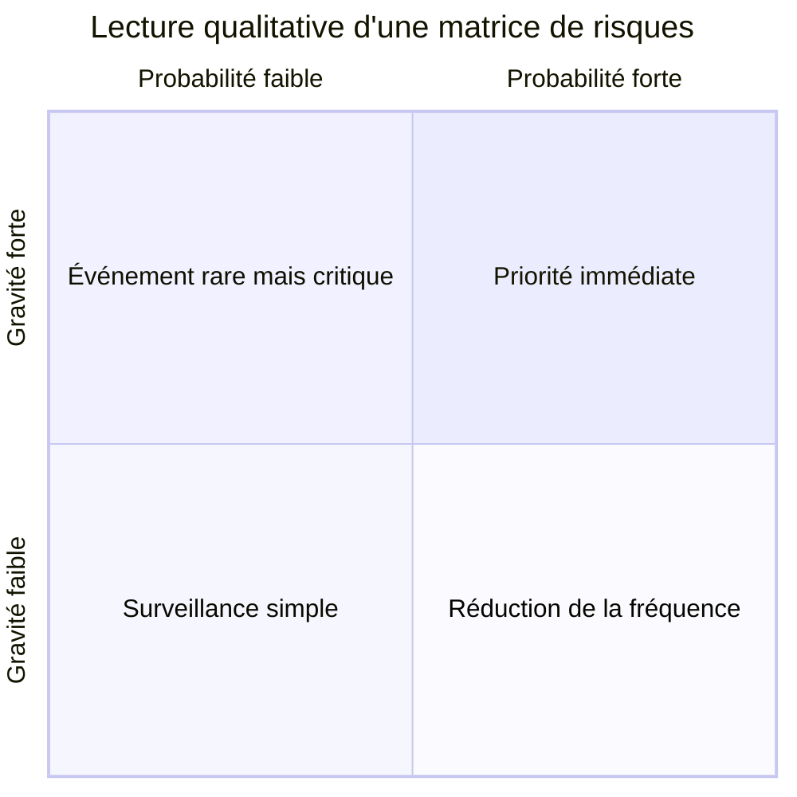

### 2.2 Limites du produit

Le produit $p \times g$ ne suffit pas dans toutes les situations.

1. **Les échelles ordinales ne sont pas des nombres physiques.** Multiplier une probabilité notée 4 sur 5 par une gravité notée 3 sur 5 produit un rang utile, pas une perte attendue mesurée.
2. **Des couples différents obtiennent le même score.** Un risque fréquent et faible peut recevoir le même résultat qu'un risque rare et catastrophique, alors que les décisions de traitement diffèrent.
3. **L'aversion au risque n'est pas linéaire.** Une organisation peut refuser un événement comportant un risque de nombreuses victimes même si son espérance mathématique ressemble à celle d'accidents individuels dispersés.
4. **Les dépendances modifient le calcul.** Une panne peut augmenter la probabilité ou la gravité d'une autre panne.
5. **L'incertitude sur les estimations disparaît du score.** Deux risques notés 12 peuvent reposer sur des données très différentes.

Le score doit donc rester accompagné de la description du scénario, de l'échelle et de la justification.

### 2.3 Courbe de Farmer et acceptabilité

Les diapositives 9 et 10 présentent une courbe séparant des zones de risques ordinaires, de risques moyens et de risques majeurs, puis une limite d'acceptabilité.[^7] L'idée essentielle est sociale autant que mathématique : la tolérance diminue fortement lorsque la gravité augmente.

Il faut distinguer :

- le risque **acceptable**, jugé suffisamment faible au regard des objectifs et critères ;
- le risque **tolérable**, accepté sous conditions parce que son élimination serait disproportionnée ou impossible ;
- le risque **inacceptable**, qui exige un changement, un arrêt ou une autre décision majeure.

Ces seuils doivent être définis avant de classer les risques. Sinon, l'équipe risque d'adapter les critères pour justifier une décision déjà prise.

## 3. Combinaisons et enchaînements de risques

### 3.1 Addition simple

Le support écrit le risque combiné sous la forme d'une somme :

$$R_c = (p_1g_1) + (p_2g_2) + \dots + (p_ng_n)$$

Cette expression peut représenter une somme de pertes attendues lorsque chaque terme décrit une perte additive, exprimée dans la même unité.[^8] L'indépendance des événements n'est pas nécessaire pour additionner leurs espérances. En revanche, une cause commune ou une cascade change les probabilités des scénarios conjoints. Si deux termes comptent la même conséquence, leur somme la compte deux fois.

> **Complément pédagogique calculé.** Un incident de probabilité $0{,}10$ coûte $100\,000\ \text{€}$ et un autre de probabilité $0{,}20$ coûte $50\,000\ \text{€}$. Si les deux pertes s'ajoutent lorsqu'elles surviennent ensemble, la perte totale espérée vaut $0{,}10 \times 100\,000 + 0{,}20 \times 50\,000 = 20\,000\ \text{€}$, même si les incidents sont dépendants. La probabilité d'avoir au moins un incident exige, elle, de connaître leur intersection : $P(A \cup B) = 0{,}10 + 0{,}20 - P(A \cap B)$. Elle vaut $0{,}28$ si les incidents sont indépendants, mais cette valeur ne peut pas être reprise sans cette hypothèse.

### 3.2 Dépendances

Trois relations doivent être recherchées.

| Relation | Description | Exemple |
|---|---|---|
| Cause commune | Plusieurs défaillances proviennent de la même origine | Une alimentation électrique unique affecte le son, la lumière et la diffusion |
| Cascade | Un événement crée les conditions du suivant | Une alerte provoque un mouvement de foule qui bloque les secours |
| Amplification | Le second événement augmente fortement l'impact du premier | Une pluie intense combinée à une panne de communication ralentit l'évacuation |

Les diapositives 12 à 14 introduisent les effets multiplicateurs, les cascades et l'effet papillon.[^9] L'effet papillon ne signifie pas que toute petite cause produit nécessairement une catastrophe. Il rappelle qu'un système sensible peut amplifier certaines variations et devenir difficile à prévoir.

### 3.3 Représenter une chaîne de risques

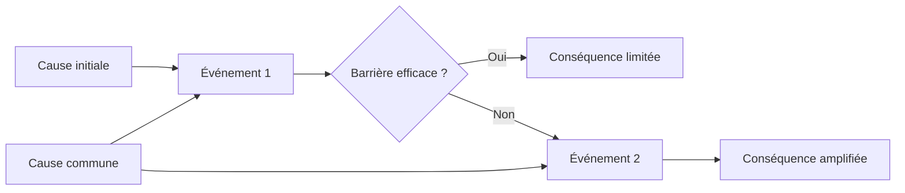

Cette représentation force l'équipe à identifier les barrières et les causes communes. Elle prépare les analyses par arbre d'événements et bow-tie.

## 4. Une démarche de management des risques

### 4.1 Approches proactive, prédictive et réactive

Le support distingue plusieurs postures.[^10]

- Une approche **réactive** apprend des accidents et incidents déjà observés.
- Une approche **prédictive** utilise des données, des tendances ou des modèles pour estimer ce qui pourrait arriver.
- Une approche **proactive** recherche les scénarios avant leur matérialisation et agit sur leurs causes.

Ces postures sont complémentaires. Une organisation sans mémoire répète des erreurs. Une organisation qui ne regarde que l'historique ignore les situations nouvelles. Une organisation qui simule sans observer le terrain risque de bâtir un modèle élégant mais faux.

### 4.2 Risques internes et risques induits

Le support distingue les risques internes au projet et ceux induits par le projet.[^11]

| Catégorie | Objet affecté | Exemples |
|---|---|---|
| Risque interne | Réussite du projet | Retard, dépassement budgétaire, qualité insuffisante, ressource indisponible |
| Risque induit | Environnement, utilisateurs ou tiers | Blessure d'un spectateur, nuisance, interruption du transport, atteinte à la réputation d'une collectivité |

Un même événement peut appartenir aux deux catégories. Une panne audiovisuelle compromet la qualité du projet, mais elle affecte aussi les diffuseurs, les partenaires et le public mondial.

### 4.3 Évolution au cours du cycle de vie

Les diapositives 17 et 18 reprennent la courbe du cycle de vie du projet. La marge de manœuvre diminue à mesure que les coûts engagés augmentent.[^12] Une décision prise pendant la conception coûte généralement moins cher qu'une correction réalisée peu avant l'exploitation.

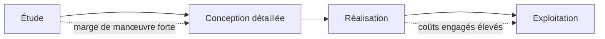

L'analyse des risques doit donc commencer tôt, puis être mise à jour. Un registre créé au lancement et jamais révisé devient une archive, pas un outil de décision.

### 4.4 Boucle de management

Le support résume le management des risques par les actions identifier, prioriser, prévenir, agir et suivre.[^13] ISO 31000 présente de manière comparable un processus d'identification, d'analyse, d'évaluation, de traitement, de suivi et de communication intégré à la gouvernance.[^3]

| Étape | Produit attendu | Question de contrôle |
|---|---|---|
| Cadrer | Objectifs, périmètre, critères | Quels objectifs et acteurs sont concernés ? |
| Identifier | Liste structurée de scénarios | Qu'est-ce qui peut se produire, pourquoi et où ? |
| Analyser | Causes, conséquences, vraisemblance | Comment le scénario se développe-t-il ? |
| Évaluer | Priorités et acceptabilité | Faut-il traiter ce risque maintenant ? |
| Traiter | Actions, responsables, délais | Quelle mesure modifie le risque ? |
| Suivre | Indicateurs et réévaluations | Le contexte ou le risque résiduel a-t-il changé ? |
| Communiquer | Information adaptée aux acteurs | Qui doit savoir quoi, quand et sous quelle forme ? |

## 5. Identifier les risques

### 5.1 Pyramide de Bird

La diapositive 21 présente une pyramide attribuée à Frank E. Bird et fondée sur un vaste échantillon d'incidents industriels. Elle illustre l'idée que les événements graves sont moins nombreux que les incidents et quasi-accidents.[^14]

La pyramide peut encourager le signalement des incidents mineurs et l'apprentissage préventif. Elle ne doit pas être lue comme une loi universelle ou comme la preuve qu'une réduction d'un nombre quelconque de petits incidents réduit automatiquement les accidents catastrophiques. Les mécanismes causaux peuvent différer.

> **Interprétation probable de la diapositive.** Le message utile pour un projet consiste à rechercher les signaux faibles et les écarts avant qu'ils ne se combinent. Le ratio exact de la pyramide importe moins que la discipline de collecte et d'analyse.

### 5.2 Sources d'identification

La diapositive 22 propose plusieurs moyens : réunions internes, brainstorming, Delphi, SWOT, Ishikawa, arbres, experts, historique, comparaison, expériences croisées, signaux faibles et intelligence artificielle.[^15]

Une identification robuste combine des perspectives différentes.

| Source | Apport | Risque de biais |
|---|---|---|
| Équipe opérationnelle | Connaissance du terrain | Normalisation des écarts habituels |
| Experts externes | Expérience spécialisée | Transfert abusif d'un autre contexte |
| Historique | Fréquences et incidents réels | Sous-estimation des ruptures nouvelles |
| Ateliers collectifs | Diversité et créativité | Conformité sociale, domination de certains membres |
| Documents et normes | Couverture structurée | Application mécanique hors contexte |
| Simulation | Comportements dynamiques | Modèle fondé sur de mauvaises hypothèses |
| IA | Exploration rapide de scénarios | Erreurs, biais, absence de responsabilité et fausses références |

L'IA peut aider à élargir une liste ou à rechercher des analogies. Elle ne remplace ni la preuve, ni l'expertise, ni l'arbitrage responsable.

### 5.3 Signaux faibles et mégatendances

Les diapositives 23 à 25 insistent sur les signaux faibles, la variabilité spatio-temporelle, les taxonomies, les scénarios, les mégatendances et les expériences d'autres secteurs.[^16]

Un signal faible est une information précoce, ambiguë et facile à négliger. Il ne constitue pas encore une preuve de danger. Sa valeur dépend du mécanisme de remontée, de l'analyse et de la possibilité d'agir avant que le signal ne devienne évident.

Pour éviter une liste infinie de tendances, l'équipe doit relier chaque mégatendance à un mécanisme concret.

| Mégatendance | Mécanisme de risque possible |
|---|---|
| Changement climatique | Fréquence ou intensité différente des événements météorologiques |
| Numérisation | Dépendance aux systèmes, cyberattaques, diffusion instantanée d'une erreur |
| Polarisation | Contestation, désinformation et risques de réputation |
| Interdépendance logistique | Propagation d'une rupture chez un fournisseur |
| Densification urbaine | Conflits d'usage et évacuation plus complexe |

### 5.4 Brainstorming

Les diapositives 26 à 29 présentent le brainstorming comme une technique de créativité collective. Elles insistent sur l'expression libre, la suspension du jugement, la diversité, l'animation et le classement ultérieur des idées.[^17]

Un atelier utile sépare deux phases.

1. **Divergence.** Produire de nombreux scénarios sans les évaluer immédiatement.
2. **Convergence.** Regrouper, reformuler, supprimer les doublons, rechercher les causes et prioriser.

Le *brown paper* peut matérialiser un processus ou un problème sur une grande surface. Les participants ajoutent des étapes, risques, dépendances et questions sous forme de notes repositionnables.

Une mauvaise séance de brainstorming confond liberté et absence de méthode. Elle produit souvent des formulations vagues comme « problème de sécurité ». Une formulation exploitable précise un événement, une cause et une conséquence : « Une interruption des communications empêche les responsables de zone de recevoir l'ordre d'évacuation, ce qui retarde le mouvement du public. »

### 5.5 Méthode Delphi

La diapositive 30 présente Delphi comme une recherche progressive de convergence et de consensus. Elle souligne aussi que les divergences initiales peuvent révéler des risques.[^18] La méthode historique utilise des réponses anonymes, plusieurs tours, un retour contrôlé et une synthèse statistique des réponses. RAND décrit ces caractéristiques comme une réponse aux limites de la discussion en face à face.[^19]

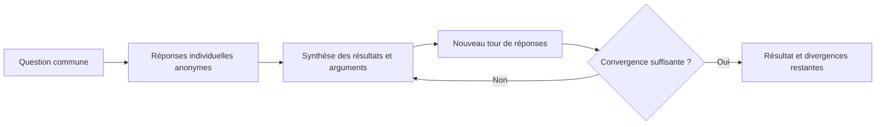

Le consensus ne garantit pas la vérité. La sélection du panel, la formulation des questions et l'information fournie aux participants influencent le résultat. Les divergences persistantes peuvent révéler une incertitude réelle qu'il faut conserver.

### 5.6 SWOT

Les diapositives 31 à 34 distinguent les forces et faiblesses internes des opportunités et menaces externes.[^20]

| Dimension | Origine | Question |
|---|---|---|
| Force | Interne | Quelle capacité aide à atteindre l'objectif ? |
| Faiblesse | Interne | Quelle limite réduit la capacité d'action ? |
| Opportunité | Externe | Quelle évolution peut être exploitée ? |
| Menace | Externe | Quelle évolution peut compromettre l'objectif ? |

Le principal défaut d'une SWOT est son caractère générique. Des termes comme « bonne équipe » ou « contexte incertain » apportent peu. Chaque élément doit être concret et relié à un objectif, une preuve et une conséquence.

La diapositive 34 associe explicitement quatre verbes aux croisements. La SWOT devient plus utile lorsque les quadrants sont croisés :

- force et opportunité : **promouvoir** un atout pour saisir une possibilité ;
- force et menace : **affronter** la menace avec un atout existant ;
- faiblesse et opportunité : **modifier** ce qui empêche de saisir la possibilité ;
- faiblesse et menace : **repenser** l'option ou le dispositif exposé.[^20]

### 5.7 Diagramme d'Ishikawa

Les diapositives 35 et 36 présentent le diagramme causes-effet.[^21] L'équipe part d'un effet précis, puis recherche des familles de causes. Dans un contexte industriel, les catégories classiques sont parfois résumées par les « 5M » ou « 6M » : main-d'œuvre, méthodes, machines, matières, milieu et mesure.

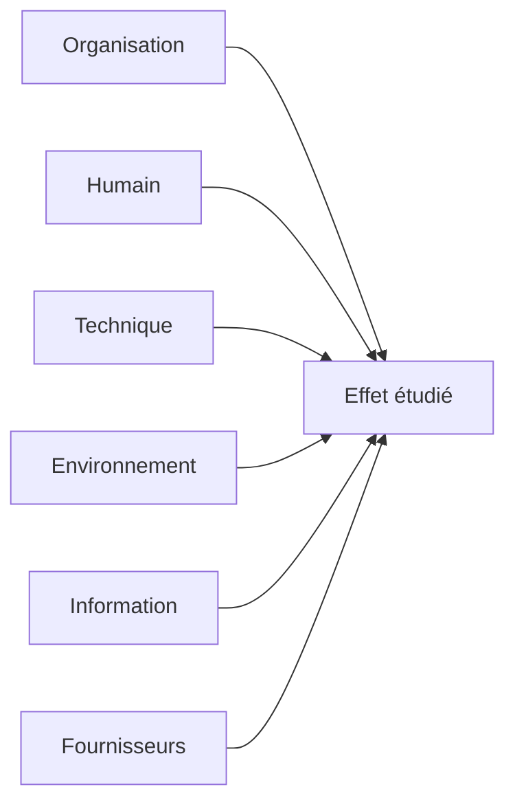

Le diagramme ne prouve pas les causes. Il organise des hypothèses causales qui doivent ensuite être testées ou documentées.

## 6. Quantifier et hiérarchiser

### 6.1 Registre et tables de référence

Les diapositives 37 et 38 montrent le passage de l'identification à la description, puis à une évaluation de probabilité et de gravité. Le support demande de noter le numéro, le type, la description, la cause et l'effet, puis de confronter les évaluations de plusieurs groupes. Un consensus ne doit pas effacer les valeurs extrêmes, qui signalent la sensibilité du résultat aux jugements des personnes consultées.[^22]

Le barème du support est un exemple propre à une organisation. Il code séparément la probabilité et la gravité avec les valeurs `1`, `2`, `4` et `8`, puis multiplie les deux codes.[^22]

| Code du support | Probabilité | Gravité |
|---:|---|---|
| 1 | Négligeable | Négligeable |
| 2 | Faible | Faible |
| 4 | Grande | Grande |
| 8 | Inacceptable | Inacceptable |

Une échelle utilisable en pratique doit définir ces mots par des critères observables et une période d'exposition. Le tableau suivant est **un exemple construit pour cette fiche**, indépendant du barème `1–2–4–8` du support.

| Niveau d'impact proposé | Personnes | Projet | Réputation |
|---:|---|---|---|
| 1 | Pas de blessure | Effet négligeable | Aucun intérêt externe |
| 2 | Soins légers | Retard local | Critique limitée |
| 3 | Blessure sérieuse possible | Perturbation notable | Couverture négative temporaire |
| 4 | Plusieurs victimes possibles | Objectif majeur compromis | Crise nationale |
| 5 | Décès multiples possibles | Échec ou arrêt du projet | Crise internationale durable |

Ces exemples doivent être adaptés au projet. Une même échelle ne convient pas automatiquement à une usine, un système informatique et un événement public.

### 6.2 Matrice de risques

Les diapositives 39 et 40 appliquent le barème $1, 2, 4, 8$ à une matrice de 16 cases. Un produit $R \leq 4$ est vert et dit acceptable ; $4 < R \leq 8$ est jaune et « à considérer » ; $R > 8$ est rouge et dit inacceptable. Ce sont les seuils de cet exemple, pas une règle générale. Ainsi, $p = 4$ et $g = 2$ donnent $R = 8$, tandis que $p = 8$ et $g = 8$ donnent $R = 64$.[^23]

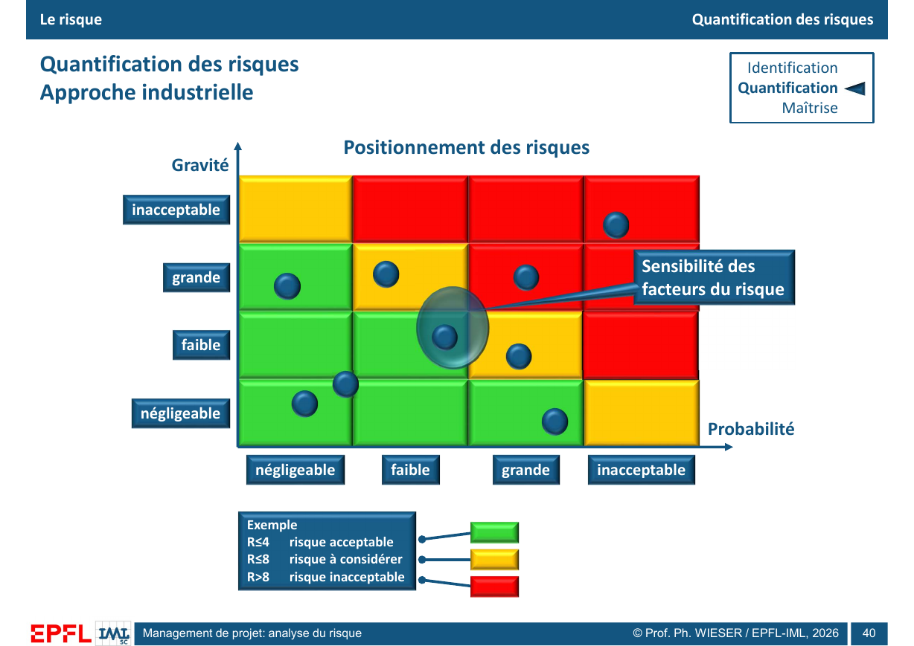

La diapositive 40 ajoute des points de tailles différentes. Leur taille illustre la sensibilité aux facteurs du risque, sans fournir d'unité ni de formule supplémentaire. Elle invite donc à examiner la stabilité du classement lorsque l'on change les hypothèses. La couleur facilite la lecture, mais elle peut masquer cette incertitude. Le registre doit conserver le raisonnement derrière le point placé dans la matrice.

La diapositive 41 compare des échelles publiques de danger d'avalanche et des drapeaux de baignade. Ce sont des outils de communication et d'action adaptés à leur activité. Ils ne fournissent pas une conversion directe vers le score $p \times g$ du projet.[^23]

Une bonne ligne de registre contient au minimum :

- l'événement redouté ;
- les causes ;
- les conséquences ;
- les mesures existantes ;
- la probabilité et sa justification ;
- l'impact et sa justification ;
- le propriétaire du risque ;
- l'action décidée ;
- la date de révision ;
- le risque résiduel.

### 6.3 AMDEC ou FMECA

Les diapositives 42 à 44 introduisent l'analyse des modes de défaillance, de leurs effets et de leur criticité. Le support utilise la formule $C = G \times F \times D$, avec gravité, fréquence et détectabilité.[^24]

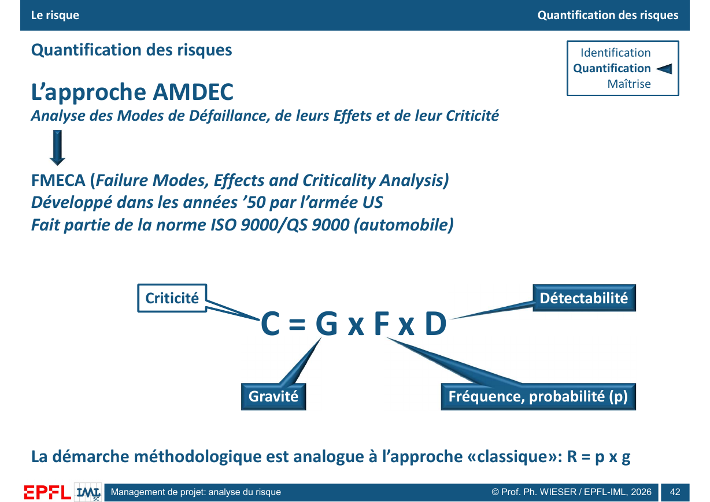

IEC 60812:2018 décrit la FMEA et sa variante FMECA comme une méthode systématique pour identifier comment un élément ou un processus peut ne plus assurer sa fonction, quels effets locaux ou globaux en résultent et quels traitements envisager.[^25]

Une AMDEC suit généralement cette séquence.

1. Définir le système, ses objectifs et ses frontières.
2. Décomposer le système en fonctions ou opérations.
3. Identifier les modes de défaillance de chaque fonction.
4. Décrire les causes et effets.
5. Recenser les contrôles existants.
6. Évaluer gravité, fréquence et détectabilité.
7. Prioriser les actions.
8. Réévaluer après traitement.

> **Complément pédagogique calculé.** Avec le barème illustratif de la diapositive 43, la gravité et la fréquence vont de $1$ à $5$, tandis que la détectabilité va de $1$ à $4$. Un message non reçu, coté $G = 5$, $F = 2$ et $D = 4$, aurait une criticité $C = 5 \times 2 \times 4 = 40$. Cet exemple de communication est construit pour la fiche ; il ne figure pas dans le support. Après ajout d'un accusé de réception, seul un nouveau jugement documenté permettrait de modifier $D$ ou les autres notes.[^24]

| Fonction | Mode de défaillance | Effet | Cause | G | F | D | C | Action envisagée |
|---|---|---|---|---:|---:|---:|---:|---|
| Informer les responsables de zone | Message non reçu | Retard d'évacuation | Réseau saturé | 5 | 2 | 4 | 40 | Canal redondant et accusé de réception |

Le produit $G \times F \times D$ ne doit pas être appliqué mécaniquement. Des combinaisons très différentes peuvent obtenir le même score. IEC 60812 prévoit d'ailleurs plusieurs façons de prioriser et ne réduit pas toute FMEA à un unique nombre de priorité.[^25]

> **Correction importante.** Le support indique que l'AMDEC fait partie d'ISO 9000 ou de QS 9000. La référence internationale générique actuelle pour la FMEA et la FMECA est IEC 60812:2018. ISO 9000 concerne les principes essentiels et le vocabulaire du management de la qualité. Il vaut mieux présenter ces cadres comme liés historiquement ou par leurs usages qualité, sans confondre leurs objets.

### 6.4 Méthodes voisines

La diapositive 44 cite MOSAR, MADS, HAZOP, LOPA et HACCP.[^26]

| Méthode | Point de départ | Sortie principale | Application adaptée |
|---|---|---|---|
| MOSAR | Système découpé en sous-systèmes | Scénarios d'accident, objectifs de sécurité et barrières | Installations ou organisations où plusieurs sous-systèmes interagissent |
| MADS | Source de danger, flux dangereux et cible | Modèle conceptuel du processus de danger | Cadrage systémique avant une analyse détaillée |
| HAZOP | Fonctionnement prévu d'un procédé ou d'une opération | Déviations, causes, conséquences, mesures existantes et actions | Procédés décrits par paramètres, séquences ou consignes |
| LOPA | Scénario initiateur et conséquence définie | Fréquence résiduelle après couches de protection indépendantes | Vérification semi-quantitative de scénarios majeurs |
| HACCP | Chaîne de production alimentaire | Dangers significatifs, points critiques, limites et surveillance | Sécurité sanitaire des aliments |

**MOSAR et MADS.** MADS représente un danger comme l'interaction entre une source, un flux dangereux et une cible. MOSAR utilise ce type de représentation dans une démarche organisée. Son premier module décompose le système, identifie les sources de danger et construit des scénarios. L'équipe évalue ensuite les risques, négocie des objectifs de sécurité et définit des moyens de prévention et de protection. Un second module peut approfondir la sûreté de fonctionnement. La méthode convient aux systèmes complexes, mais le découpage et les scénarios deviennent lourds si le périmètre reste vague.[^27]

**HAZOP.** L'équipe choisit un nœud d'étude, précise son intention de fonctionnement, puis combine un paramètre avec un mot-guide. « Débit » et « aucun » donnent par exemple « aucun débit ». Pour chaque déviation crédible, l'équipe consigne les causes, les conséquences, les moyens de détection, les protections existantes et les actions. IEC 61882 structure l'étude en définition, préparation, séances d'examen, documentation et suivi. HAZOP fonctionne bien lorsque le système peut être décrit par des paramètres ou des étapes. Il couvre moins naturellement une menace stratégique diffuse.[^27]

**LOPA.** L'analyse part d'un événement initiateur et d'une conséquence. Elle retient seulement les couches qui préviennent le scénario ou en atténuent la conséquence, qui sont indépendantes de l'initiateur et des autres couches, et dont la performance peut être vérifiée. L'équipe combine la fréquence de l'initiateur avec les probabilités de défaillance à la demande des couches pour estimer une fréquence résiduelle. LOPA sert à vérifier si les barrières suffisent au regard d'un critère de tolérance. Elle devient trompeuse si deux couches partagent une alimentation, un capteur, un logiciel ou une équipe.[^27]

**HACCP.** La démarche décrit le produit et son usage, construit puis vérifie le diagramme du procédé, analyse les dangers biologiques, chimiques et physiques, et détermine les points critiques. Pour chaque point critique, l'équipe fixe une limite, une surveillance, des corrections, une vérification et des enregistrements. HACCP traite la sécurité des aliments. Ses principes peuvent inspirer le contrôle d'un processus, mais leur transposition ne transforme pas un autre domaine en application HACCP.[^27]

Ces méthodes ne sont pas interchangeables. Une AMDEC part d'une fonction et demande comment elle peut défaillir. HAZOP part d'une intention de fonctionnement et cherche les déviations. MOSAR construit des scénarios à l'échelle d'un système. LOPA teste la suffisance de barrières indépendantes pour un scénario déjà défini. HACCP organise la maîtrise des dangers dans une chaîne alimentaire.

## 7. Mettre à jour et simuler

### 7.1 Variation dans le temps et l'espace

La diapositive 45 montre qu'un risque change de position dans une matrice.[^28] Une évaluation doit donc porter une date, un périmètre et une hypothèse de contexte.

Pour un événement, la probabilité et l'impact peuvent varier selon :

- la phase de préparation ou d'exploitation ;
- la zone géographique ;
- l'heure et la densité du public ;
- la météo ;
- l'état des infrastructures ;
- les mesures déjà déployées ;
- l'information disponible.

### 7.2 Simulation dynamique

Les diapositives 46 à 48 proposent la simulation numérique pour étudier les combinaisons et dynamiques.[^29] Une simulation peut représenter des flux de personnes, la circulation, une chaîne logistique, un planning ou une distribution de coûts.

Sur la diapositive 46, les captures de FlexSim montrent des processus et des espaces de production. La diapositive 47 représente la distribution d'un résultat après $N$ exécutions, avec un minimum, une valeur la plus probable, un maximum et une dispersion notée $\sigma$. Le support ne donne ni $N$ ni les paramètres des modèles. Il faut donc lire ces figures comme une démonstration de méthode, sans leur attribuer un résultat chiffré.[^29]

La diapositive 48 montre une autre piste, associée à l'IA et aux expériences croisées, pour identifier, quantifier et combiner les risques. Elle mentionne un projet de recherche de la chaire SCF–ENPC avec Mohamed Saâd El Harrab et Ph. Wieser. La capture d'un logiciel et les courbes n'établissent pas, à elles seules, la performance d'une méthode.[^29]

Une simulation fiable exige :

1. une question de décision précise ;
2. un modèle explicite ;
3. des données et distributions justifiées ;
4. des scénarios de sensibilité ;
5. une comparaison avec des observations ;
6. une interprétation qui conserve les limites du modèle.

L'animation visuelle d'une simulation ne prouve pas sa validité. Un modèle peut sembler réaliste tout en reposant sur de mauvaises hypothèses.

## 8. Arbres de décision et valeur espérée

Les diapositives 49 à 52 présentent un choix d'offre commerciale sous incertitude. Chaque option conduit à des résultats possibles auxquels sont associées des probabilités et des gains.[^30]

Le contrat porte sur $100\,000$ articles à un coût unitaire de $1{,}50\ \text{€}$. Les prix candidats sont $2{,}90\ \text{€}$, $2{,}50\ \text{€}$ et $2{,}10\ \text{€}$. Le gain en cas de vente est donc, dans cet ordre, $140\,000\ \text{€}$, $100\,000\ \text{€}$ et $60\,000\ \text{€}$. Le support suppose un gain nul lorsque l'offre est perdue. Il donne des probabilités de gagner de $10\ \%$, $50\ \%$ et $90\ \%$.[^30]

La valeur espérée d'une option $j$ s'écrit :

$$VE_j = \sum_i p_{ij} \times G_{ij}$$

où $p$ désigne la probabilité du résultat et $G$ son gain ou sa perte.

| Prix offert | Marge unitaire si gagné | Gain si gagné | Probabilité de gagner | Valeur espérée |
|---:|---:|---:|---:|---:|
| $2{,}90\ \text{€}$ | $1{,}40\ \text{€}$ | $140\,000\ \text{€}$ | $10\ \%$ | $14\,000\ \text{€}$ |
| $2{,}50\ \text{€}$ | $1{,}00\ \text{€}$ | $100\,000\ \text{€}$ | $50\ \%$ | $50\,000\ \text{€}$ |
| $2{,}10\ \text{€}$ | $0{,}60\ \text{€}$ | $60\,000\ \text{€}$ | $90\ \%$ | $54\,000\ \text{€}$ |

La dernière ligne se calcule par $0{,}90 \times 60\,000 + 0{,}10 \times 0 = 54\,000\ \text{€}$. Sous les hypothèses du support, l'offre à $2{,}10\ \text{€}$ maximise la valeur espérée. La diapositive 51 représente une somme de termes associés à différentes options ; pour choisir, il faut calculer une espérance **à l'intérieur de chaque option**, puis comparer les trois résultats comme le fait la diapositive 52.[^30]

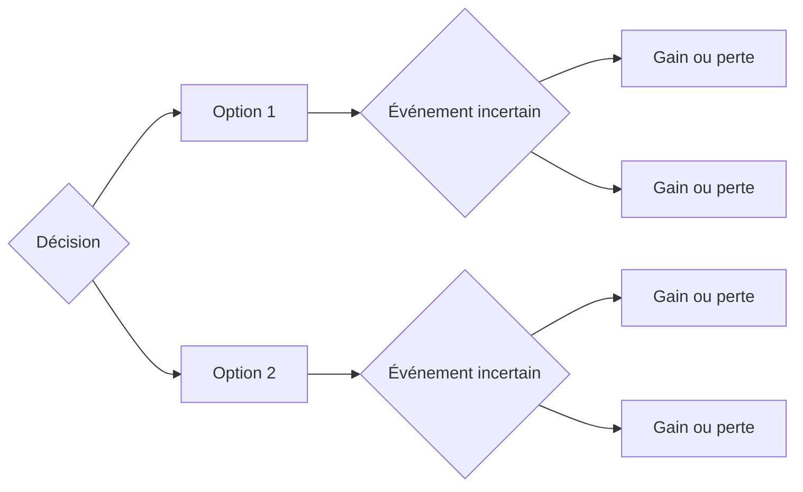

**Lecture critique.** La valeur espérée convient à un décideur neutre au risque lorsque les probabilités et résultats monétaires sont suffisamment fiables. Dans cet exemple, la perte d'une offre vaut $0\ \text{€}$ par hypothèse. Le temps de préparation de l'offre, une éventuelle pénalité ou une capacité de production limitée changeraient les gains. La valeur espérée ne remplace pas l'analyse de ces contraintes.

## 9. Maîtriser les risques

### 9.1 Stratégies de traitement

La diapositive 53 présente quatre stratégies : accepter, réduire, éviter et transférer.[^31]

| Stratégie | Effet recherché | Exemple |
|---|---|---|
| Éviter | Supprimer l'activité ou la condition qui crée le risque | Retirer une séquence impossible à sécuriser |
| Réduire | Diminuer la probabilité ou l'impact | Ajouter une barrière et former les équipes |
| Transférer | Partager une conséquence financière ou opérationnelle | Assurance ou contrat avec responsabilités définies |
| Accepter | Conserver le risque avec surveillance et réserve | Tolérer un retard mineur prévu dans la marge |

Le transfert contractuel ne supprime pas toujours la responsabilité morale, réglementaire ou réputationnelle. Une assurance indemnise une perte couverte. Elle ne répare pas nécessairement la confiance.

### 9.2 Prévention et protection

Le support distingue la prévention, qui agit surtout sur la probabilité, et la protection, qui agit surtout sur la gravité.[^31]

| Mesure | Avant l'événement | Après le déclenchement |
|---|---|---|
| Prévention | Évite ou rend moins probable | Effet indirect |
| Protection | Peut rester passive jusqu'à l'événement | Limite les conséquences |
| Détection | Signale un écart ou un événement | Permet une réponse plus rapide |
| Récupération | Prépare la continuité et le retour | Réduit la durée et l'impact global |

### 9.3 Lean, 5S et DMAIC

Les diapositives 54 à 58 relient la complication à la génération de risques et présentent Lean, 5S, Six Sigma, DMAIC, cartographie des processus et mind mapping.[^32]

#### Complexité, complication et risque

Le support oppose implicitement deux problèmes. La **complexité** vient des interactions, des boucles de retour, des acteurs nombreux et de l'incertitude ; elle ne peut pas toujours être supprimée. La **complication** vient plutôt d'étapes, d'interfaces ou de règles qui s'accumulent sans apporter de valeur suffisante. Simplifier une procédure peut réduire les erreurs de transmission. Cela ne supprime pas les interdépendances réelles d'un grand projet.

Une simplification doit donc conserver les fonctions de sécurité. Retirer une approbation redondante et inutile peut réduire les délais. Retirer deux validations indépendantes parce qu'elles paraissent similaires peut supprimer une barrière contre l'erreur. L'équipe doit demander, pour chaque étape : quelle valeur produit-elle, quel risque maîtrise-t-elle et que se passe-t-il si elle disparaît ?

#### Lean et Value Stream Mapping

Le Lean cherche notamment à rendre le flux visible, à distinguer la valeur du gaspillage et à améliorer le système complet plutôt qu'une tâche isolée. Une **Value Stream Map** représente les flux de matière et d'information nécessaires pour produire un service ou un produit. La démarche construit d'abord une carte de l'état actuel, puis une carte de l'état futur et un plan de transformation.[^34]

Pour analyser les risques, la carte doit au minimum indiquer les étapes, les attentes, les stocks ou files, les décisions, les reprises, les canaux d'information et les responsables. Elle aide à repérer les transferts sans propriétaire, les délais qui masquent un incident et les points où une information erronée se propage. Elle ne prouve pas que l'état futur est sûr : les barrières critiques doivent être testées séparément.

Le Lean peut retirer des étapes inutiles et clarifier un processus. Une réduction excessive des réserves ou redondances peut cependant diminuer la résilience. L'objectif n'est pas de supprimer toute marge, mais de distinguer le gaspillage d'une capacité de sécurité utile.

#### 5S

Les cinq pratiques sont généralement traduites par **trier**, **ranger**, **nettoyer**, **standardiser** et **maintenir**. Elles rendent les anomalies plus visibles : un outil absent, un câble mal raccordé, une zone encombrée ou une version de document incorrecte se repèrent plus vite dans un environnement standardisé. Certaines variantes ajoutent un sixième S pour la sécurité.[^34]

Les 5S ne sont pas un nettoyage ponctuel. Il faut définir une situation attendue, attribuer la responsabilité du maintien et vérifier régulièrement les écarts. Ils réduisent les erreurs et pertes de temps ordinaires, mais ne remplacent ni l'analyse des scénarios majeurs ni les barrières techniques.

#### Six Sigma et DMAIC

Six Sigma met l'accent sur la réduction de la variation et la maîtrise d'un processus par les données. Lean et Six Sigma sont souvent combinés : le premier examine surtout le flux et les activités sans valeur, le second la variabilité et la capacité du processus.[^34]

ASQ définit DMAIC comme une démarche structurée destinée à améliorer un processus existant qui ne satisfait pas les performances attendues. Les cinq phases sont définir, mesurer, analyser, améliorer et contrôler.[^33]

| Phase | Question |
|---|---|
| Définir | Quel problème et quel objectif ? |
| Mesurer | Quelle est la performance actuelle ? |
| Analyser | Quelles causes expliquent l'écart ? |
| Améliorer | Quelle modification traite les causes ? |
| Contrôler | Comment vérifier que l'amélioration dure ? |

Une application rigoureuse conserve une chaîne de preuve. La phase *Définir* fixe le problème, le périmètre, les utilisateurs et l'indicateur. *Mesurer* établit la performance initiale et la qualité des données. *Analyser* teste les causes au lieu de retenir la première explication. *Améliorer* compare et expérimente des solutions. *Contrôler* fixe les seuils, responsables et réactions qui empêchent le retour à l'ancien fonctionnement.

#### Cartographie de processus et mind mapping

Une **cartographie de processus** montre l'ordre des activités, les décisions, les entrées, les sorties et les responsabilités. Elle convient à l'analyse d'un flux de travail. Une **mind map** part d'un sujet central et organise des branches d'idées ; elle convient à l'exploration initiale d'un problème, mais ne représente pas automatiquement l'ordre temporel, les dépendances ou les contrôles.

La diapositive 58 avertit contre la dérive du détail. Une carte trop dense peut devenir inutilisable. Le niveau de décomposition doit rester lié à une question de décision : localiser une interface critique, attribuer une responsabilité, réduire un délai ou vérifier une barrière. Si aucun lecteur ne peut expliquer ce que la carte permet de décider, il faut la simplifier ou la scinder.

### 9.4 Modèle du gruyère suisse

La diapositive 59 présente le modèle de James Reason.[^35] Chaque couche de défense comporte des faiblesses. Un accident devient possible lorsque les faiblesses de plusieurs couches s'alignent. Reason distingue notamment les erreurs actives proches de l'événement et les conditions latentes créées par l'organisation.[^36]

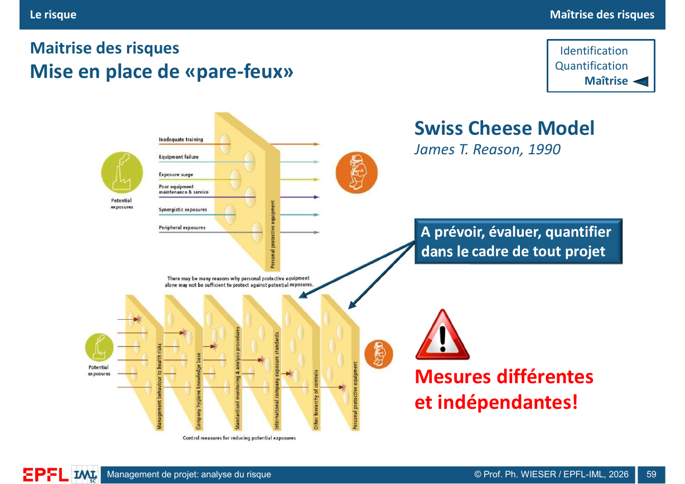

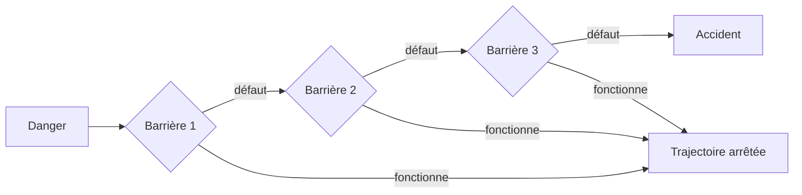

Le modèle est utile pour résister à l'explication « une personne a fait une erreur ». Il oblige à demander pourquoi plusieurs défenses ont laissé passer la trajectoire.

### 9.5 Mode dégradé et résilience

La diapositive 60 associe les procédures en mode dégradé à la résilience.[^37] Un mode dégradé définit comment assurer les fonctions essentielles lorsqu'une partie du système est indisponible.

Un plan utile précise :

- le déclencheur ;
- l'autorité qui décide ;
- les fonctions prioritaires ;
- les moyens alternatifs ;
- les limites acceptables ;
- la communication ;
- les conditions de retour au mode normal.

Un document de secours jamais exercé reste une hypothèse. Les exercices et répétitions testent les interfaces, les délais et la compréhension des rôles.

### 9.6 Poka-yoke, check-lists et redondance

Les diapositives 61 et 62 présentent des moyens physiques, les détrompeurs, les check-lists et la redondance.[^38]

- Un **poka-yoke** empêche une erreur ou la rend immédiatement visible.
- Une **check-list** soutient la mémoire et coordonne des actions critiques.
- Une **redondance** ajoute un moyen capable de reprendre une fonction.

La redondance n'est utile que si les moyens ne partagent pas la même cause de panne. Deux canaux reposant sur la même alimentation, le même réseau ou la même équipe ne sont pas pleinement indépendants.

### 9.7 Apprentissage entre secteurs

La diapositive 63 illustre le transfert de pratiques de l'aviation vers l'hôpital.[^39] Une expérience croisée devient utile lorsque l'équipe transfère un mécanisme, pas une recette complète. Une check-list aéronautique et une check-list chirurgicale partagent une logique de coordination, mais leurs contextes, responsabilités et contraintes diffèrent.

## 10. Application au management de projet

### 10.1 Organisation et information

La diapositive 64 place le risque dans la structure de gouvernance. Le comité de pilotage, la direction de projet, le chef de projet et les groupes d'utilisateurs doivent recevoir une information adaptée.[^40]

Une gouvernance claire répond aux questions suivantes :

- Qui possède le risque ?
- Qui décide du traitement ?
- Qui finance l'action ?
- Qui surveille l'indicateur ?
- Qui informe les parties prenantes ?
- Qui peut arrêter une activité ?

### 10.2 Agile et coordination

La diapositive 65 présente les itérations agiles comme un moyen de maîtriser le risque par la coordination et le contrôle des étapes.[^41] Des cycles courts réduisent l'intervalle entre une hypothèse et son retour. Ils ne conviennent cependant pas à toutes les décisions. Une autorisation de sécurité ou une infrastructure physique peut exiger un jalon formel et une preuve avant toute mise en service.

### 10.3 Système d'information et chaîne logistique

La diapositive 66 rapproche le projet d'une chaîne logistique : les besoins et informations entrent, la réalisation produit un résultat, et le système d'information assure synchronisation, traçabilité et suivi.[^42]

Une information tardive ou incohérente peut devenir un risque en soi. La maîtrise demande une source de vérité, des responsabilités de mise à jour et des canaux alternatifs pour les informations critiques.

### 10.4 Risque économique

La diapositive 67 associe l'évaluation économique des variantes à une approche probabiliste et à la valeur actuelle nette.[^43] Plutôt que d'utiliser un seul coût prévisionnel, une simulation peut représenter des distributions de coûts, de recettes, de délais ou de taux.

Pour une série de flux nets $F_t$, un investissement initial $I_0$ et un taux d'actualisation $r$, la valeur actuelle nette s'écrit :

$$VAN = -I_0 + \sum_{t=1}^{T}\frac{F_t}{(1+r)^t}$$

Une VAN positive signifie que la valeur actualisée des flux retenus dépasse l'investissement initial selon les hypothèses du modèle. Elle ne prouve pas que le projet est sans risque. Le résultat dépend du périmètre des coûts et bénéfices, des dates, du taux, des valeurs terminales et des scénarios.

Une analyse probabiliste attribue des distributions aux hypothèses incertaines, conserve leurs corrélations lorsque cela est justifié, recalcule la VAN de nombreuses fois et observe sa distribution. La question de décision peut alors devenir : quelle est la probabilité que la VAN soit négative, quel quantile défavorable faut-il financer et quelles hypothèses expliquent le plus la dispersion ?

Le résultat doit montrer :

- la valeur moyenne ;
- la dispersion ;
- les quantiles défavorables ;
- les hypothèses les plus influentes ;
- les scénarios extrêmes plausibles.

### 10.5 Risque de planification

La diapositive 68 compare une planification déterministe et une planification probabiliste.[^44] PERT estime traditionnellement une durée à partir de trois valeurs : optimiste, la plus probable et pessimiste.

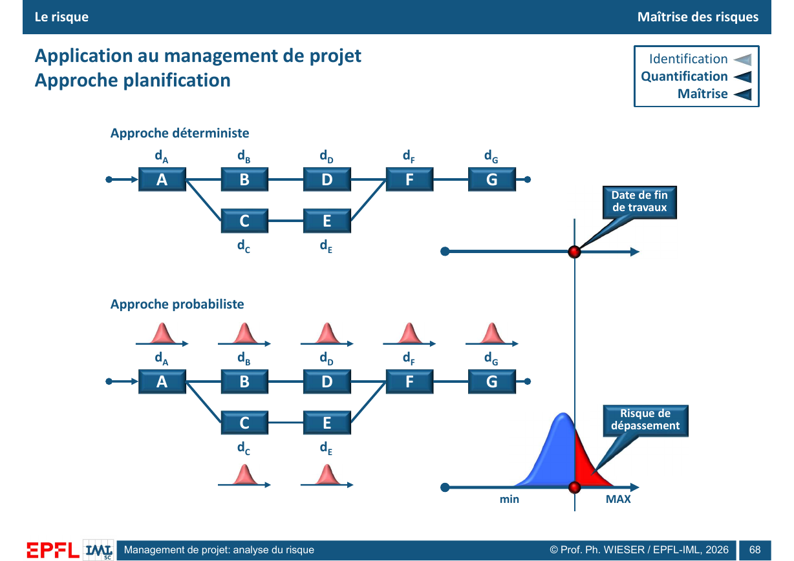

$$t_e = \frac{t_o + 4t_m + t_p}{6}$$

La valeur $t_o$ est la durée optimiste, $t_m$ la durée la plus probable et $t_p$ la durée pessimiste. Cette moyenne pondérée résume une distribution supposée ; elle n'est pas une durée garantie. Une date calculée à partir des seules moyennes peut masquer une forte asymétrie et la possibilité qu'une autre chaîne de tâches devienne critique.

Une analyse probabiliste de planning suit quatre étapes.

1. Construire un réseau cohérent de tâches, de jalons et de dépendances.
2. Affecter aux durées incertaines des distributions justifiées et modéliser les corrélations importantes.
3. Simuler de nombreux plannings en recalculant le chemin critique à chaque itération.
4. Lire une distribution de dates, la probabilité de respecter un jalon et la sensibilité du résultat aux tâches.

PMI cite PERT, les scénarios *what-if* et la simulation Monte Carlo parmi les techniques quantitatives d'analyse du risque de planning.[^46] La simulation peut représenter les dépendances et les changements de chemin critique si le modèle les contient. Elle ne corrige pas un réseau incomplet, des durées arbitraires ou l'oubli des contraintes de ressources.

## 11. Synthèse opérationnelle

La dernière diapositive relie les risques externes et internes au triangle qualité-coût-délai, puis rappelle les familles d'outils.[^45]

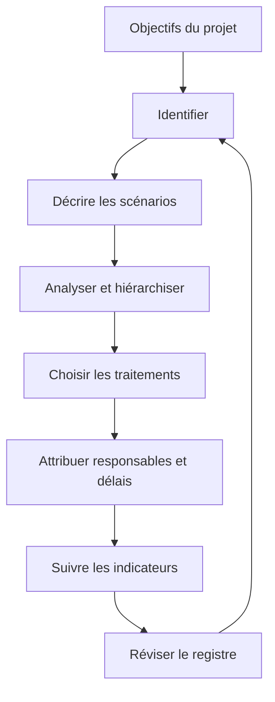

Une analyse de risques utile produit des décisions traçables. Elle ne se termine pas par une matrice colorée. Elle relie chaque scénario à un responsable, une mesure, une échéance, une preuve de réalisation et une nouvelle estimation du risque résiduel.

## Questions d'entraînement

1. Quelle différence existe entre un danger, un événement redouté et un risque ?
2. Dans quel cas le produit $p \times g$ peut-il être interprété comme une valeur attendue ?
3. Pourquoi deux risques ayant le même score peuvent-ils exiger des traitements différents ?
4. Quelle différence existe entre un risque interne et un risque induit par le projet ?
5. Pourquoi la pyramide de Bird ne doit-elle pas être appliquée comme une loi universelle ?
6. Comment Delphi limite-t-elle certains biais des réunions classiques ?
7. Pourquoi un diagramme d'Ishikawa ne prouve-t-il pas les causes ?
8. Quelle différence existe entre une AMDEC et un HAZOP ?
9. Quand faut-il éviter plutôt que réduire un risque ?
10. Quelle différence existe entre prévention, protection, détection et récupération ?
11. Dans quelles conditions une redondance n'est-elle pas indépendante ?
12. Pourquoi une simulation visuellement convaincante peut-elle rester invalide ?

## Réponses synthétiques

1. Le danger est une source potentielle de dommage. L'événement redouté décrit ce qui pourrait arriver. Le risque relie l'incertitude de cet événement aux objectifs et conséquences.
2. Lorsque la probabilité et l'impact sont définis sur des échelles quantitatives compatibles et que le produit représente une espérance pertinente.
3. Le score masque la combinaison probabilité-gravité, l'incertitude, l'aversion et la nature des traitements.
4. Le risque interne affecte la réussite du projet. Le risque induit affecte son environnement ou des tiers.
5. Les ratios varient selon les secteurs et les mécanismes des incidents mineurs peuvent différer de ceux des catastrophes.
6. Delphi utilise l'anonymat, l'itération et un retour contrôlé.
7. Il organise des hypothèses. Une enquête ou des données doivent confirmer les relations causales.
8. L'AMDEC part des fonctions et modes de défaillance. HAZOP part des déviations par rapport à un fonctionnement prévu.
9. Lorsqu'aucun traitement ne ramène le risque à un niveau tolérable ou que l'activité n'est pas indispensable.
10. La prévention réduit la probabilité, la protection limite l'impact, la détection accélère la réaction et la récupération restaure les fonctions.
11. Lorsque les moyens partagent une alimentation, un réseau, une équipe, un lieu ou une autre cause commune.
12. La qualité visuelle ne valide ni les hypothèses, ni les données, ni le comportement du modèle.

## Couverture des diapositives

| Diapositives | Contenu principal | Sections correspondantes |
|---:|---|---|
| 1-7 | Introduction, définition, exemples, cindynique | Sections 1 et 2 |
| 8-10 | Calcul et acceptabilité du risque | Section 2 |
| 11-14 | Combinaison, dépendances et effet papillon | Section 3 |
| 15-20 | Approches, cycle de vie et management | Section 4 |
| 21-25 | Identification, signaux faibles et tendances | Section 5.1 à 5.3 |
| 26-29 | Brainstorming et exemples | Section 5.4 |
| 30 | Delphi | Section 5.5 |
| 31-34 | SWOT | Section 5.6 |
| 35-36 | Ishikawa | Section 5.7 |
| 37-41 | Tables, matrices et exemples | Section 6.1 et 6.2 |
| 42-44 | AMDEC et méthodes voisines | Sections 6.3 et 6.4 |
| 45-48 | Suivi et simulation | Section 7 |
| 49-52 | Arbre de décision | Section 8 |
| 53 | Traitements | Section 9.1 et 9.2 |
| 54-58 | Lean, 5S, Six Sigma et processus | Section 9.3 |
| 59-60 | Défenses et mode dégradé | Sections 9.4 et 9.5 |
| 61-63 | Poka-yoke, check-lists, redondance, collaboration | Sections 9.6 et 9.7 |
| 64-66 | Organisation, Agile et information | Sections 10.1 à 10.3 |
| 67 | Évaluation économique probabiliste | Section 10.4 |
| 68 | Planification probabiliste | Section 10.5 |
| 69 | Synthèse | Section 11 |

## Références

[^1]: Philippe Wieser, *Management de projet : analyse du risque*, `2_MGT_427_risks_26.pdf`, diapositive 7 et structure générale des diapositives 21 à 69.
[^2]: Ibid., diapositives 3 à 6.
[^3]: ISO, *ISO 31000:2018, Risk management — Guidelines*, 2018, confirmé en 2023, https://www.iso.org/standard/65694.html, consulté le 29 septembre 2026.
[^4]: Philippe Wieser, *Analyse du risque*, diapositive 2.
[^5]: Ibid., diapositive 7.
[^6]: Ibid., diapositive 8.
[^7]: Ibid., diapositives 9 et 10.
[^8]: Ibid., diapositive 11.
[^9]: Ibid., diapositives 12 à 14.
[^10]: Ibid., diapositive 15.
[^11]: Ibid., diapositive 16.
[^12]: Ibid., diapositives 17 et 18.
[^13]: Ibid., diapositives 19 et 20.
[^14]: Ibid., diapositive 21.
[^15]: Ibid., diapositive 22.
[^16]: Ibid., diapositives 23 à 25.
[^17]: Ibid., diapositives 26 à 29.
[^18]: Ibid., diapositive 30.
[^19]: James Dewar et John Friel, « Expert Opinion on Key Energy Issues in 2020 », dans RAND Corporation, *E-Vision 2000*, CF-170, p. 52-56, description des réponses anonymes, des itérations, du retour contrôlé et de l'agrégation statistique, https://www.rand.org/content/dam/rand/pubs/conf_proceedings/2005/CF170.pdf, consulté le 30 septembre 2026.
[^20]: Philippe Wieser, *Analyse du risque*, diapositives 31 à 34.
[^21]: Ibid., diapositives 35 et 36.
[^22]: Ibid., diapositives 37 et 38.
[^23]: Ibid., diapositives 39 à 41.
[^24]: Ibid., diapositives 42 à 44.
[^25]: IEC, *IEC 60812:2018, Failure modes and effects analysis (FMEA and FMECA)*, 2018, https://webstore.iec.ch/en/publication/26359, consulté le 29 septembre 2026.
[^26]: Philippe Wieser, *Analyse du risque*, diapositive 44.
[^27]: IEC, *IEC 61882:2016, Hazard and operability studies (HAZOP studies) — Application guide*, https://webstore.iec.ch/en/publication/24321 ; P. Périlhon et O. Grandamas, « MOSAR : une méthode pour l'analyse de risques », *Lettre de la sûreté de fonctionnement*, nos 48-49, 1997, notice INRS https://portaildocumentaire.inrs.fr/Default/doc/SYRACUSE/116496/mosar-une-methode-pour-l-analyse-de-risques-48-49?_lg=fr-FR ; INERIS, *Évaluation des dispositifs de prévention et de protection utilisés pour réduire les risques d'accidents majeurs*, rapport Oméga 7, section 5.2 « LOPA », https://prestations.ineris.fr/sites/default/files/PrestaWeb/Pages-Solution/Documents%20Associ%C3%A9s/Omega7.pdf ; Codex Alimentarius, *General Principles of Food Hygiene, HACCP System and Guidelines for its Application*, https://www.fao.org/4/w6419e/w6419e03.htm, consultés le 30 septembre 2026.
[^28]: Philippe Wieser, *Analyse du risque*, diapositive 45.
[^29]: Ibid., diapositives 46 à 48.
[^30]: Ibid., diapositives 49 à 52.
[^31]: Ibid., diapositive 53.
[^32]: Ibid., diapositives 54 à 58.
[^33]: American Society for Quality, *DMAIC*, https://asq.org/quality-resources/dmaic, consulté le 29 septembre 2026.
[^34]: American Society for Quality, *Six Sigma Tools and Techniques*, https://asq.org/quality-resources/sixsigma/tools ; Lean Enterprise Institute, *5S*, https://www.lean.org/lexicon-terms/five-s/ et *Value Stream Mapping*, https://www.lean.org/lexicon-terms/value-stream-mapping/, consultés le 30 septembre 2026.
[^35]: Philippe Wieser, *Analyse du risque*, diapositive 59.
[^36]: James Reason, « Human error: models and management », *BMJ*, vol. 320, 2000, p. 768-770, DOI 10.1136/bmj.320.7237.768, https://pubmed.ncbi.nlm.nih.gov/10720363/, consulté le 29 septembre 2026.
[^37]: Philippe Wieser, *Analyse du risque*, diapositive 60.
[^38]: Ibid., diapositives 61 et 62.
[^39]: Ibid., diapositive 63.
[^40]: Ibid., diapositive 64.
[^41]: Ibid., diapositive 65.
[^42]: Ibid., diapositive 66.
[^43]: Ibid., diapositive 67.
[^44]: Ibid., diapositive 68.
[^45]: Ibid., diapositive 69.
[^46]: Project Management Institute, *Scheduling Professional Examination Content Outline*, tâche 4.10, analyse quantitative du risque de planning par scénarios, Monte Carlo et PERT, https://www.pmi.org/military/sitecore/content/home/certifications/types/-/media/pmi/documents/public/pdf/certifications/scheduling-professional-exam-outline.pdf, consulté le 30 septembre 2026.
