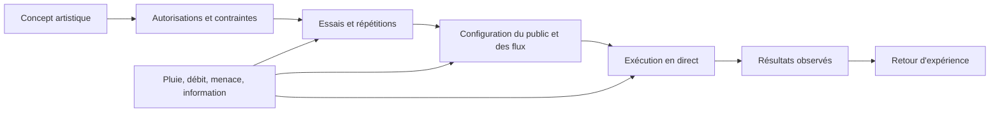

# Cadre et méthode d'analyse

## Objet

Cette analyse étudie la cérémonie d'ouverture olympique du 26 juillet 2024 comme un projet complexe. Le système comprend la parade fluviale, les performances sur la Seine et ses abords, le protocole du Trocadéro, la vasque, la captation, les accès, la sécurité, les secours, les transports, la navigation, les achats et la réputation. Le périmètre reprend la définition de la base factuelle.[^1]

La question centrale est la suivante : **comment livrer un spectacle mondial dans un espace urbain ouvert, alors que la même infrastructure sert au public, aux délégations, aux secours, à la navigation, aux transports et à l'activité économique ?**

Cette formulation évite deux erreurs. Elle ne réduit pas le projet à une scène artistique. Elle ne confond pas non plus un bilan favorable avec la preuve que chaque mesure a été efficace.

## Ce que l'analyse doit démontrer

Le projet de cours doit produire quatre réponses.

1. Le périmètre, les dépendances et les critères de réussite sont explicites.
2. Les interfaces entre acteurs sont visibles, même lorsque les responsabilités juridiques restent inconnues.
3. Les risques sont formulés comme des événements observables, avec des causes, des conséquences, des contrôles et un risque résiduel.
4. Les conclusions séparent les faits documentés, les inférences et les lacunes.

## Modèle de preuve

| Niveau | Définition | Formulation dans l'analyse |
|---|---|---|
| Direct | Une source affirme explicitement le fait. | « La source indique que… » |
| Soutenu | Plusieurs sources indépendantes convergent. | « Les sources indiquent fortement que… » |
| Inféré | L'analyse relie des faits sans preuve d'une décision interne. | « Cela suggère que… » |
| Spéculatif | Plusieurs explications restent compatibles. | « Une hypothèse serait… » |
| Inconnu | Le corpus ne permet pas de répondre. | « Les sources consultées ne permettent pas d'établir… » |

Les fiches de contexte appliquent déjà cette distinction. Elles signalent aussi les différences de périmètre entre les chiffres de préparation et les résultats postérieurs. Par exemple, les 600 000 spectateurs annoncés en 2021, les 326 000 places détaillées en mars 2024 et les 300 000 ou 500 000 personnes mentionnées après l'événement ne sont pas une série homogène.[^2]

## Méthodes du cours appliquées ici

| Méthode | Usage dans le projet | Limite à respecter |
|---|---|---|
| Approche système | Relier fleuve, flotte, spectacle, accès, sécurité, transports et réputation. | Le schéma montre des dépendances analytiques, pas une hiérarchie officielle. |
| Approche processus | Décrire la chaîne billet, station, contrôle, place et sortie. | Une procédure publiée ne prouve pas son exécution parfaite. |
| WBS | Décomposer le livrable en conception, autorisations, flotte, spectacle, public, diffusion et retour d'expérience. | La WBS est une reconstruction pédagogique. |
| Registre des parties prenantes | Relier acteurs, attentes, pouvoir d'action et interfaces. | La présence d'un acteur ne prouve pas sa délégation de signature. |
| Registre des risques | Standardiser l'événement redouté, ses causes, ses effets et ses barrières. | Les scores ne sont pas ceux de Paris 2024. |
| Matrice de risque | Prioriser les risques selon une échelle commune. | Une note élevée indique une priorité d'analyse, pas une probabilité historique. |
| AMDEC | Décomposer un mode de défaillance en gravité, vraisemblance et détectabilité. | Les valeurs sont pédagogiques quand les données internes manquent. |
| Ishikawa | Chercher les causes d'un incident ou d'un retard sans s'arrêter à la cause immédiate. | Le diagramme ne prouve pas qu'une cause a effectivement produit l'incident. |
| Défenses en profondeur | Examiner les barrières indépendantes et leurs dépendances communes. | Plusieurs mesures peuvent partager le même point de défaillance. |
| Scénarios et mode dégradé | Tester une station fermée, un débit élevé, une pluie continue ou une panne de système. | Un scénario construit n'est pas un compte rendu du jour J. |
| PDCA | Organiser l'apprentissage entre concept, test, correction et exploitation. | Le corpus public ne fournit pas tous les procès-verbaux internes. |

Le cours définit le risque comme une combinaison d'incertitude, de conséquences et d'écarts possibles. Pour la cotation pédagogique, ce dossier utilise le produit simple $R = p \times g$ avec une échelle de 1 à 5. Cette formule sert à comparer des priorités. Elle ne résume pas les dépendances, les corrélations, la détectabilité ou les effets en chaîne.[^3]

## Modèle causal du projet

Le modèle distingue les entrées que l'équipe peut concevoir, les contraintes qu'elle peut seulement encadrer et les résultats qu'elle doit observer. Il rend visible le point critique du projet. Une cérémonie en direct n'offre pas une nouvelle date pour corriger un défaut découvert trop tard.

## Données minimales d'un risque

Chaque ligne du registre intégré contient les champs suivants.

| Champ | Question à poser |
|---|---|
| Identifiant | Quelle ligne peut être suivie dans le temps ? |
| Événement redouté | Que peut-on observer ou constater ? |
| Causes | Quelles conditions rendent l'événement possible ? |
| Conséquences | Qui subit un effet sur la sécurité, le délai, le coût, la qualité ou la réputation ? |
| Probabilité | Quelle échelle et quelles preuves justifient la valeur ? |
| Impact | Quelle est la gravité si l'événement survient ? |
| Contrôles documentés | Quelles mesures sont réellement sourcées ? |
| Analyse ajoutée | Quelle recommandation est produite pour le cours ? |
| Risque résiduel | Que reste-t-il possible après les contrôles ? |
| Sources | Où le lecteur peut-il vérifier l'énoncé ? |

## Conclusion de cadrage

La base factuelle permet d'analyser une architecture de projet et ses dépendances. Elle ne permet pas de reconstituer les contrats privés, les journaux de décision, les seuils d'arrêt, les scores internes de risque ou toutes les données d'expérience du public. La bonne conclusion est donc une analyse contrôlée par les preuves, et non une histoire complète de la décision interne.

## Notes

[^1]: [Périmètre retenu et chronologie](../context/00-chronologie-perimetre.md#périmètre-retenu).
[^2]: [Changements de jauge](../context/00-chronologie-perimetre.md#comment-lire-les-changements-de-jauge).
[^3]: [Note de cours sur le produit $R = p \times g$ et ses limites](../../lecture-notes/02-analyse-des-risques.md#2-le-modèle-simple-r--p--g).
