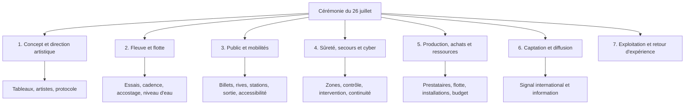
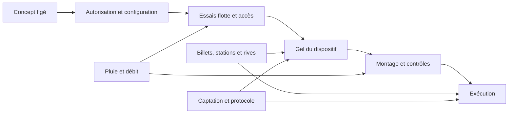

# Cadrage, périmètre et planning

## Charte analytique

| Élément | Définition retenue |
|---|---|
| Projet | Concevoir et livrer la cérémonie d'ouverture olympique du 26 juillet 2024 dans un corridor urbain et fluvial. |
| Livrable principal | Une expérience en direct combinant parade, performances, protocole, vasque et retransmission. |
| Livrables opérationnels | Parcours navigable, flotte, installations temporaires, accès, sûreté, secours, transports, captation et plans de continuité. |
| Contraintes fixes | Date, parcours, réglementation, capacité du fleuve, sécurité, droits des personnes, coordination avec les activités urbaines et diffusion mondiale. |
| Dépendances critiques | Débit et ligne d'eau, tests de flotte, autorisations, contrôle du public, stations et ponts, alimentation technique, signal international. |
| Critères de réussite | Cérémonie tenue, continuité des fonctions critiques, sécurité des personnes, expérience lisible, traitement des tiers et résultats documentables. |
| Hors périmètre | Compétitions dans la Seine, cérémonies paralympiques et budget complet des Jeux, sauf dépendance explicitement démontrée. |

Le périmètre est plus large que la durée du spectacle. La préparation des quais, les fermetures, les embarquements, les essais et la sortie du public appartiennent au système à livrer. La chronologie officielle distingue déjà la conception, les tests, les jauges, les accès et l'exécution.[^1]

## Décomposition du livrable

Cette WBS est une reconstruction pédagogique. Elle n'attribue pas les lots aux mêmes organisations que le projet réel. Elle sert à vérifier qu'un risque ne disparaît pas parce qu'il se trouve entre deux domaines.

## Chaîne temporelle

| Phase | Jalons documentés | Décision de management à analyser |
|---|---|---|
| Conception | Idée sur la Seine développée à partir de 2019, puis annonce publique en décembre 2021. | Quel périmètre artistique et opérationnel devient irréversible ? |
| Direction artistique | Thomas Jolly est nommé en septembre 2022. | Comment les ambitions artistiques deviennent-elles des exigences testables ? |
| Première preuve opérationnelle | Test autorisé et effectué en juillet 2023 avec 39 bateaux de parade et 18 accompagnateurs. | Quels critères font passer un test de l'observation à l'acceptation ? |
| Configuration du public | Jauge de 104 000 places payantes et 222 000 invitations annoncée en mars 2024. | Quel lien entre capacité, accès, sûreté et flux ? |
| Préparation finale | Deuxième test le 17 juin 2024, montage progressif à partir du 17 juin, répétitions finales annoncées en juillet. | Quelle marge reste-t-il quand une répétition est annulée ? |
| Exécution | Cérémonie réalisée le 26 juillet, avec 85 bateaux de parade rapportés après l'événement. | Quelles barrières ont absorbé la pluie, les flux et les aléas ? |
| Bilan | Bilans officiels, rapports de sécurité, transport et cybersécurité. | Comment distinguer résultat, coût et causalité ? |

La chronologie montre un changement progressif de configuration. Elle ne prouve pas que chaque étape a été validée par une gouvernance unique. Elle montre cependant que le projet a dû fermer des décisions tardives sous une date fixe.[^1]

## Dépendances et chemin critique

Les dépendances les plus fortes sont les suivantes.

1. Le concept artistique dépend de la disponibilité du fleuve, des ponts, des quais et des règles de navigation.
2. La flotte dépend des essais, du débit, des manœuvres, de l'ordre des délégations et de la zone de débarquement.
3. Le public dépend du couple billet, rive et station. Il dépend aussi du débit des contrôles et de la réouverture progressive des transports.
4. La sécurité dépend de l'intégrité des zones, de la circulation des secours et de la qualité des informations.
5. La diffusion dépend de la cadence, de la lumière, du son, de la météo et de l'absence d'un défaut protocolaire visible.

Un risque sur le chemin critique ne se mesure pas seulement par sa probabilité. Il se mesure aussi par la marge restante pour le détecter, le corriger et répéter la solution. L'annulation d'une répétition en raison du débit est donc importante même sans incident le jour J. Elle réduit une fenêtre d'apprentissage dans un système avec de nombreuses interfaces.[^2]

## Décisions de passage à renforcer

Les documents publics ne donnent pas les critères internes. L'analyse propose donc les points de passage suivants, à présenter comme une reconstruction.

| Gate | Question d'acceptation | Preuve attendue |
|---|---|---|
| G1, concept | Le spectacle reste compréhensible dans le corridor prévu ? | Scénario, exigences de parcours, contraintes d'accès |
| G2, système fluvial | Chaque séquence de navigation possède-t-elle une manœuvre testée et une solution de repli ? | Compte rendu d'essai, écarts, actions et responsables |
| G3, public | Les flux d'arrivée, de contrôle, de place et de sortie sont-ils compatibles ? | Modèle de flux, tests de station, consignes par rive |
| G4, sûreté et secours | Les contrôles ne bloquent-ils pas une intervention ou une évacuation ? | Exercices, temps d'accès, exceptions et décision d'arrêt |
| G5, production | Les prestataires, installations, énergie et signal sont-ils prêts sous pluie ? | Réception, essais techniques, redondance, journal de réserve |
| G6, exploitation | Qui peut arrêter, ralentir ou modifier une séquence ? | Matrice d'escalade et journal de décision |

## Lecture avec le cycle de vie

Le projet combine une phase de conception relativement séquentielle avec des boucles d'essais et de correction. Une lecture hybride est donc plus utile qu'une opposition entre « classique » et « agile ».

- La date et certaines autorisations imposent une planification amont.
- Les essais de flotte et les tests de flux fournissent des retours qui doivent modifier le dispositif.
- La dernière semaine réduit la marge et rend les changements coûteux.
- Le jour J passe en exploitation contrôlée, avec une capacité de décision et de repli.
- Le retour d'expérience doit fermer la boucle et préserver les preuves.

Il ne faut pas attribuer au COJOP une méthode agile ou un cycle en V précis sans document interne. Le vocabulaire décrit ici la structure observable du travail, pas une méthode revendiquée par l'organisateur.[^3]

## Conclusion

Le risque principal du cadrage n'est pas l'absence d'un planning. C'est la coexistence de plusieurs plannings qui doivent converger avant une date immuable. Un planning robuste doit donc afficher les interfaces, les critères d'acceptation, la marge de répétition et les décisions qui ne peuvent plus être repoussées.

## Notes

[^1]: [Chronologie vérifiée](../context/00-chronologie-perimetre.md#chronologie-vérifiée).
[^2]: [Essais et apprentissage par les tests](../context/04-meteo-seine-navigation-logistique.md#2-préparation-et-apprentissage-par-les-essais).
[^3]: [Choisir une démarche adaptée au projet](../../lecture-notes/01-introduction-au-management-de-projet.md#5-choisir-une-démarche-adaptée-au-projet).
