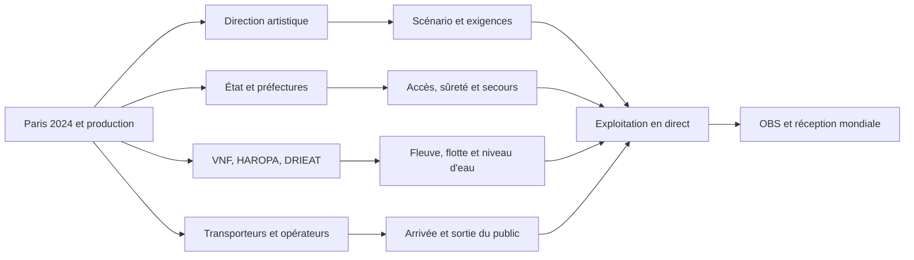

# Gouvernance et interfaces

## Pourquoi la gouvernance est le risque central

La cérémonie ne se déroulait pas dans une enceinte appartenant à un seul opérateur. Le COJOP portait l'organisation des Jeux, tandis que l'État, les préfectures, la Ville de Paris, les gestionnaires du fleuve, les opérateurs de transport, la production artistique, les diffuseurs et les tiers affectés conservaient des rôles distincts. La fiche de contexte confirme ces responsabilités séparées et rappelle qu'une participation ne prouve pas une délégation de signature.[^1]

Le problème de management n'est donc pas de trouver « le » responsable. Il consiste à faire circuler la bonne information au bon moment entre des acteurs qui n'ont ni le même mandat, ni le même horizon, ni les mêmes critères de réussite.

## Carte des parties prenantes

| Groupe | Intérêt principal | Pouvoir d'action documenté | Dépendance critique |
|---|---|---|---|
| COJOP, Paris 2024 et direction des cérémonies | Livrer le spectacle et coordonner les partenaires. | Organisation globale, production et coordination. | Dépend de décisions publiques, de prestataires et de la disponibilité du site. |
| État, ministères et préfectures | Sécurité, accès, ordre public, autorisations et continuité. | Réglementation, périmètres, police, autorisations et arbitrages publics. | Dépend des informations techniques et des capacités opérationnelles. |
| Ville de Paris et collectivités | Accueil, espaces, invitations, services urbains et acceptabilité locale. | Mise à disposition d'espaces, voirie et coordination territoriale. | Dépend des restrictions, des riverains et des opérateurs. |
| VNF, HAROPA et DRIEAT | Navigation, ouvrages, domaine fluvial et continuité économique. | Avis, règles, ouvrages, conventions portuaires et mesures de navigation. | Dépend de la météo, du débit, de la flotte et des usagers du fleuve. |
| IDFM, RATP, SNCF et ministère des Transports | Acheminement, stations, gares, plans de transport et sortie. | Planification des services, régulation et information voyageur. | Dépend des jauges, des fermetures et des comportements d'arrivée. |
| Direction artistique, artistes et prestataires | Qualité artistique, production, scénographie et exécution. | Conception et production dans les limites autorisées. | Dépend de la météo, de la sécurité, du calendrier et de la captation. |
| OBS, diffuseurs et médias | Signal mondial, commentaire et réception. | Captation, distribution et cadrage médiatique. | Dépend du spectacle, du protocole et des systèmes techniques. |
| Athlètes et délégations | Participation, sécurité, visibilité et dignité protocolaire. | Contraintes opérationnelles liées aux embarquements et au parcours. | Dépend de la flotte, du cadencement et de l'information. |
| Spectateurs, riverains, entreprises et usagers du fleuve | Accès, sécurité, mobilité, continuité économique et droits. | Comportements, retours, recours et acceptabilité. | Dépend des règles, de l'information et des capacités de transport. |

Cette carte regroupe des acteurs pour rendre les interfaces lisibles. Elle ne remplace pas les contrats, arrêtés, délégations et organigrammes complets. Les identifiants détaillés `STAKE-*` se trouvent dans la fiche de contexte.[^1]

## Interfaces qui doivent fonctionner

Les interfaces essentielles sont les suivantes.

1. **Scénario et espace public.** Une modification artistique peut toucher un quai, un pont, une zone de sécurité, une route ou un plan de captation.
2. **Fleuve et production.** Un décor ou un ordre de bateaux modifie la navigation et les manœuvres.
3. **Transport et accès.** Une station fermée ou une rive imposée change la pression sur les contrôles et les cheminements.
4. **Sûreté et secours.** Un contrôle plus strict peut ralentir une évacuation ou l'accès d'un véhicule d'urgence.
5. **Production et diffusion.** Une erreur de protocole ou de données peut produire un dommage mondial même si la mécanique du spectacle continue.
6. **Projet et tiers.** Une fermeture qui protège le spectacle peut déplacer des coûts vers les transporteurs, les commerces, les riverains ou les usagers ordinaires.

## RACI reconstruit pour le cours

Le tableau suivant n'est pas une matrice officielle. Il constitue une hypothèse de travail qui doit être remplacée si les contrats ou journaux de décision deviennent disponibles.

| Activité | Responsable opérationnel probable | Autorité à confirmer | Acteurs à consulter | Preuve à rechercher |
|---|---|---|---|---|
| Concevoir le scénario | Direction artistique et production | Paris 2024, partenaires du mouvement olympique | Ville, État, OBS, équipes techniques | Contrat, validation artistique, version du scénario |
| Autoriser un test fluvial | Préfecture et gestionnaires du fleuve | Autorité signataire de l'arrêté | COJOP, VNF, HAROPA, police | Arrêté, avis techniques, compte rendu de test |
| Organiser la flotte | Production, armateurs et conducteurs | Chaîne d'autorisation à confirmer | VNF, DRIEAT, secours, captation | Plan de flotte, procédure d'accostage, registre d'écarts |
| Réguler les accès | Préfecture de police et opérateurs de transport | Autorité de décision par zone | Ville, COJOP, IDFM, RATP, SNCF | Plan de circulation, seuils, main courante |
| Assurer les secours | Services de sécurité et de secours | Chaîne de commandement à confirmer | COJOP, préfectures, hôpitaux, associations | Plan ORSEC ou équivalent, exercices, délais |
| Produire le signal | OBS et prestataires techniques | Droits et validations à confirmer | Direction artistique, diffuseurs | Plan de captation, redondance, incidents |
| Décider un repli | Autorité politique et opérationnelle à confirmer | Seuils de bascule inconnus | COJOP, artistique, sécurité, transport | Scénarios, critères, journal de décision |

Une matrice RACI utile ne doit pas remplir chaque case par habitude. Elle doit afficher les cases inconnues. Inventer une responsabilité pour rendre le tableau complet créerait une fausse certitude.

## Coordination observable

Trois relations sont documentées avec une précision suffisante pour l'analyse.

- Le test de juillet 2023 relie la demande du COJOP, les avis de HAROPA, VNF et la préfecture de police, puis une autorisation préfectorale et une information des usagers par VNF.[^2]
- La préparation des transports relie l'État, les opérateurs et les organisateurs aux périmètres de sécurité et aux billets.[^3]
- La continuité du fleuve relie VNF, les transporteurs de céréales, les ouvrages, les horaires d'écluses et des mesures de compensation envisagées.[^4]

Ces exemples prouvent des interfaces. Ils ne prouvent pas que le même circuit a traité chaque changement tardif du 26 juillet. Le journal des demandes de changement et la matrice d'escalade restent des pièces manquantes.

## Points de rupture possibles

| Rupture | Déplacement du risque | Indicateur à suivre |
|---|---|---|
| Une information artistique arrive après le gel de la sécurité | Accès ou plan de secours non aligné | Heure de la dernière modification et impacts ouverts |
| Un opérateur reçoit une instruction différente de celle du billet | Mauvaise rive, files et refus | Version publiée par canal et taux de correction |
| Un ouvrage fluvial change de régime sans information commune | Retard de flotte ou arrêt d'essai | État du fleuve, message horodaté, décision associée |
| La chaîne de commandement reçoit une alerte non qualifiée | Évacuation ou interruption inutile | Délai de levée de doute et niveau d'escalade |
| Un prestataire livre un composant sans preuve de réception | Défaillance en direct et recherche de responsabilité | Réserve ouverte, propriétaire, date de clôture |

## Recommandations analytiques

1. Tenir une source de vérité versionnée pour le parcours, les accès, les stations, les délégations et les exceptions.
2. Associer chaque changement à son effet sur la sûreté, le fleuve, la mobilité, la captation et les tiers.
3. Définir une autorité d'escalade pour chaque interface critique, même lorsqu'elle n'a pas le pouvoir de tout décider.
4. Rendre les critères d'arrêt et de repli observables, datés et testés.
5. Conserver un journal de décision qui distingue une instruction, un avis, une approbation et un résultat.

## Conclusion

La gouvernance du projet est un réseau de contrats, d'autorisations, d'opérations et de relations publiques. Le risque vient moins du nombre d'acteurs que des points où une décision change de domaine sans changer de propriétaire explicite. L'analyse doit donc suivre les interfaces et leurs preuves, pas seulement dessiner un organigramme.

## Notes

[^1]: [Registre des acteurs et limites de responsabilité](../context/01-gouvernance-parties-prenantes.md#registre-des-acteurs).
[^2]: [Coordination du test fluvial](../context/01-gouvernance-parties-prenantes.md#relations-et-décisions-que-les-sources-permettent-de-suivre).
[^3]: [Préparation des transports et des accès](../context/07-mobilites-acces-accessibilite-impacts-urbains.md#2-planification-à-rebours-depuis-les-jauges).
[^4]: [Continuité économique du fleuve](../context/04-meteo-seine-navigation-logistique.md#5-continuité-économique-du-fleuve).
