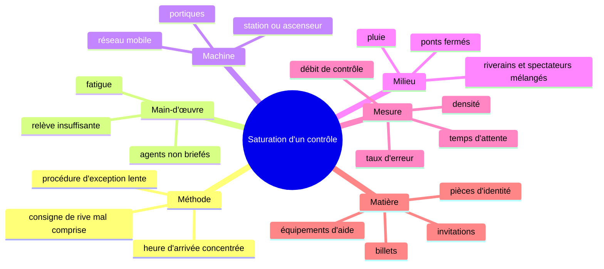

# Registre intégré des risques

## Échelle de cotation

Les scores de ce registre sont une construction pédagogique. Ils ne sont pas les scores internes de Paris 2024. La probabilité et l'impact sont cotés de 1 à 5. Le score indicatif suit $R = p \times g$.

| Valeur | Probabilité | Impact |
|---:|---|---|
| 1 | Rare dans le scénario étudié | Effet local et récupérable |
| 2 | Peu probable | Retard ou correction limitée |
| 3 | Possible | Dégradation visible d'un domaine |
| 4 | Probable ou exposition répétée | Effet majeur sur plusieurs fonctions |
| 5 | Très probable ou déjà observé dans le périmètre | Effet critique sur les personnes, le direct ou la continuité |

| Score | Priorité pédagogique |
|---:|---|
| 1–4 | Surveiller et documenter |
| 5–9 | Traiter par une mesure proportionnée |
| 10–14 | Priorité de conception et d'exercice |
| 15–25 | Décision de direction, scénario de repli ou réduction forte |

Un score ne remplace pas une analyse de dépendance. Un risque peu probable peut rester prioritaire si son impact est critique et si sa détection arrive trop tard.

## Registre principal

| ID | Événement redouté | Causes principales | Conséquences | $p$ | $g$ | $R$ | Contrôles documentés | Risque résiduel |
|---|---|---|---|---:|---:|---:|---|---|
| SEC-01 | Une intrusion armée atteint le public. | Menace non détectée, accès détourné ou filtrage contourné. | Blessures nombreuses, arrêt, évacuation et perte de confiance. | 2 | 5 | 10 | Périmètres, filtrage, renseignement, intervention et zones contrôlées.[^1] | Élevé en gravité. Les taux de détection et les seuils d'arrêt ne sont pas publics. |
| SEC-02 | Une foule se comprime à un contrôle ou une station. | Arrivées simultanées, mauvaise rive, information tardive, refus de titre. | Chutes, retard, impossibilité d'intervenir et atteinte aux personnes. | 4 | 4 | 16 | Affectation par billet, restrictions de circulation, contrôle et régulation des stations.[^2] | Les volumes réels, temps d'attente et densités ne sont pas publiés. |
| FLUV-01 | Le débit ou la ligne d'eau devient incompatible avec un essai ou une manœuvre. | Pluies, apports amont, ouvrages, variation brusque. | Annulation d'essai, retard, accostage difficile et effet en chaîne. | 3 | 4 | 12 | Prévision, coordination des ouvrages, arrêt du turbinage, barrages et travaux d'urgence.[^3] | Les seuils d'exploitation et la marge du jour J restent inconnus. |
| FLUV-02 | Deux bateaux entrent en collision ou perdent la cadence. | Densité, manœuvre inhabituelle, visibilité, décor ou erreur humaine. | Blessures, blocage, retard de délégation et rupture du signal. | 2 | 5 | 10 | Tests, répétitions annoncées, encadrement et entraînement des manœuvres.[^3] | Les quasi-accidents et comptes rendus détaillés ne sont pas publics. |
| TECH-01 | La pluie dégrade une séquence technique ou artistique. | Eau sur câbles, instruments, costumes, sols, caméras ou décors. | Blessure, panne, suppression de tableau ou baisse de qualité. | 3 | 4 | 12 | Préparations, protections et capacités de remplacement supposées, mais peu détaillées publiquement.[^3] | La pluie est établie, mais l'incidentologie technique ne l'est pas. |
| MOB-01 | Une station ou un passage se sature. | Pic d'arrivées, station trop proche, débit de contrôle insuffisant. | Files, fermeture d'urgence, retards et tensions avec les riverains. | 4 | 4 | 16 | Planification par jauges, station recommandée, fermetures séquencées et information.[^2] | Les courbes de flux et seuils de régulation ne sont pas disponibles. |
| MOB-02 | Un spectateur arrive sur la mauvaise rive et ne rejoint pas sa zone. | Billet mal lu, pont fermé, information contradictoire ou changement tardif. | Détour, refus d'accès, surcharge déplacée et expérience dégradée. | 3 | 3 | 9 | Rive et station indiquées sur le billet, applications et agents.[^2] | Le taux d'erreur et les corrections en temps réel sont inconnus. |
| ACC-01 | Une personne handicapée subit une rupture de chaîne d'accès. | Navette indisponible, station non accessible, détour, contrôle incompatible. | Impossibilité d'assister ou de sortir, atteinte aux droits. | 3 | 4 | 12 | Navettes, zones de dépose et exceptions d'accès motorisé.[^2] | L'effectivité, les délais et les incidents individuels ne sont pas documentés. |
| CYB-01 | Un système critique devient indisponible ou compromis. | Attaque, saturation, dépendance non redondée ou erreur de configuration. | Perte d'information, accès perturbé, retard ou communication fausse. | 2 | 5 | 10 | Audits, exercices, signalement centralisé et coordination ANSSI.[^1] | Les systèmes propres à la cérémonie et leurs temps de reprise ne sont pas connus. |
| REP-01 | Une séquence est reçue comme une attaque contre un groupe. | Ambiguïté visuelle, cadrage, contexte culturel, image isolée et polarisation. | Blessure symbolique, menaces, pression sur les partenaires et crise médiatique. | 4 | 3 | 12 | Revue de réception, éléments de langage, veille et protection des personnes recommandés.[^4] | Toute revue réduit l'ambiguïté sans garantir une réception commune. |
| REP-02 | Une donnée protocolaire erronée devient un incident diplomatique. | Mauvais fichier, nomenclature, validation bilingue insuffisante. | Excuses, protestation, atteinte à la délégation et amplification mondiale. | 2 | 4 | 8 | Contrôle croisé, source maîtresse, répétition audio et verrouillage des versions recommandés.[^4] | L'erreur peut franchir plusieurs canaux avant détection. |
| ECO-01 | La fermeture du fleuve pénalise un usager économique critique. | Durée d'arrêt, récolte céréalière, stockage limité, information tardive. | Retards, coûts, conflit de parties prenantes et demande de compensation. | 3 | 3 | 9 | Réduction de la fermeture, horaires d'écluses, zones de stationnement, guichet et compensation étudiée.[^3] | Le coût net et les préjudices réels ne sont pas consolidés. |
| FIN-01 | La prévision financière ne couvre pas le périmètre réel. | Coûts répartis entre acteurs, définitions changeantes, recettes et investissements mêlés. | Arbitrages tardifs, contrôle a posteriori et lecture trompeuse de la réussite. | 4 | 4 | 16 | Contrôles financiers et rapports postérieurs, mais pas de coût consolidé de la seule cérémonie.[^5] | Les montants restent non comparables sans périmètre, financeur et date. |

## Matrice de priorité

Chaque cellule contient les identifiants qui ont la même combinaison de probabilité et d'impact. La lecture va de la probabilité faible à forte, de gauche à droite, et de l'impact faible à critique, de bas en haut.

| Impact \\ Probabilité | 1 | 2 | 3 | 4 | 5 |
|---|---:|---:|---:|---:|---:|
| 5, critique |  | SEC-01, FLUV-02, CYB-01 |  |  |  |
| 4, majeur |  | REP-02 | FLUV-01, TECH-01, ACC-01 | SEC-02, FIN-01 |  |
| 3, modéré |  |  | MOB-02, ECO-01 | REP-01 |  |
| 2, faible |  |  |  |  |  |
| 1, local |  |  |  |  |  |

La matrice met en évidence plusieurs priorités de conception. Le contrôle des flux et la prévision des ressources obtiennent un score élevé parce qu'ils peuvent dégrader plusieurs domaines. Le débit et la pluie sont prioritaires parce qu'ils réduisent la marge d'apprentissage et touchent la navigation, la technique et le public. La réputation possède une gravité plus diffuse, mais une exposition répétée par le signal mondial.

## AMDEC ciblée sur un incident protocolaire

Une AMDEC ne doit pas rester au niveau vague de « problème de communication ». Elle décompose une fonction et son mode de défaillance.

| Fonction | Mode de défaillance | Effet | Cause possible | Gravité | Occurrence | Détection | Priorité d'action |
|---|---|---|---|---:|---:|---:|---|
| Présenter une délégation | Nom d'État incorrect dans deux langues | Incident diplomatique immédiat | Mauvaise source, copie, validation incomplète | 4 | 2 | 3 | Source maîtresse, contrôle bilingue et répétition |
| Hissé du drapeau | Orientation inversée | Erreur visible et perte de crédibilité | Repère physique absent, contrôle tardif | 3 | 2 | 3 | Détrompeur, repère et vérification juste avant |
| Synchroniser le direct | Carton, audio et commentaire divergent | Confusion pour le public | Versions non verrouillées | 3 | 2 | 4 | Version unique, gel et test de bascule |

Les valeurs sont pédagogiques. Le fait que l'erreur sud-coréenne ait été reconnue ne mesure pas l'occurrence historique d'autres erreurs. Il montre l'importance d'une chaîne de données courte et testable.[^4]

## Ishikawa pour une saturation de contrôle

Le diagramme empêche de traiter la foule comme une seule cause humaine. Le projet doit mesurer le débit, la densité, les erreurs d'orientation, les exceptions d'accès et la capacité de secours. Sans ces mesures, un bilan « sans incident majeur » ne permet pas de conclure que le système était confortable ou équitable.[^1][^2]

## Dépendances communes

Plusieurs risques partagent des barrières ou des données.

| Dépendance commune | Risques touchés | Conséquence si elle tombe |
|---|---|---|
| Source de vérité des horaires et versions | MOB-02, REP-02, SEC-02 | Une correction se propage trop tard ou de façon contradictoire. |
| Communications inter-organisations | FLUV-01, FLUV-02, SEC-06, MOB-01 | Plusieurs équipes réagissent à un état différent. |
| Accès et contrôle | SEC-01, SEC-02, ACC-01, MOB-03 | La barrière de sûreté ralentit les secours ou exclut un public. |
| Fenêtre de répétition | FLUV-01, FLUV-02, TECH-01, REP-02 | Les défauts restent non détectés avant la date fixe. |
| Chaîne de commandement | Tous les risques à effet rapide | Une alerte est escaladée trop tard ou sans propriétaire. |

## Limites de la cotation

Le corpus public ne donne pas les fréquences historiques, les quasi-incidents, les temps de détection, les seuils de décision ni les coûts par événement. Les valeurs servent à structurer la discussion et à choisir les données à demander. Elles ne doivent jamais être présentées comme une mesure statistique de la cérémonie.

## Notes

[^1]: [Sécurité, secours et cyber](../context/03-securite-surete-secours.md#10-registre-analytique-des-risques-contrôles-et-preuves).
[^2]: [Mobilités, accès et accessibilité](../context/07-mobilites-acces-accessibilite-impacts-urbains.md#10-registre-analytique-des-risques-de-mobilité).
[^3]: [Registre des risques fluviaux](../context/04-meteo-seine-navigation-logistique.md#8-registre-analytique-des-risques-liés-au-fleuve).
[^4]: [Réputation, erreurs et controverses](../context/06-reputation-medias-controverses.md#3-la-controverse-autour-de-la-séquence-festivité).
[^5]: [Budget, achats et ressources](../context/05-budget-achats-ressources.md#8-faits-inférences-et-inconnus-à-conserver-ensemble).
