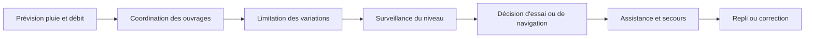
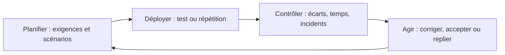

# Traitements, continuité et apprentissage

## Choisir un traitement

Le cours distingue les réponses qui évitent, réduisent, transfèrent ou acceptent un risque. Le choix dépend de la gravité, de la marge disponible, du coût de la mesure et de la possibilité de détecter l'écart avant le direct.

| Réponse | Question | Exemple analytique pour la cérémonie |
|---|---|---|
| Éviter | Peut-on supprimer l'exposition ? | Remplacer une séquence fluviale ou fermer un accès trop dangereux. |
| Réduire | Peut-on diminuer la probabilité ou l'impact ? | Tester la flotte, répartir les arrivées, stabiliser la ligne d'eau. |
| Transférer ou partager | Qui peut porter une partie du risque avec un contrat, une assurance ou un accord ? | Convention portuaire, prestation technique, accord avec les transporteurs. |
| Accepter sous contrôle | Le risque reste-t-il compatible avec les objectifs si une décision est explicite ? | Conserver un choix artistique controversable avec une veille et une réponse préparées. |
| Exploiter | L'incertitude peut-elle produire une amélioration ? | Utiliser les essais pour corriger l'ordre, les manœuvres et la signalétique. |

Une absence d'incident ne prouve pas qu'une réponse était optimale. L'analyse doit comparer l'événement observé, le contrôle documenté, le résultat et le risque qui reste possible.

## Défenses en profondeur

### Exemple du fleuve

La gestion du niveau d'eau combine plusieurs barrières.

La Cour des comptes décrit la surveillance, la coordination des ouvrages, l'arrêt temporaire du turbinage, la fiabilisation de barrages et un marché de travaux d'urgence. Elle rapporte aussi qu'aucun incident de navigation n'a été constaté pendant la cérémonie. Cette convergence est un bon cas de défense en profondeur. Elle ne permet pas d'attribuer la réussite à une seule barrière.[^1]

### Exemple des flux

Le contrôle d'accès n'est pas une barrière isolée. Il doit être relié au billet, à la rive, à la station, à la capacité de contrôle, aux agents, aux secours et aux réouvertures.

| Barrière | Fonction | Mode de défaillance | Mesure à surveiller |
|---|---|---|---|
| Billet et information | Orienter vers la bonne rive et la bonne station. | Version tardive ou lecture erronée. | Taux d'erreur et corrections diffusées. |
| Station et pont | Distribuer les arrivées. | Saturation ou fermeture non comprise. | Débit, densité et temps d'attente. |
| Contrôle | Empêcher une entrée interdite. | Débit trop faible ou exception bloquée. | Temps de contrôle, refus, interventions. |
| Agents et signalétique | Faire vivre la règle dans l'espace. | Consignes différentes ou relève insuffisante. | Brief, couverture de poste, escalade. |
| Secours | Rendre la zone praticable en cas d'incident. | Accès bloqué par le contrôle ou la foule. | Délai d'accès et chemin libre. |
| Réouverture | Permettre une sortie progressive. | Pic simultané ou service incomplet. | Courbe de sortie et disponibilité des lignes. |

Si plusieurs barrières dépendent du même message ou du même système, elles ne sont pas indépendantes. Une analyse sérieuse doit donc chercher les défaillances communes.

## Plans de continuité et repli

Les options de repli annoncées en avril 2024 comprennent une cérémonie limitée au Trocadéro et un retour au Stade de France. La source établit l'existence politique de ces options. Elle ne donne pas les seuils, la maturité, les contrats, les capacités ni les délais de bascule.[^2]

Il faut distinguer quatre niveaux de continuité.

| Niveau | Déclencheur | Action | Décision à définir |
|---|---|---|---|
| Ajustement | Écart local encore absorbable. | Modifier une cadence, un accès, un tableau ou un message. | Responsable de l'ajustement et délai de notification. |
| Repli partiel | Une fonction du parcours devient indisponible. | Supprimer ou déplacer une séquence. | Critère d'acceptation du nouveau format. |
| Repli de format | Le fleuve ou la sûreté ne permet plus la configuration prévue. | Passer au Trocadéro ou à un autre site. | Heure limite, contrats, public et signal. |
| Arrêt ou évacuation | Danger pour les personnes. | Interrompre, isoler ou évacuer. | Autorité d'arrêt, canal d'ordre et protection des secours. |

La bascule avant l'arrivée du public n'est pas une évacuation. Les deux décisions n'ont ni le même délai, ni les mêmes conséquences, ni les mêmes responsables. Le plan doit donc garder des procédures séparées.

## Scénarios de mode dégradé

| Scénario | Première conséquence | Réponse immédiate | Donnée qui manque pour valider |
|---|---|---|---|
| Débit trop élevé avant une répétition | Fenêtre d'apprentissage perdue. | Replanifier une séquence plus courte et capturer les écarts non testés. | Seuil de débit et capacité de répétition de remplacement. |
| Pluie continue le soir du spectacle | Sols, équipements et public exposés. | Protéger, ralentir, remplacer ou supprimer les éléments non sûrs. | Critères météo, inventaire de protection et autorité d'arrêt. |
| Station proche saturée | File déplacée vers la rue ou le contrôle. | Fermer, détourner et informer par un message commun. | Débit par station et temps de propagation de la consigne. |
| Panne d'un système d'accès | Vérification et information ralenties. | Basculer sur une procédure papier ou une équipe dédiée. | Temps de reprise et liste de fonctions prioritaires. |
| Erreur de protocole en direct | Dommage diplomatique visible. | Corriger factuellement, présenter des excuses et verrouiller la suite du script. | Source maîtresse et procédure de correction. |
| Sabotage d'une infrastructure distante | Déplacements d'agents et de spectateurs perturbés. | Réacheminer, prioriser les fonctions critiques et informer. | Liste des personnes indispensables et alternatives contractées. |

## Boucle PDCA adaptée

La boucle doit produire un objet vérifiable à chaque tour.

1. **Planifier.** Écrire l'exigence, le seuil, le propriétaire et la décision attendue.
2. **Déployer.** Tester dans une configuration proche du jour J, y compris les interfaces.
3. **Contrôler.** Enregistrer les écarts et les quasi-incidents, pas seulement les succès.
4. **Agir.** Corriger, réduire le périmètre, accepter avec justification ou déclencher un repli.
5. **Boucler.** Répéter jusqu'au gel, puis conserver le journal pour le retour d'expérience.

Les sources publiques montrent des tests et des répétitions, ainsi qu'une annulation liée au débit. Elles ne fournissent pas le registre complet des écarts ni les actions fermées. L'analyse doit donc proposer la boucle sans attribuer à Paris 2024 un usage documenté de PDCA.[^3]

## Indicateurs de pilotage proposés

Ces indicateurs sont des recommandations pour un projet similaire. Ils ne sont pas des résultats mesurés de la cérémonie.

| Domaine | Indicateur | Seuil de décision à définir |
|---|---|---|
| Fleuve | Écart de niveau, vitesse et position des bateaux | Aucune séquence ne démarre si la marge est sous le minimum validé. |
| Flotte | Retard cumulé et écart au cadencement | Une délégation en retard déclenche une procédure d'espacement. |
| Accès | Débit de contrôle, densité et temps d'attente | La station est dérivée avant la saturation physique. |
| Secours | Délai d'accès et chemin libre | Toute barrière qui bloque l'accès est levée ou contournée. |
| Technique | État des équipements protégés et signaux redondants | Un mode dégradé est activé avant la perte du signal. |
| Information | Version publiée et taux de correction | Un changement est envoyé sur tous les canaux concernés. |
| Réputation | Volume qualifié, menaces et portée des corrections | Une critique reste séparée d'une menace ou d'une manipulation. |
| Coûts | Engagements, réserves, coûts externes et réutilisation | Un changement sans financement identifié remonte à la gouvernance. |

## Apprentissage et clôture

La clôture doit répondre à trois questions différentes.

- Le spectacle a-t-il été livré ?
- Les contrôles ont-ils fonctionné selon des critères mesurés ?
- Le système a-t-il transféré un coût ou un risque vers des tiers ?

Le bilan public permet de répondre partiellement à la première question. Les autres exigent des données d'incidents, de flux, de délais, de coûts, d'accessibilité et de décisions. Un retour d'expérience qui ne conserve que « aucun incident majeur » perd précisément les écarts qui permettent d'améliorer le prochain projet.

## Notes

[^1]: [Pilotage du niveau d'eau et résultat de navigation](../context/04-meteo-seine-navigation-logistique.md#4-débit-et-ligne-deau-transformer-un-aléa-en-variable-pilotée).
[^2]: [Options de repli annoncées](../context/00-chronologie-perimetre.md#event-008).
[^3]: [Tests, pluie et boucle d'apprentissage](../context/04-meteo-seine-navigation-logistique.md#9-lecture-avec-les-méthodes-du-cours).
