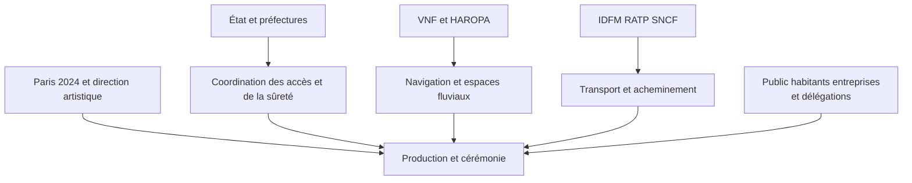

# Gouvernance et parties prenantes de la cérémonie d'ouverture

La cérémonie du 26 juillet 2024 réunit des autorités publiques, un organisateur sportif, une production artistique et des opérateurs qui conservent leurs missions propres. Le Gouvernement décrit le COJOP comme le pilote global des Jeux. Cela ne permet pas de lui attribuer toutes les compétences publiques de police, de navigation ou de transport. Niveau Direct pour sa mission ; la distinction des responsabilités est une règle de lecture du dossier.[^1]

Cette cartographie utilise les attributions explicites des sources, consultées le 29 septembre 2026. Elle n'est pas une matrice officielle des responsabilités. Une participation démontrée n'établit pas automatiquement qui approuvait une dépense, pouvait arrêter une opération ou supportait juridiquement un dommage. Ces questions nécessitent les contrats, arrêtés et délégations correspondant à l'action et à la date concernées.

## Registre des acteurs

Les événements `EVENT-*` sont définis dans la [chronologie](00-chronologie-perimetre.md). Les groupes réunis dans une même ligne sont un regroupement analytique ; ils ne constituent pas nécessairement une entité de commandement commune.

Le schéma résume les interfaces que les sources permettent de suivre. Les flèches représentent une relation documentée ou une dépendance explicitement analysable, pas une hiérarchie juridique complète.

La responsabilité d'une décision précise exige une pièce plus fine — contrat, arrêté, délégation ou journal de décision — que la seule présence d'un acteur dans ce schéma.

| Identifiant | Acteur | Rôle documenté dans le projet ou son cadre | Interfaces et limites |
|---|---|---|---|
| STAKE-001 | COJOP / Paris 2024 ; Tony Estanguet ; Thierry Reboul | Planifier, organiser, financer et livrer les Jeux. Thierry Reboul dirige les cérémonies et décrit le travail commun avec la direction artistique, les agences et les pouvoirs publics. Direct.[^1][^2] | [EVENT-002](00-chronologie-perimetre.md#EVENT-002), [EVENT-004](00-chronologie-perimetre.md#EVENT-004), [EVENT-016](00-chronologie-perimetre.md#EVENT-016). Le détail des délégations de signature internes n'est pas établi. |
| STAKE-002 | Comité international olympique, CIO | Partie au contrat de ville hôte. Tony Estanguet le cite parmi les interlocuteurs travaillant aux conditions de réalisation du concept fluvial en juillet 2021. Direct.[^1][^3] | [EVENT-003](00-chronologie-perimetre.md#EVENT-003). Aucun pouvoir de police territoriale ne lui est attribué dans cette note. La chaîne d'approbation détaillée des tableaux artistiques reste à établir. |
| STAKE-003 | Président de la République, Premier ministre et ministères | Le Conseil olympique et paralympique est présidé par le Président ; le comité interministériel l'est par le Premier ministre. Emmanuel Macron annonce publiquement les options de repli en avril 2024. Direct.[^1][^4] | [EVENT-008](00-chronologie-perimetre.md#EVENT-008). L'annonce politique ne démontre pas à elle seule la procédure opérationnelle d'activation. |
| STAKE-004 | Délégation interministérielle aux Jeux, DIJOP ; Michel Cadot | Coordination de l'action de l'État et liaison avec les partenaires. Le ministre de l'Intérieur identifie Michel Cadot pour la distribution des invitations avec les tiers de confiance. Direct.[^1][^5] | [EVENT-012](00-chronologie-perimetre.md#EVENT-012). Le suivi interministériel est distinct de la production artistique. |
| STAKE-005 | Préfecture de région Île-de-France / préfecture de Paris ; Marc Guillaume ; Cindy Léoni | Le préfet autorise le test nautique de juillet 2023. Cindy Léoni est explicitement chargée de coordonner l'organisation des cérémonies d'ouverture ; elle décrit les tests et la préparation fluviale. Direct.[^6][^7] | [EVENT-006](00-chronologie-perimetre.md#EVENT-006), [EVENT-009](00-chronologie-perimetre.md#EVENT-009), [EVENT-015](00-chronologie-perimetre.md#EVENT-015). Ne pas confondre PRIF et préfecture de police. |
| STAKE-006 | Préfecture de police de Paris ; Laurent Nuñez | Sécurisation, périmètres et contrôles d'accès à la cérémonie. Le bilan du ministère situe Laurent Nuñez à la conduite du dispositif. Direct.[^8] | [EVENT-014](00-chronologie-perimetre.md#EVENT-014), [EVENT-018](00-chronologie-perimetre.md#EVENT-018). Compétences à distinguer de celles du gestionnaire du fleuve et de l'organisateur. |
| STAKE-007 | Ville de Paris ; Anne Hidalgo ; Pierre Rabadan | Co-organisation de l'accueil sur les quais hauts et des invitations ; mise à disposition d'espaces portuaires par conventions avec HAROPA PORT et Paris 2024. Direct.[^9][^10] | [EVENT-010](00-chronologie-perimetre.md#EVENT-010), EVENT-012. Les pouvoirs de la maire ne sont pas assimilés à ceux du préfet de police. |
| STAKE-008 | Région Île-de-France, Métropole du Grand Paris, Seine-Saint-Denis et autres collectivités hôtes | Plusieurs collectivités siègent au conseil d'administration du COJOP. Leur participation institutionnelle est explicite. Direct.[^1] | EVENT-001, EVENT-004. Une présence au conseil ne prouve pas une responsabilité sur chaque opération de la cérémonie. |
| STAKE-009 | Voies navigables de France, VNF | Mobilisation du foncier et de la logistique fluviale. Pour le test de juillet 2023, VNF émet les avis à la batellerie prescrits par l'arrêté. Direct.[^6][^11] | EVENT-006, EVENT-015. La régulation documentaire de navigation ne signifie pas direction du spectacle. |
| STAKE-010 | HAROPA PORT | Mise à disposition du domaine public portuaire pour la cérémonie et les épreuves, au moyen de conventions d'occupation temporaire conclues avec Paris 2024 et Paris. Direct.[^10] | EVENT-010, EVENT-016. Les conventions complètes n'ont pas été obtenues ; leur existence ne révèle pas toutes les obligations financières. |
| STAKE-011 | DRIEAT Île-de-France | Thierry Reboul cite explicitement la DRIEAT dans l'équipe des organismes associés à la gestion du fleuve pour la cérémonie. Direct sur cette participation.[^2] | EVENT-006, EVENT-015. Le présent corpus ne permet pas d'attribuer à la DRIEAT seule la validation de chaque bateau ou décor. |
| STAKE-012 | Compagnies fluviales, armateurs, conducteurs et équipages | Participation aux tests de navigation, manœuvres et débarquement décrits par la PRIF. Les conducteurs doivent disposer du plan de circulation prévu par l'arrêté ministériel de juillet 2023. Direct.[^7][^12] | EVENT-006, EVENT-009, EVENT-015, EVENT-016. Inventaire exhaustif des exploitants et contrats de chaque bateau non obtenu. |
| STAKE-013 | Île-de-France Mobilités, RATP, SNCF et ministère chargé des Transports | IDFM établit les plans de transport franciliens. L'État, les opérateurs et les organisateurs préparent les acheminements en articulation avec la sécurité. Direct.[^9][^13] | EVENT-010, EVENT-012, EVENT-014. Autorité organisatrice et exploitants sont distincts ; ce regroupement facilite l'analyse des interfaces. |
| STAKE-014 | Thomas Jolly, direction artistique, créateurs et artistes | Jolly dirige artistiquement les cérémonies. Les crédits du scénographe identifient notamment Maud Le Pladec pour la danse, Victor Le Masne pour la musique, Emmanuelle Favre et Bruno de Lavenère pour la scénographie, Daphné Bürki pour le stylisme et Thomas Dechandon pour la lumière. Direct.[^14][^15] | EVENT-005, EVENT-016. Ces crédits établissent des fonctions créatives, pas un pouvoir autonome d'autoriser une installation sur l'espace public. |
| STAKE-015 | Paname 24 et prestataires de production | Havas Events, membre du dispositif, attribue à Paname 24 la production exécutive des deux cérémonies d'ouverture, incluant logistique et exécution. Direct, déclaration du prestataire.[^16] | EVENT-010, EVENT-016. Liste complète des lots, sous-traitants, assurances et responsabilités contractuelles non obtenue. |
| STAKE-016 | Olympic Broadcasting Services, OBS, et diffuseurs détenteurs de droits | OBS se présente comme diffuseur hôte et décrit la fourniture du signal international aux détenteurs de droits, avec une production spécifique pour l'ouverture. Direct.[^17] | EVENT-016. Distinguer captation du signal commun et émissions propres de chaque chaîne. Les contrats de diffusion ne sont pas reconstitués. |
| STAKE-017 | Athlètes, comités nationaux olympiques et délégations | Les délégations participent à la parade. En juillet 2024, le SGAE annonce leur embarquement sur 85 bateaux ; cette annonce est un état préparatoire. Direct.[^18] | EVENT-015, EVENT-016. Le nombre total d'athlètes inscrits aux Jeux n'est pas le nombre effectivement embarqué. |
| STAKE-018 | Spectateurs, habitants, entreprises, bouquinistes et usagers du fleuve | Les dispositifs d'accès modifient leurs déplacements. Le Conseil d'État précise les droits des personnes résidant ou travaillant habituellement dans le périmètre. Les transporteurs céréaliers négocient aussi la durée d'interruption de navigation. Direct.[^19][^20] | EVENT-007, EVENT-010, EVENT-013, EVENT-014. Les personnes concernées ne sont pas seulement des spectateurs ou des destinataires de communication. |
| STAKE-019 | Sapeurs-pompiers, secours et associations agréées de sécurité civile | Le bilan de l'Intérieur confirme l'engagement de pompiers et de bénévoles des associations agréées avec les forces de sécurité. Direct.[^8] | EVENT-016, EVENT-018. Les plans médicaux, capacités hospitalières et chaînes de décision sanitaire propres à la cérémonie ne sont pas détaillés ici. |
| STAKE-020 | Police, gendarmerie, unités spécialisées et Armées | Le Conseil des ministres annonce les forces de sécurité intérieure, GIGN, RAID, BRI, plongeurs-démineurs et un dispositif de sûreté aérienne sous autorité du ministère des Armées. Direct.[^9] | EVENT-014, EVENT-016, EVENT-018. Les forces et les chaînes civiles ou militaires ne sont pas fusionnées dans cette cartographie. |

## Relations et décisions que les sources permettent de suivre

La préparation du test de juillet 2023 fournit un exemple concret de coordination. Paris 2024 dépose une demande ; l'arrêté du préfet mentionne les avis de HAROPA, de VNF et du préfet de police. Il prescrit ensuite des mesures au COJOP et à VNF. Cette séquence établit une interface documentée entre organisateur, propriétaire ou gestionnaire d'espaces et autorités publiques. Elle ne prouve pas que le même circuit s'appliquait à toutes les décisions de juillet 2024. Niveau Direct pour le test ; l'extension à d'autres opérations reste inconnue.[^6]

L'accueil du public montre une autre relation. Au 26 juin, le Gouvernement nomme l'État, Paris et Paris 2024 comme co-organisateurs de l'attribution des invitations gratuites. Les plans de transport sont préparés avec IDFM, la RATP et la SNCF, puis articulés avec les périmètres définis par le préfet de police. Il est donc possible d'étudier des dépendances entre invitation, accès physique et acheminement, sans inventer une autorité unique chargée de l'ensemble. Niveau Direct pour les rôles ; la lecture en dépendances est analytique.[^9]

| Objet de coordination | Relation effectivement documentée | Question restant ouverte |
|---|---|---|
| Navigation d'essai | Demande COJOP, avis techniques et de sécurité, autorisation préfectorale, information des usagers par VNF.[^6] | Quelle procédure complète de réception a été appliquée à la flotte du jour J ? |
| Occupation portuaire | Conventions entre HAROPA PORT, Paris 2024 et la Ville.[^10] | Quels lots, obligations de remise en état et transferts de risque figurent dans chaque convention ? |
| Spectacle et espace public | Thierry Reboul décrit une préparation commune entre production, art, Ville, État et gestionnaires fluviaux.[^2] | Qui approuve chaque modification tardive, à quel seuil et avec quelle trace ? |
| Transport et sécurité | Plans élaborés avec les opérateurs et articulés avec les périmètres.[^9][^13] | Quels indicateurs et seuils ont conduit à modifier les flux le 26 juillet ? |
| Continuité économique du fleuve | La PRIF annonce un accord avec la profession céréalière et VNF sur les interruptions et les horaires d'écluses.[^20] | Quel bilan mesuré des pertes, reports de trafic et compensations ? |

## Éléments soutenus, inférences et inconnus

Les sources indiquent fortement que la coordination a reposé sur plusieurs interfaces opérationnelles. Cette lecture s'appuie sur l'autorisation du test, les conventions portuaires et la préparation des transports. Elle est classée Soutenu. Elle ne doit pas devenir l'affirmation selon laquelle Paris 2024 aurait officiellement utilisé une organisation « matricielle », une méthode agile ou une matrice RACI précise.[^6][^10][^13]

Il est probable qu'une modification tardive d'une installation ait nécessité de réexaminer ses effets sur les accès, la navigation et la captation. Cette inférence suit la coexistence de ces usages sur les mêmes espaces. Aucun registre public de demandes de changement n'a été trouvé pour mesurer leur fréquence ou leur coût.

Une incohérence mérite d'être conservée dans le dossier. La page commerciale d'Havas Events attribue au CIO l'ensemble des décisions créatives et du choix des artistes, tandis que d'autres sources identifient la direction artistique de Thomas Jolly et l'équipe du COJOP. Ces formulations peuvent décrire des niveaux différents d'approbation, ou une simplification éditoriale. Les contrats et procédures nécessaires pour trancher ne sont pas disponibles dans ce corpus. La note retient uniquement la production exécutive explicitement revendiquée par Paname 24 ; elle n'attribue pas au CIO un contrôle artistique exclusif. Niveau Inconnu sur la chaîne complète d'approbation.[^16][^2][^15]

Les contrats de production, les procès-verbaux des comités, le journal des décisions du jour J, les délégations de signature, la liste complète des prestataires et les critères d'arrêt du spectacle restent à rechercher. La documentation consultée suffit pour identifier les principales parties prenantes et plusieurs interfaces. Elle ne suffit pas pour attribuer une responsabilité juridique en cas d'incident hypothétique.

## Notes

[^1]: Gouvernement, « Les acteurs des Jeux de Paris 2024 », 5 janvier 2024, modification du 27 novembre 2025, sections État, COJOP et collectivités, [page](https://www.info.gouv.fr/grand-dossier/jeux-olympiques-et-paralympiques-2024/les-acteurs-des-jeux-de-paris-2024). Consulté le 29 septembre 2026.
[^2]: Préfecture d'Île-de-France, « Interview de Thierry Reboul, directeur des cérémonies des JOP de Paris 2024 », mise à jour le 24 juillet 2024, [page](https://www.prefectures-regions.gouv.fr/ile-de-france/Region-et-institutions/L-action-de-l-Etat/Jeux-olympiques-et-paralympiques-de-Paris-2024-JOP-2024/Interview-de-Thierry-Reboul-directeur-des-ceremonies-des-JOP-de-Paris-2024). Consulté le 29 septembre 2026.
[^3]: Rachel Pretti et Jean-Philippe Leclaire, L'Équipe, « Paris 2024 : une cérémonie d'ouverture des JO sur la Seine », 24 juillet 2021, entretien Macron-Estanguet, [article](https://www.lequipe.fr/Tous-sports/Actualites/Paris-2024-une-ceremonie-d-ouverture-des-jo-sur-la-seine/1272681). Consulté le 29 septembre 2026.
[^4]: Élysée, « J-100 Paris 2024 : Interview du Président Emmanuel Macron sur RMC et BFMTV », 15 avril 2024, passage sur les options de repli, [transcription](https://www.elysee.fr/emmanuel-macron/2024/04/15/j-100-paris-2024-interview-du-president-emmanuel-macron-sur-rmc-et-bfmtv). Consulté le 29 septembre 2026.
[^5]: Sénat, commission des lois, audition du 5 mars 2024, passage sur Michel Cadot et les tiers de confiance, [compte rendu](https://www.senat.fr/compte-rendu-commissions/20240304/lois.html). Consulté le 29 septembre 2026.
[^6]: Préfecture de Paris, arrêté no 75-2023-07-13-00001, 13 juillet 2023, recueil no 75-2023-390, pages 10-14, [PDF](https://www.prefectures-regions.gouv.fr/irecontenu/telechargement/107572/680591/file/recueil-75-2023-390-recueil-des-actes-administratifs-special%20du%2013.07.2023.pdf). Consulté le 29 septembre 2026. Portée limitée au test autorisé.
[^7]: Préfecture d'Île-de-France, « Coordination de l'organisation des cérémonies d'ouverture des JOP 2024 pour Paris », entretien avec Cindy Léoni, mise à jour le 24 juillet 2024, [page](https://www.prefectures-regions.gouv.fr/ile-de-france/Region-et-institutions/L-action-de-l-Etat/Jeux-olympiques-et-paralympiques-de-Paris-2024-JOP-2024/Coordination-de-l-organisation-des-ceremonies-d-ouverture-des-JOP-2024-pour-Paris). Consulté le 29 septembre 2026.
[^8]: Ministère de l'Intérieur, « Plan A : ils l'ont fait ! », 1er août 2024, [bilan](https://www.interieur.gouv.fr/actualites/grands-dossiers/a-linterieur-des-jeux-olympiques-et-paralympiques-de-paris-2024/plan-a). Consulté le 29 septembre 2026.
[^9]: Gouvernement, « Compte rendu du Conseil des ministres du 26 juin 2024 », communication sur les Jeux, [page](https://www.info.gouv.fr/conseil-des-ministres/compte-rendu-du-conseil-des-ministres-du-26-06-2024). Consulté le 29 septembre 2026.
[^10]: HAROPA PORT, « JOP 2024 : 100% de la Seine dédiés aux Jeux Olympiques et Paralympiques à Paris », 26 juillet 2024, [communiqué](https://www.haropaport.com/fr/espace-presse/100-de-la-seine-dedies-aux-jeux-olympiques-et-paralympiques-paris). Consulté le 29 septembre 2026.
[^11]: VNF, *Tour d'horizon 2022 / 2023, Bassin de la Seine et Loire aval*, page PDF 9, encadré sur la cérémonie, [rapport](https://www.vnf.fr/vnf/app/uploads/2023/09/Tour-d%E2%80%99horizon-2022-2023_VNF-Bassin-de-la-Seine-et-Loire-aval.pdf). Consulté le 29 septembre 2026.
[^12]: Ministère chargé des Transports, arrêté du 11 juillet 2023, articles 1-2, [Légifrance](https://www.legifrance.gouv.fr/jorf/id/JORFTEXT000047812180). Consulté le 29 septembre 2026.
[^13]: Gouvernement et partenaires des mobilités, dossier du 13 juin 2024, fichier `20240613_dp_mobilites_jop24.pdf`, pages 4-5 et 7-12, [PDF](https://www.ecologie.gouv.fr/sites/default/files/documents/20240613_dp_mobilites_jop24.pdf). Consulté le 29 septembre 2026.
[^14]: Ville d'Angers, *Vivre à Angers*, no 450, novembre 2022, pages 20-21, [PDF](https://www.angers.fr/uploads/tx_pdfbox/pdf-interactif_vaa-450.pdf). Consulté le 29 septembre 2026.
[^15]: Bruno de Lavenère, « Cérémonie d'ouverture des Jeux olympiques, Paris 2024 », portfolio professionnel, date de publication non indiquée, liste des crédits, [page](https://www.brunodelavenere.com/portfolio/ceremonie-douverture-des-jeux-olympiques-paris-2024/). Consulté le 29 septembre 2026.
[^16]: Havas Events, « Paris 2024 Olympic and Paralympic Games », date non indiquée, section « Paname 24 », [page](https://havasevents.com/project/paris-2024-olympic-and-paralympic-games/). Consulté le 29 septembre 2026. Communication du prestataire, non contrat public.
[^17]: Olympic Broadcasting Services, *Broadcasting the Olympic Games*, présentation média de juin 2024, pages PDF 4, 11 et 17, [PDF](https://www.obs.tv/prx/asset.php?gen=1&tgt=27062024-June-OBSMediaKit-Paris2024-EN-32af8e033065.pdf). Consulté le 29 septembre 2026. Titres des sections sur le diffuseur hôte, le signal international et la cérémonie.
[^18]: Secrétariat général des affaires européennes, « La Cérémonie d'ouverture des Jeux olympiques de Paris, c'est aujourd'hui ! », texte relatif au 26 juillet 2024, date éditoriale distincte non affichée, [page](https://sgae.gouv.fr/sites/SGAE/accueil/a-propos-du-sgae/archives/la-ceremonie-douverture-des-jeux.html). Consulté le 29 septembre 2026.
[^19]: Conseil d'État, décision no 494485, 15 juillet 2024, points 4-7, [Légifrance](https://www.legifrance.gouv.fr/ceta/id/CETATEXT000050045949). Consulté le 29 septembre 2026.
[^20]: Préfecture d'Île-de-France, « JO : accord entre la préfecture et la profession céréalière pour la circulation des barges sur Seine », mise à jour le 16 février 2024, section sur l'interruption de navigation et les écluses, [page](https://www.prefectures-regions.gouv.fr/ile-de-france/Region-et-institutions/L-action-de-l-Etat/Jeux-olympiques-et-paralympiques-de-Paris-2024-JOP-2024/JO-accord-entre-la-prefecture-et-la-profession-cerealiere-pour-la-circulation-des-barges-sur-Seine). Consulté le 29 septembre 2026.
