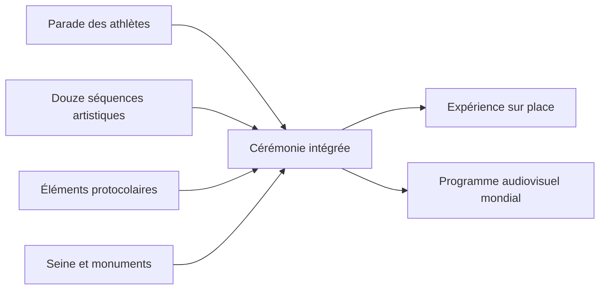
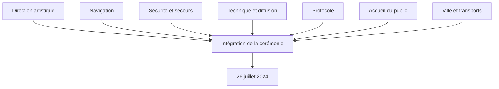

# Conception artistique et transformation de la ville en scène

## Périmètre de cette note

Cette note décrit le concept artistique de la cérémonie d'ouverture olympique du 26 juillet 2024 et les contraintes de projet créées par ce concept. Elle ne cherche pas encore à juger les controverses ni à établir le registre complet des risques. Ces sujets feront l'objet de notes séparées.

## Une rupture de périmètre

Le choix structurant consistait à faire sortir la cérémonie du stade et à utiliser la Seine et les monuments de Paris comme décor, parcours et espace de représentation. La Ville de Paris présente l'événement comme la première cérémonie d'ouverture olympique organisée hors d'un stade. Le parcours devait suivre environ six kilomètres entre le pont d'Austerlitz et le Trocadéro.[^1]

Cette décision ne constitue pas un simple changement de lieu. Elle transforme la nature du projet.

| Dimension | Cérémonie en stade | Cérémonie sur la Seine |
|---|---|---|
| Périmètre | Enceinte compacte | Corridor urbain de six kilomètres |
| Public | Accès par quelques portes contrôlées | Quais bas, quais hauts, ponts, riverains et espaces périphériques |
| Scène | Plateau central maîtrisé | Fleuve, ponts, monuments, toits et installations distribuées |
| Athlètes | Défilé à pied | Transport collectif par bateaux |
| Technique | Réseaux concentrés | Son, lumière, vidéo et communications répartis le long du parcours |
| Sécurité | Périmètre fermé | Plusieurs périmètres et interfaces avec la ville active |
| Répétition | Accès prolongé à l'enceinte possible | Répétitions contraintes par la navigation, la confidentialité et l'espace public |
| Météo | Protection partielle | Exposition directe à la pluie, au vent et aux variations du fleuve |
| Diffusion | Caméras orientées vers un espace délimité | Réalisation audiovisuelle mobile sur plusieurs kilomètres |

> **Analyse.** Le concept artistique agrandit le système à maîtriser. Il augmente le nombre d'interfaces entre création, navigation, sécurité, mobilité, protocole, diffusion et espace public. Il augmente aussi la valeur potentielle du projet en donnant à la ville un rôle que le stade ne pouvait pas offrir.

## Promesse et objectifs artistiques

La documentation officielle décrit plusieurs objectifs liés.

- Placer les athlètes au centre de la cérémonie.
- Montrer Paris, ses monuments et son patrimoine au public mondial.
- Ouvrir la cérémonie à un public plus large qu'un stade.
- Mélanger parade, création artistique et éléments protocolaires.
- Produire un récit de la France contemporaine à travers plusieurs périodes, styles et disciplines.[^1][^2]

Le document d'information olympique destiné aux fédérations distinguait trois composantes : la parade des athlètes sur six kilomètres, les performances artistiques réparties sur les barges et les ponts, puis les éléments protocolaires autour du Trocadéro et du pont d'Iéna.[^3]

Cette intégration crée une contrainte de synchronisation. La parade ne sert pas d'interlude entre deux spectacles. Elle constitue une partie du spectacle. Un retard de navigation, une interruption technique ou une modification protocolaire peut donc affecter plusieurs composantes à la fois.

## Direction artistique

Paris 2024 a nommé Thomas Jolly directeur artistique des cérémonies olympiques et paralympiques en 2022. La Ville indiquait alors qu'il devait constituer une équipe pluridisciplinaire et développer un projet destiné à produire des images propres à Paris 2024.[^4]

Dans un entretien de février 2024, Thomas Jolly explique que le travail a commencé par la réunion d'auteurs et d'autrices provenant d'univers différents. L'équipe a parcouru les quais, navigué sur la Seine et travaillé dans une salle d'écriture. Il décrit la cérémonie comme une représentation de la France à un moment donné, fondée sur sa multiplicité et sur l'histoire visible le long du fleuve.[^5]

Cette méthode révèle plusieurs activités de conception :

1. observation du lieu réel ;
2. exploration des possibilités de navigation et de mise en scène ;
3. écriture collective du récit ;
4. sélection des monuments et séquences ;
5. traduction du récit en performances, musique, costumes et images télévisées ;
6. intégration avec les contraintes techniques et de sécurité.

> **Niveau de preuve.** Les étapes 1 à 3 sont directement soutenues par l'entretien. Les étapes 4 à 6 décrivent la logique nécessaire à une production de cette nature, mais cette note ne prétend pas qu'elles correspondent aux noms exacts des processus internes de Paris 2024.

## Architecture du spectacle

Les documents publiés avant la cérémonie annonçaient douze tableaux ou séquences artistiques le long du parcours. Le dernier ensemble autour du Trocadéro et de la tour Eiffel devait réunir les séquences protocolaires et artistiques finales.[^1]

Le rapport officiel postérieur aux Jeux décrit une cérémonie intitulée « Ça ira », composée de douze séquences. Il indique que la pluie a renforcé la dimension dramatique de la représentation et que le spectacle associait la parade, les composantes artistiques et le protocole. Le fleuve formait l'axe de la cérémonie. Un porteur de flamme masqué reliait les différentes séquences.[^2]

| Élément de conception | Fonction dans le récit | Dépendances de projet |
|---|---|---|
| Seine | Axe spatial et mouvement de la parade | Navigation, niveau du fleuve, sécurité, communication |
| Monuments | Décor et références historiques | Autorisations, visibilité, éclairage, préservation |
| Bateaux | Transport et scène mobile | Ordonnancement, embarquement, capacité, vitesse, manœuvre |
| Ponts et quais | Lieux de performance et de public | Charge, accès, barriérage, évacuation, technique |
| Porteur masqué | Fil narratif | Continuité audiovisuelle, coordination des séquences |
| Écrans et sonorisation | Continuité pour le public réparti | Énergie, synchronisation, latence, météo |
| Réalisation télévisée | Expérience du public mondial | Caméras, liaisons, conduite, droits et coordination |
| Trocadéro | Concentration du protocole final | Accréditations, chefs d'État, timing, sécurité renforcée |

## Évolution des chiffres de production

Les chiffres publics ne décrivent pas toujours le même objet. Ils doivent être datés et définis.

| Source et moment | Chiffre publié | Interprétation prudente |
|---|---:|---|
| Ville de Paris, juillet 2024 | près de 160 bateaux, dont 85 bateaux d'athlètes | Ensemble annoncé des embarcations nécessaires, pas seulement la parade des délégations[^1] |
| Magazine municipal, juin 2024 | 94 bateaux | Prévision plus proche de l'événement, périmètre non détaillé dans l'extrait public[^6] |
| Bilan officiel post-Jeux | 85 bateaux | Flottille effective décrite pour la parade olympique[^2] |
| Bilan officiel post-Jeux | 205 délégations et 6 800 athlètes présents | Participation effective indiquée dans le rapport[^2] |
| Communication préalable | près de 10 500 athlètes et 206 délégations | Population olympique attendue ou concernée, pas nécessairement tous les participants effectifs à la parade[^1] |

Ces écarts ne prouvent pas une mauvaise planification. Ils peuvent venir d'une évolution du dispositif, d'une différence entre capacité et participation, ou d'un périmètre de comptage différent. Une analyse fiable doit conserver les définitions au lieu de choisir le chiffre qui semble le plus spectaculaire.

## Chiffres de réalisation publiés après les Jeux

Le rapport officiel de Paris 2024 fournit plusieurs mesures de réalisation :

- 85 bateaux ;
- 205 délégations et 6 800 athlètes présents ;
- 124 tribunes le long des six kilomètres ;
- 20 000 m² d'installations terrestres ;
- 71 écrans géants ;
- 24,4 millions de téléspectateurs en France.[^2]

Ces chiffres donnent une idée de l'ampleur opérationnelle, mais ils ne suffisent pas à reconstituer les ressources internes, le budget propre à la cérémonie, le nombre de répétitions ou les chaînes de responsabilité. Ces éléments doivent être documentés séparément.

## La pluie comme test du concept

La cérémonie s'est déroulée sous une pluie intense. Le rapport officiel l'intègre à son récit en indiquant que la pluie a renforcé la dimension dramatique du spectacle.[^2] Cette formulation décrit le résultat artistique perçu par l'organisateur. Elle ne permet pas de conclure que la pluie ne créait aucun problème opérationnel.

Il faut distinguer :

- la continuité globale du spectacle ;
- l'expérience des spectateurs exposés ;
- les conditions de travail des artistes et techniciens ;
- les effets sur les costumes, surfaces et équipements ;
- la qualité de certaines séquences audiovisuelles ;
- les risques électriques et de glissade ;
- les mesures de protection ou d'adaptation réellement déployées.

Le fait que la cérémonie ait continué constitue un résultat observable. L'efficacité de chaque mesure météorologique doit encore être établie par des sources.

## Exigences contradictoires

Le concept devait satisfaire des exigences qui ne s'alignent pas spontanément.

| Exigence | Tension associée |
|---|---|
| Ouvrir la cérémonie au plus grand nombre | Augmente le périmètre à contrôler |
| Garder le contenu secret | Limite les répétitions complètes et la circulation d'information |
| Placer les athlètes au centre | Impose de coordonner leur transport avec le spectacle |
| Montrer toute la ville | Disperse les installations et les équipes |
| Protéger les personnes et les chefs d'État | Crée des restrictions d'accès et de circulation |
| Produire un récit artistique audacieux | Expose à des interprétations culturelles et politiques divergentes |
| Assurer une expérience locale | Doit rester compatible avec la réalisation télévisée mondiale |
| Préserver le patrimoine | Limite certaines installations et interventions |

Ces tensions constituent des risques de conception. Elles demandent des arbitrages. Par exemple, une mesure de sécurité peut réduire la proximité avec le public. Une adaptation à la pluie peut modifier un costume ou une chorégraphie. Une séquence claire sur place peut être difficile à comprendre à l'écran, et inversement.

## Analyse de management de projet

### Caractère novateur

La cérémonie comportait peu de précédents directement comparables. Cette nouveauté augmente l'incertitude sur les interfaces, les durées, les réactions du public et les besoins techniques. Elle rend les prototypes, essais locaux, simulations et répétitions particulièrement importants.

### Intégration

Le produit final dépendait d'une intégration entre sous-projets :

La direction artistique ne pouvait pas finaliser seule la cérémonie. Chaque décision spatiale ou temporelle devait rester compatible avec les contraintes des autres sous-systèmes.

### Critères possibles de réussite

Les objectifs publics permettent de proposer des critères d'analyse, sans prétendre reproduire les indicateurs internes de Paris 2024.

| Objectif public | Indicateur observable possible |
|---|---|
| Placer les athlètes au centre | Part de la cérémonie où la parade reste visible et intégrée |
| Ouvrir à un large public | Nombre et répartition des spectateurs, accessibilité réelle |
| Montrer Paris | Utilisation lisible des monuments et du parcours |
| Produire des images uniques | Couverture internationale et mémorisation des séquences |
| Assurer le protocole | Exécution des étapes olympiques obligatoires |
| Maintenir la continuité | Nombre et gravité des interruptions |
| Garantir la sécurité | Incidents, accès des secours et respect des périmètres |

## Points encore inconnus

Les sources consultées ne permettent pas encore d'établir avec précision :

- le budget propre à la cérémonie olympique ;
- la structure contractuelle complète des prestataires artistiques et techniques ;
- le nombre total de répétitions et leur couverture fonctionnelle ;
- les critères formels utilisés pour arbitrer entre création et sécurité ;
- les scénarios météorologiques détaillés et seuils de modification ;
- les changements de dernière minute provoqués par la pluie ;
- les incidents techniques internes sans effet visible sur la diffusion.

Ces absences doivent rester visibles dans la base de connaissances.

## Références

[^1]: Ville de Paris, « La Seine, superstar de la cérémonie d'ouverture des Jeux de Paris 2024 », mise à jour du 22 juillet 2024, https://www.paris.fr/pages/la-seine-superstar-de-la-ceremonie-d-ouverture-des-jeux-de-paris-2024-19965, consulté le 29 septembre 2026.
[^2]: Paris 2024, *Official Report of the Paris 2024 Olympic and Paralympic Games*, section « Ça ira: a grandiose ceremony with 12 artistic sequences », p. 30, bibliothèque du CIO, https://library.olympics.com/digitalCollection/DigitalCollectionAttachmentDownloadHandler.ashx?documentId=3702240&parentDocumentId=3598869&skipCopyright=true&skipWatermark=true, consulté le 29 septembre 2026.
[^3]: Paris 2024, guide d'information destiné aux fédérations internationales, section « Ceremonies », p. 47, bibliothèque du CIO, https://library.olympics.com/digitalCollection/DigitalCollectionAttachmentDownloadHandler.ashx?documentId=3459714&parentDocumentId=3459678&skipCopyright=true&skipWatermark=true, consulté le 29 septembre 2026.
[^4]: Ville de Paris, « Thomas Jolly pilotera les cérémonies des Jeux de Paris 2024 », 21 septembre 2022, https://www.paris.fr/pages/thomas-jolly-aux-commandes-des-ceremonies-des-jeux-de-paris-2024-22065, consulté le 29 septembre 2026.
[^5]: France Inter, « Thomas Jolly : “Je crois qu'il n'y a pas de populaire sans exigence” », 27 février 2024, https://www.radiofrance.fr/franceinter/podcasts/grand-canal/grand-canal-du-mardi-27-fevrier-2024-3703142, consulté le 29 septembre 2026.
[^6]: Ville de Paris, *À Paris, hors-série été 2024 : Ouvrir grand les Jeux*, juin 2024, https://cdn.paris.fr/paris/2024/06/19/ac240050-a-paris-85-mag-bat-v2-7-v6wN.pdf, consulté le 29 septembre 2026.
