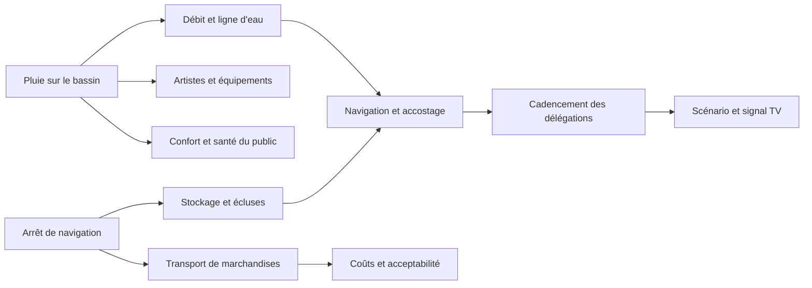
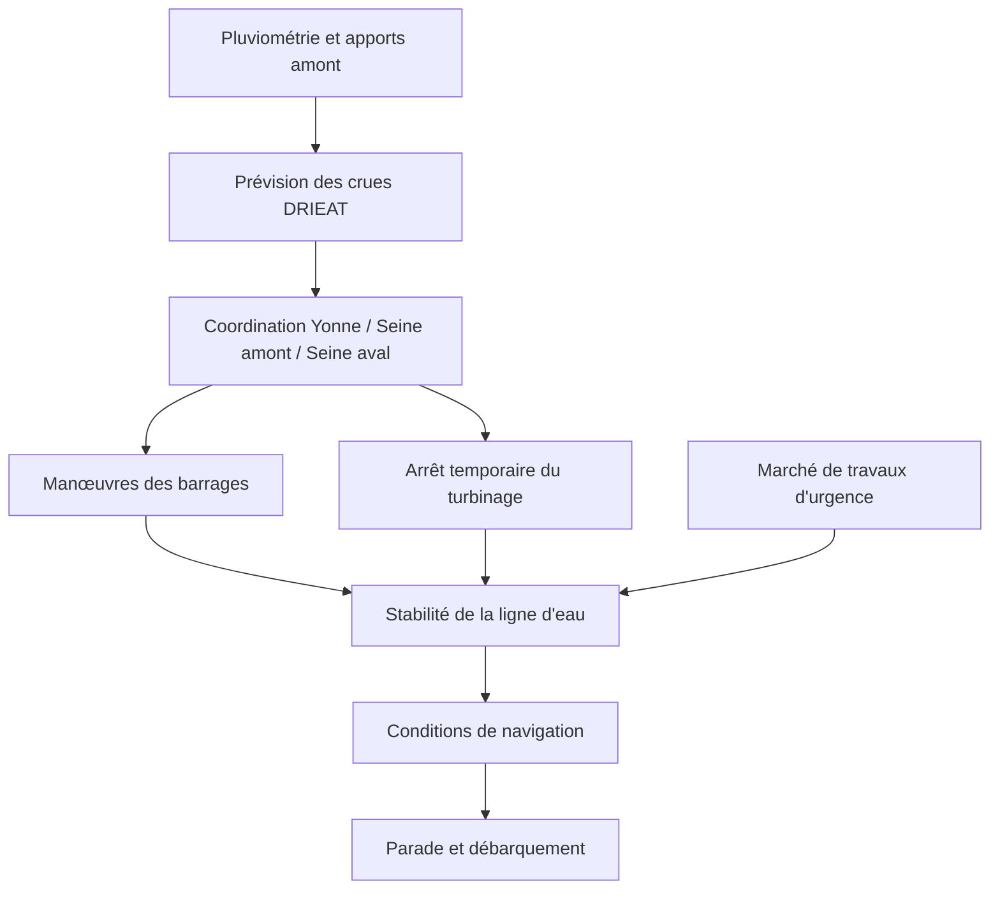

# Météo, Seine, navigation et logistique fluviale

Cette note examine la cérémonie d’ouverture du 26 juillet 2024 comme un système **météo–fleuve–flotte–spectacle–activité économique**. Elle ne traite pas la pluie comme un simple décor : les précipitations, le débit et la hauteur d’eau peuvent affecter les répétitions, la manœuvrabilité, les installations, l’image télévisée, les artistes, le public et le calendrier de décision. Les sources sont consultées le 29 septembre 2026.

> **Règle de preuve.** Les chiffres de préparation décrivent ce qui était prévu à une date donnée. Les bilans postérieurs décrivent ce qui a été observé ou revendiqué après l’événement. Un résultat favorable ne prouve pas, à lui seul, qu’une mesure particulière en est la cause.

## 1. Pourquoi la Seine change la nature du projet

Une cérémonie en stade utilise une enceinte conçue pour concentrer le public, contrôler les accès, distribuer l’énergie et protéger une scène relativement fixe. Ici, le « site » était un corridor urbain d’environ six kilomètres, entre le pont d’Austerlitz et le pont d’Iéna, complété par des lieux de spectacle et de protocole. La Préfecture de région décrivait 85 bateaux de délégations, presque autant d’embarcations d’encadrement, d’assistance, de cadencement ou de captation, et près de 200 embarcations présentes avec les décors.[^1]

Cette configuration crée plusieurs interfaces critiques :

- les bateaux doivent rester dans un ordre et un rythme compatibles avec le scénario et la retransmission ;
- les conducteurs doivent réaliser des manœuvres parfois inhabituelles, notamment après le débarquement au pont d’Iéna ;
- les éléments de décor réduisent ou modifient localement les espaces de navigation ;
- la ligne d’eau doit rester compatible avec les ponts, les quais, les accostages et la stabilité des installations ;
- le fleuve reste un axe économique majeur qu’il n’est pas possible de neutraliser sans effets sur les transporteurs, passagers, céréaliers, ports et entreprises riveraines ;
- une pluie affecte simultanément les surfaces, les équipements, les interprètes, le public, les caméras et le débit en amont.

La Seine représente, selon VNF, 40 à 50 % du trafic fluvial national de marchandises et 80 % de l’activité de transport de passagers. Ces chiffres institutionnels définissent l’ordre de grandeur de la dépendance économique ; ils ne mesurent pas la perte imputable à la seule cérémonie.[^2]

## 2. Préparation et apprentissage par les essais

La navigation n’a pas été validée en une seule fois. Un premier test a eu lieu en juillet 2023, puis un deuxième le 17 juin 2024. À quelques jours de la cérémonie, la Préfecture de région annonçait encore trois répétitions avec l’ensemble des bateaux.[^1] Les essais couvraient notamment :

- l’amarrage et le départ ;
- l’**évitage**, c’est-à-dire la manœuvre permettant à un bateau de changer de direction ;
- le suivi du parcours et le maintien du cadencement ;
- le contournement des décors positionnés sur la Seine ;
- le débarquement après le pont d’Iéna ;
- l’accostage puis le redémarrage vers l’aval dans une configuration inhabituelle pour les conducteurs parisiens.[^1]

Le deuxième test a été présenté par la Préfecture comme montrant des progrès par rapport au premier. Cette appréciation prouve une boucle d’apprentissage déclarée ; elle ne fournit ni critères d’acceptation, ni taux d’écart, ni liste publique des défauts corrigés. Il faut donc éviter d’affirmer que les organisateurs ont employé une méthode précise — agile, AMDEC ou autre — sans document interne.

Une répétition en flotte complète prévue le 24 juin a été annulée en raison du débit trop élevé, selon *Le Parisien*.[^3] Le fait important pour l’analyse de projet n’est pas seulement l’annulation. Il s’agit du couplage entre :

1. une fenêtre de répétition limitée ;
2. un aléa hydrologique non commandable ;
3. un grand nombre d’équipages et d’interfaces ;
4. des configurations artistiques encore à éprouver ;
5. une date d’événement immuable.

Ce couplage transforme la météo en risque de calendrier et d’intégration. Il est raisonnable d’inférer que la suppression d’un essai réduit la marge disponible pour observer et corriger les écarts. En revanche, les sources publiques ne permettent pas de mesurer le retard, les tâches replanifiées ou le niveau officiel de risque résiduel.

## 3. La pluie du 26 juillet : fait observé et effets possibles

Météo-France qualifie la pluie de continue pendant la cérémonie. Entre le vendredi soir et le samedi, environ 15 mm sont tombés sur Paris, soit l’équivalent d’une semaine de précipitations parisiennes en juillet.[^4] Son bilan mensuel ajoute que les pluies ont été parfois soutenues.[^5]

Ce constat doit être séparé de deux autres questions :

- **la prévision disponible avant l’événement**, qui peut modifier les protections ou le déroulé ;
- **les conséquences réelles**, qui exigent des observations sur les personnes, le matériel et les séquences.

La pluie pouvait théoriquement produire les effets suivants. Le tableau classe ces relations comme risques analytiques, sauf lorsqu’une source établit le résultat.

| Objet exposé | Mécanisme de défaillance plausible | Effet projet | Indicateur ou contrôle pertinent | Statut public connu |
|---|---|---|---|---|
| Artistes et danseurs | Sol ou pont glissant, refroidissement, costume alourdi | Blessure, qualité réduite, suppression de mouvement | Adhérence, température ressentie, décision du responsable de séquence | Exposition certaine ; bilan détaillé non public |
| Instruments, son, lumière et vidéo | Infiltration, court-circuit, connectique humide, protection optique | Perte de signal ou de tableau | Indice de protection, redondance, essais sous pluie | Mesures techniques détaillées non publiques |
| Spectateurs | Inconfort, hypothermie légère, mouvements de foule vers les abris | Santé, satisfaction, flux non prévus | Postes de secours, observation de densité, messages au public | Pluie établie ; effets agrégés non isolés publiquement |
| Bateaux et équipages | Visibilité dégradée, surfaces glissantes, vent/pluie | Manœuvre plus difficile, retard, chute | Vitesse, distances, équipage d’assistance | Aucun incident de navigation constaté selon la Cour[^6] |
| Captation | Gouttes sur objectifs, contraste réduit, plans inutilisables | Qualité du signal mondial | Caméras de rechange, housses, nettoyage | Le signal a été produit ; incidentologie non publiée |
| Scénographie | Eau sur décors, tissus, éléments mobiles | Déformation, panne, image différente du prévu | Inspections, drainage, tolérances météo | Détails publics insuffisants |
| Planning | Adaptations tardives, temps de protection, changements d’ordre | Pression sur les équipes et décisions | Journal de changements, heure de gel | Journal interne non obtenu |

L’événement ayant été mené à son terme, la pluie n’a pas déclenché un abandon global. Cela ne signifie pas qu’elle était sans effet, ni que tous les traitements avaient été dimensionnés pour 15 mm. L’absence de registre public des incidents artistiques et techniques empêche d’établir une performance « sans défaillance ».

## 4. Débit et ligne d’eau : transformer un aléa en variable pilotée

Le débit du fleuve ne peut pas être supprimé, mais certaines variations de niveau peuvent être amorties par la coordination des ouvrages. VNF indique que les équipes ont géré un débit élevé après une pluviométrie estivale historique, présentée comme supérieure de 30 à 35 % ; la formulation publique « 300 m3 de volume d’eau » est ambiguë et ne doit pas être réutilisée comme mesure sans unité et période précisées.[^2]

La Cour des comptes apporte une description plus exploitable des contrôles :

- surveillance et pilotage du niveau en amont et pendant la cérémonie ;
- coordination renforcée entre les ouvrages de l’Yonne, de la Seine amont et de la Seine aval ;
- comptes rendus quotidiens des manœuvres de barrage au service de prévision des crues de la DRIEAT ;
- arrêt du turbinage de quatre centrales hydroélectriques de l’Yonne et de la Seine amont deux jours avant la cérémonie, afin d’éviter une variation brusque ;
- fiabilisation des barrages de Suresnes et marché de travaux d’urgence en cas d’avarie de barrage ou d’écluse.[^6]

Ces mesures forment une défense en profondeur : prévention de la variation, surveillance, coordination multi-ouvrages et capacité de réparation. La Cour rapporte qu’aucun incident de navigation n’a été constaté pendant la cérémonie ni, plus largement, pendant les Jeux.[^6] Cette observation est un résultat important, mais elle ne permet pas d’attribuer une probabilité d’échec évitée à chaque contrôle.

## 5. Continuité économique du fleuve

La fermeture du corridor nécessaire aux installations, répétitions et opérations de sûreté déplaçait le risque vers les activités économiques. La récolte céréalière rend juillet particulièrement sensible pour le transport et le stockage des grains. Après concertation, un protocole annoncé le 15 février 2024 a réduit l’arrêt de navigation de 8 à 10 jours envisagés initialement à 6,5 jours.[^7][^6]

Le dispositif comprenait :

- la réouverture après la cérémonie dans la nuit du 26 au 27 juillet ;
- l’extension jusqu’à minuit, au lieu de 20 h, de certains horaires d’écluses ;
- des zones prioritaires de stationnement des barges en amont et en aval ;
- un guichet unique pour traiter les difficultés des opérateurs ;
- l’étude d’un mécanisme de compensation pour d’éventuels préjudices.[^7]

VNF indique en outre avoir utilisé le bras secondaire de Gennevilliers pour assurer une continuité de circulation lorsque le bras principal était fermé. Son bilan revendique près de 50 bateaux par jour sur la portion Suresnes–Chatou et jusqu’à 12 000 tonnes de céréales par jour, équivalant selon l’établissement à 600 camions évités.[^2] Ces chiffres décrivent l’ensemble du dispositif estival, pas uniquement les jours de fermeture liés à la cérémonie.

Cette réponse illustre un traitement du risque par **réduction** et **partage** :

- réduction de la durée d’interruption ;
- création d’itinéraires et de capacités de stockage alternatifs ;
- augmentation temporaire des heures d’exploitation ;
- canal unique de résolution des problèmes ;
- possibilité de compensation pour un dommage résiduel.

Elle montre aussi un arbitrage de parties prenantes. Une fermeture maximale aurait simplifié le projet événementiel mais transféré davantage de coût à la filière. Une ouverture maximale aurait réduit l’impact économique mais augmenté la complexité et l’exposition opérationnelle. Le protocole cherche un compromis ; les données publiques disponibles ne permettent pas de chiffrer son optimum économique.

## 6. Infrastructures, stockage et flotte

La Cour des comptes indique que VNF a lancé dès 2020, via le Plan d’aide à la modernisation et à l’innovation, une stratégie de verdissement de quarante bateaux destinés au transport des athlètes. Les subventions publiques liées aux études et à l’électrification atteignent 8,3 millions d’euros pour 29 millions d’euros de travaux. HAROPA Port a prolongé certaines conventions d’occupation afin d’aider à amortir les investissements.[^6]

Le quai et le front d’accostage Louis-Blériot ont été rénovés pour servir de zone de stockage après le débarquement des athlètes. Cette installation est un maillon discret mais critique : la parade ne s’arrête pas lorsque les personnes descendent ; les bateaux doivent libérer la zone et être repositionnés sans bloquer les unités suivantes.[^6]

VNF rapporte qu’en septembre 2024, 26 des 85 bateaux de parade disposaient déjà d’une motorisation plus propre soutenue par le programme PAMI. Ce chiffre postérieur n’est pas équivalent à l’objectif de verdissement de quarante bateaux décrit par la Cour : l’un porte sur les bateaux effectivement mobilisés et soutenus, l’autre sur une stratégie d’investissement. Il faut conserver les deux périmètres au lieu de les traiter comme une contradiction.[^2][^6]

## 7. Chaîne de contrôle opérationnel

La sous-préfète chargée de la coordination indique avoir été présente, le soir de la cérémonie, dans une « Chaîne de Commandement et de Contrôle » réunissant les parties prenantes, afin de superviser l’événement, anticiper les imprévus et traiter les urgences.[^1] Il s’agit d’une preuve directe de l’existence déclarée d’un dispositif commun, mais non d’un organigramme complet.

Du point de vue de la gestion de projet, cette structure devait au minimum relier :

- l’état du fleuve et les ouvrages de navigation ;
- les mouvements de la flotte ;
- les équipes artistiques et techniques ;
- la sécurité et les secours ;
- les transports et accès du public ;
- la captation et le minutage du direct.

Les documents publics ne donnent pas les seuils de décision, la matrice d’escalade, les droits d’arrêt ou la séquence d’activation des plans de repli. Toute matrice RACI construite ultérieurement dans l’analyse devra donc être clairement étiquetée **reconstruction analytique**, et non organisation officielle.

## 8. Registre analytique des risques liés au fleuve

Les niveaux ci-dessous sont une première cotation pédagogique. Ils ne sont pas les scores employés par Paris 2024. La vraisemblance et l’impact devront être harmonisés avec la future échelle commune du projet.

| ID | Événement redouté concret | Causes / déclencheurs | Conséquences | Traitements documentés | Résultat observé | Risque résiduel ou information manquante |
|---|---|---|---|---|---|---|
| FLUV-01 | Débit ou niveau incompatible avec un essai ou la parade | Pluies sur le bassin, manœuvre d’ouvrage, variation brusque | Annulation d’essai, difficulté d’accostage, modification du parcours | Surveillance, coordination amont/aval, arrêt du turbinage, barrages, capacité de travaux d’urgence[^6] | Un essai annulé en juin ; aucun incident de navigation le 26 juillet[^3][^6] | Seuils d’exploitation et marge du jour J inconnus |
| FLUV-02 | Collision, échouement ou rupture de cadence | Densité de bateaux, manœuvre inhabituelle, visibilité, décor | Blessures, blocage, interruption du direct | Deux tests, répétitions annoncées, entraînement des manœuvres, assistance[^1] | Aucun incident de navigation rapporté[^6] | Comptes rendus d’essais et quasi-accidents non publics |
| FLUV-03 | Panne d’un bateau de délégation | Défaillance propulsion/énergie, infiltration, erreur humaine | Retard, délégation immobilisée, image dégradée | Embarcations d’encadrement et d’assistance annoncées[^1] | Parade réalisée | Redondance exacte et procédure de remorquage inconnues |
| FLUV-04 | Saturation de la zone de débarquement ou stockage | Retard cumulé, accès contraint, bateau immobilisé | Effet domino sur la flotte | Rénovation Louis-Blériot pour le stockage[^6] | Aucun incident public identifié | Capacité, temps de rotation et solution de débordement inconnus |
| FLUV-05 | La pluie dégrade une séquence artistique ou technique | 15 mm environ, exposition en plein air | Blessure, panne, suppression ou baisse de qualité | Protections non détaillées publiquement | Cérémonie menée à terme[^4] | Journal d’incidents techniques absent |
| FLUV-06 | La fermeture du fleuve bloque la logistique céréalière | Arrêts nécessaires en période de récolte | Retards, coûts, pertes, conflit avec parties prenantes | Réduction à 6,5 jours, horaires étendus, stockage, guichet, compensation étudiée[^7] | Continuité partielle revendiquée par VNF[^2] | Coût net et demandes d’indemnisation non publiés ici |
| FLUV-07 | Avarie d’un barrage ou d’une écluse | Défaillance technique pendant une fenêtre critique | Variation de ligne d’eau, trafic bloqué | Fiabilisation de Suresnes et marché de travaux d’urgence[^6] | Aucun incident de navigation rapporté | Temps de réparation garanti non public |
| FLUV-08 | Décarbonation inachevée ou flotte non prête | Conversion complexe, financement, disponibilité | Écart d’objectif environnemental, indisponibilité | PAMI, 8,3 M€ de subventions pour 29 M€ de travaux[^6] | 26 bateaux de la parade soutenus et plus propres selon VNF[^2] | Objectif exact et critères « verdis » à normaliser |

## 9. Lecture avec les méthodes du cours

### AMDEC/FMECA

Une AMDEC utile ne noterait pas « météo » comme une ligne générique. Elle décomposerait les modes de défaillance : perte d’adhérence d’une scène, infiltration d’un boîtier, indisponibilité d’un bateau, erreur de cadence, accostage impossible, ou hauteur d’eau hors tolérance. Pour chaque mode, l’équipe devrait définir l’effet, la cause, la gravité, la vraisemblance, la détectabilité et l’action. Les valeurs numériques seraient une construction pédagogique, faute de registre interne public.

### Ishikawa

Pour le mode « retard d’une délégation au débarquement », les branches pertinentes seraient :

- **machine** : propulsion, gouverne, alimentation ;
- **méthode** : ordre, vitesse, protocole d’accostage ;
- **main-d’œuvre** : formation et fatigue de l’équipage ;
- **milieu** : pluie, débit, visibilité, autres bateaux ;
- **matière/charge** : nombre de personnes, répartition et équipements ;
- **mesure** : position, temps de passage, communications et alerte.

### Défenses en profondeur

Le pilotage de la ligne d’eau illustre plusieurs barrières indépendantes ou partiellement indépendantes : prévision, coordination des barrages, limitation des variations de turbinage, entretien, marché d’urgence et supervision du jour J. L’analyse ultérieure devra rechercher les dépendances communes : une même rupture de communication ou une crue exceptionnelle pourrait affaiblir plusieurs barrières simultanément.

### Gestion des parties prenantes

Le protocole avec la filière céréalière est un cas concret de traitement d’un risque induit par le projet. La fermeture protège l’événement mais crée un dommage externe. L’identification des acteurs, la réduction de la durée, les créneaux élargis, le stockage et la compensation envisagée montrent que le risque doit être analysé au-delà de la seule réussite du spectacle.

## 10. Ce qui est établi, soutenu ou inconnu

### Établi directement

- la pluie continue et un cumul d’environ 15 mm entre le vendredi soir et le samedi ;[^4]
- deux tests de navigation et trois répétitions complètes annoncées ;[^1]
- l’annulation rapportée d’un essai en juin pour débit trop élevé ;[^3]
- le pilotage coordonné de la ligne d’eau et l’arrêt du turbinage avant la cérémonie ;[^6]
- la réduction négociée de l’arrêt de navigation à 6,5 jours ;[^7][^6]
- l’absence d’incident de navigation constaté par la Cour des comptes ;[^6]
- les investissements publics décrits pour le verdissement et les infrastructures fluviales.[^6]

### Soutenu mais à formuler comme analyse

- le fleuve a accru le nombre d’interfaces critiques par rapport à une cérémonie en stade ;
- l’annulation d’un essai a réduit la marge d’apprentissage disponible ;
- le pilotage hydraulique et le dispositif de supervision constituent une défense en profondeur ;
- la continuité économique a été traitée comme un problème de compromis entre sécurité de l’événement et activité du fleuve.

### Inconnu dans le corpus actuel

- les seuils météo et hydrologiques de report, d’arrêt ou de bascule ;
- les prévisions exactes et les décisions prises heure par heure le 26 juillet ;
- les plans techniques de protection contre la pluie ;
- le nombre de quasi-accidents, pannes ou écarts de cadence ;
- le coût consolidé imputable aux seules contraintes fluviales de la cérémonie ;
- les indemnisations effectivement demandées ou payées ;
- les critères contractuels d’acceptation de chaque bateau et installation ;
- le journal de décisions de la chaîne de commandement.

## 11. Enseignements de management de projet

1. **Traiter l’environnement comme une partie du système.** Le débit, les barrages et l’activité économique ne sont pas des contraintes externes secondaires : ils déterminent la faisabilité.
2. **Tester les interfaces, pas seulement les composants.** Un bateau apte à naviguer n’est pas encore apte à tenir une cadence, contourner un décor, débarquer une délégation puis libérer la zone.
3. **Réserver des fenêtres de répétition redondantes.** Une répétition extérieure peut être perdue pour une cause indépendante du projet.
4. **Distinguer résultat et causalité.** « Aucun incident » est une observation ; démontrer l’efficacité d’une barrière demande des données sur les écarts, alertes et interventions.
5. **Tracer les changements et seuils de décision.** La valeur analytique des retours d’expérience dépend d’un journal horodaté des prévisions, arbitrages et adaptations.
6. **Inclure les risques induits.** La mesure qui sécurise l’événement peut déplacer le coût vers les transporteurs et riverains.
7. **Préparer le mode dégradé.** Assistance, stockage, itinéraires alternatifs et travaux d’urgence rendent possible la continuité malgré une panne locale.

## Notes

[^1]: Préfecture de la région d’Île-de-France, « Coordination de l’organisation des cérémonies d’ouverture des JOP 2024 pour Paris », mise à jour le 24 juillet 2024, questions sur la flotte, les tests et la chaîne de contrôle, [page officielle](https://www.prefectures-regions.gouv.fr/ile-de-france/Region-et-institutions/L-action-de-l-Etat/Jeux-olympiques-et-paralympiques-de-Paris-2024-JOP-2024/Coordination-de-l-organisation-des-ceremonies-d-ouverture-des-JOP-2024-pour-Paris). Consulté le 29 septembre 2026.
[^2]: Voies navigables de France, « Un été olympique réussi pour VNF », 17 septembre 2024, sections sur les usages, la continuité, la ligne d’eau et la flotte, [page officielle](https://www.vnf.fr/vnf/presses/un-ete-olympique-reussi-pour-vnf/). Consulté le 29 septembre 2026. Il s’agit du bilan de l’opérateur lui-même.
[^3]: Vincent Mongaillard, « Cérémonie d’ouverture des JO 2024 : les prochaines répétitions des bateaux auront lieu à partir du 20 juillet », *Le Parisien*, 4 juillet 2024, [article](https://www.leparisien.fr/jo-paris-2024/ceremonie-douverture-des-jo-2024-les-prochaines-repetitions-des-bateaux-auront-lieu-a-partir-du-20-juillet-04-07-2024-JVHDZR6FZ5FC7G3FZHSTV4QYSA.php). Consulté le 29 septembre 2026. Source secondaire ; l’ordre interne d’annulation n’a pas été obtenu.
[^4]: Météo-France, « Un été 2024 chaud marqué par des orages localement violents et deux vagues de chaleur », section « Retour sur la météo des Jeux Olympiques », 2024, [page officielle](https://mobile.meteofrance.com/actualites-et-dossiers/actualites/ete-2024-chaud-orages-localement-violents-deux-vagues-chaleur). Consulté le 29 septembre 2026.
[^5]: Météo-France, « Bilan climatique de juillet 2024 : un mois marqué par les orages et la première vague de chaleur de l’été », 2024, [page officielle](https://meteofrance.com/presse/bilan-climatique-de-juillet-2024-un-mois-marque-par-les-orages-et-la-premiere-vague-de). Consulté le 29 septembre 2026.
[^6]: Cour des comptes, *Bilan des transports et des mobilités pendant les Jeux olympiques et paralympiques de Paris 2024*, rapport public thématique, septembre 2025, annexe no 9 « Préparation du transport fluvial à la cérémonie d’ouverture », p. 106 du rapport, [PDF officiel](https://www.ccomptes.fr/sites/default/files/2025-09/20250929-S2025-1151-Bilan-transports-mobilites-dans-transports-durant-JOP2024.pdf). Consulté le 29 septembre 2026.
[^7]: Préfecture de la région d’Île-de-France, « JO : accord entre la préfecture et la profession céréalière pour la circulation des barges sur Seine », mise à jour le 16 février 2024, [page officielle](https://www.prefectures-regions.gouv.fr/ile-de-france/Region-et-institutions/L-action-de-l-Etat/Jeux-olympiques-et-paralympiques-de-Paris-2024-JOP-2024/JO-accord-entre-la-prefecture-et-la-profession-cerealiere-pour-la-circulation-des-barges-sur-Seine). Consulté le 29 septembre 2026.
