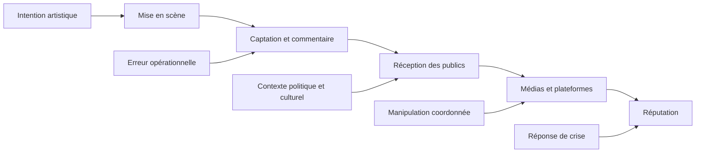
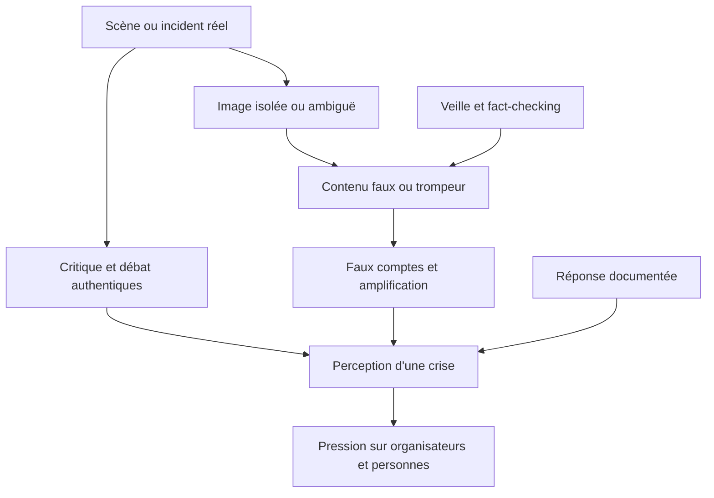

# Réputation, médias, controverses et menace informationnelle

Cette note analyse la cérémonie d’ouverture olympique de Paris 2024 comme une opération de communication mondiale exposée à des interprétations concurrentes. Elle distingue quatre objets qui sont souvent confondus : la **réception mesurée**, la **critique légitime**, le **harcèlement** et la **manipulation de l’information**. Les sources ont été consultées le 29 septembre 2026.

> **Principe de méthode.** Un record d’audience ne prouve pas une adhésion unanime. Une polémique visible ne prouve pas un rejet majoritaire. L’intention artistique ne suffit pas à déterminer la réception, mais une interprétation du public ne prouve pas non plus l’intention de l’auteur.

## 1. La cérémonie comme livrable symbolique

Le livrable n’était pas seulement une soirée sans incident. La cérémonie devait produire des images, un récit collectif et une représentation de la France pour plusieurs publics : spectateurs sur place, téléspectateurs, délégations, CIO, partenaires, communautés culturelles et religieuses, responsables politiques et médias internationaux. Thomas Jolly présentait en 2022 son ambition comme la création d’« images uniques » et d’un récit collectif affirmant la possibilité d’un « nous » devant les nations.[^1]

Ce caractère symbolique crée une asymétrie : une scène de quelques minutes peut devenir le principal sujet de conversation alors que le projet dure des années et mobilise de nombreux métiers. Le risque réputationnel ne réside donc pas seulement dans une panne. Il naît de l’écart possible entre :

- ce que les créateurs veulent exprimer ;
- ce que le diffuseur cadre et explique ;
- ce que différents publics perçoivent ;
- ce que les médias sélectionnent ;
- ce que les plateformes amplifient ;
- ce que des acteurs hostiles déforment volontairement.

## 2. Indicateurs de portée et de réception

### 2.1 Audience télévisée

Le rapport de l’Arcom sur la diffusion des Jeux, fondé sur des données Médiamétrie, indique une moyenne de **23,24 millions** de téléspectateurs sur France 2 à partir de 19 h 30, soit **83,1 %** de part d’audience. L’ajout de **1,19 million** de visionnages en rattrapage à J+7 porte la moyenne à **24,43 millions**, présentée comme le record de l’histoire de la télévision française, toutes chaînes et tous programmes confondus.[^2]

Le chiffre arrondi de **24,4 millions** apparaît aussi dans les bilans du ministère des Sports, de la Ville de Paris et du rapport post-Jeux de Paris 2024.[^3] Ces chiffres sont cohérents lorsqu’on distingue direct et rattrapage. Ils ne doivent pas être comparés directement à une audience mondiale non définie par la même méthode.

### 2.2 Satisfaction déclarée

Le premier bilan gouvernemental publié en août 2024 indique que **86 % des Français** ont trouvé la cérémonie réussie.[^3] L’AFP rattache ce nombre à un sondage Harris Interactive et emploie une formulation supérieure à 85 %.[^4] Sans questionnaire, échantillon et date dans la source gouvernementale, le pourcentage doit rester un indicateur déclaratif, pas une mesure absolue de la qualité artistique.

### 2.3 Spectateurs sur place : périmètres divergents

Le même bilan gouvernemental parle de près de **360 000 spectateurs le long de la Seine**, dont près de deux tiers d’étrangers.[^3] La Ville de Paris mentionne **300 000 spectateurs** dans son récit photographique.[^5] D’autres documents de préparation décrivent 104 000 places payantes et 222 000 invitations gratuites. Ces nombres ne sont pas nécessairement contradictoires : capacité, invitations, personnes sur les quais et fréquentation d’un périmètre élargi peuvent différer. La [chronologie](00-chronologie-perimetre.md) conserve ces définitions datées.

### 2.4 Réception médiatique internationale

La revue de presse du *Monde* rapporte de nombreux jugements favorables : audace, caractère spectaculaire, capacité à utiliser Paris comme scène, tolérance et universalité. Elle rapporte aussi des critiques portant sur la longueur, certains choix esthétiques, les difficultés d’accès et les effets de la pluie.[^6] Cette sélection prouve la coexistence de lectures, pas une distribution statistique de l’opinion mondiale.

| Indicateur | Valeur documentée | Ce qu’il permet de dire | Ce qu’il ne permet pas de dire |
|---|---:|---|---|
| Audience France 2 en direct | 23,24 M ; 83,1 % de part d’audience[^2] | Portée nationale exceptionnelle | Satisfaction ou compréhension |
| Direct + rattrapage J+7 | 24,43 M[^2] | Record selon Médiamétrie/Arcom | Audience mondiale |
| « Réussie » | 86 % selon bilan gouvernemental[^3] | Adhésion déclarée majoritaire dans le sondage cité | Unanimité ou absence de controverse |
| Presse étrangère | Avis positifs et critiques recensés[^6] | Diversité des cadrages | Proportion de tous les médias |
| Spectateurs physiques | 300 000 ou près de 360 000 selon périmètre[^3][^5] | Ordre de grandeur | Comptage audité comparable aux billets |

## 3. La controverse autour de la séquence « Festivité »

### 3.1 Ce qui est établi

La séquence montrait notamment des artistes drag réunis autour d’une structure évoquant une table ou un podium, puis Philippe Katerine incarnant Dionysos. Des responsables religieux et de nombreux internautes ont interprété l’image comme une parodie de *La Cène* de Léonard de Vinci. La Conférence des évêques de France (CEF) a publié le 27 juillet un texte qui saluait les moments de beauté et d’allégresse de la cérémonie, tout en déplorant des scènes qu’elle considérait comme une dérision et une moquerie du christianisme.[^7]

Thomas Jolly a ensuite déclaré ne pas s’être inspiré de *La Cène* et avoir voulu une fête païenne liée aux dieux de l’Olympe, avec Dionysos. Paris 2024 a déclaré qu’il n’existait aucune intention de manquer de respect à un groupe religieux.[^4] L’AFP a montré que certaines images présentées comme des manifestations provoquées par la cérémonie étaient en réalité anciennes ou sans lien avec elle.[^4]

### 3.2 Ce que les preuves ne permettent pas d’affirmer

Les sources permettent d’établir l’interprétation de certains publics, la réaction de la CEF et l’explication du directeur artistique. Elles ne permettent pas de lire l’intention mentale de chaque créateur ou de chaque spectateur. Il faut donc éviter deux excès :

- affirmer comme un fait que Paris 2024 a volontairement parodié *La Cène* ;
- affirmer que les personnes blessées ont nécessairement agi de mauvaise foi puisque l’intention déclarée était différente.

Pour un chef de projet, la question centrale est l’**écart de décodage**. Une composition visuelle peut activer une référence culturelle non souhaitée, particulièrement lorsqu’elle est isolée en capture d’écran, séparée de l’apparition de Dionysos et diffusée sans le contexte de la séquence.

### 3.3 Analyse du risque

| Élément | Analyse |
|---|---|
| Événement redouté | Une scène est reçue comme une attaque contre un groupe religieux plutôt que comme une célébration mythologique et inclusive. |
| Causes possibles | Ambiguïté visuelle, références multiples, cadrage télévisuel, différences culturelles, image fixe sortie de la séquence, contexte de polarisation. |
| Conséquences | Blessure symbolique, appels au boycott, pression sur partenaires, détournement de l’attention, menaces contre les artistes, exploitation politique et informationnelle. |
| Contrôles possibles | Revue interculturelle, test de réception, cartographie des interprétations, éléments de langage préparés, cellule de veille, protection des personnes, réponse rapide et factuelle. |
| Limite | Une revue préventive ne doit pas être présentée comme garantie d’absence de critique ni comme censure automatique du choix artistique. |

La décision de conserver une scène controversable peut être un choix assumé de création. Dans ce cas, le risque n’est pas « oublié » si l’équipe l’a identifié, accepté au bon niveau et préparé. Les documents publics ne donnent pas le registre interne ni l’arbitrage précis ; il serait donc faux d’affirmer que Paris 2024 avait accepté formellement ce risque selon une méthode particulière.

## 4. Représentation, inclusion et polarisation avant l’événement

Avant même la confirmation publique de sa participation, Aya Nakamura a été visée par des messages racistes liés à l’hypothèse qu’elle chante pendant la cérémonie. Le parquet de Paris a ouvert une enquête en mars 2024 après un signalement de la Licra, confiée au Pôle national de lutte contre la haine en ligne.[^8] Paris 2024 et Thomas Jolly avaient publiquement condamné ces attaques.

Cet épisode montre qu’un risque réputationnel peut se matérialiser pendant la phase de conception, avant la diffusion du livrable. Il combine :

- confidentialité du programme et rumeurs ;
- compétition politique sur la définition de l’identité nationale ;
- exposition personnelle des artistes ;
- risque de fuite et de campagne coordonnée ;
- tension entre protection des personnes et volonté de représentation.

La prestation finale — Aya Nakamura avec la Garde républicaine devant l’Institut de France — mettait précisément en scène le rapprochement de symboles que les controverses avaient opposés.[^5] Dire qu’elle « a résolu » le conflit serait excessif ; on peut en revanche l’analyser comme une réponse artistique cohérente avec l’objectif d’une France diverse.

## 5. Erreurs opérationnelles à forte charge diplomatique

### 5.1 Identification de la Corée du Sud

Lors du passage de la délégation sud-coréenne, l’annonce en français et en anglais a employé le nom officiel de la Corée du Nord. Le CIO a reconnu une erreur opérationnelle et présenté des excuses ; son président a également appelé le président sud-coréen.[^9]

Cette erreur illustre un mode de défaillance simple mais grave : une donnée textuelle erronée passe dans deux canaux linguistiques et atteint une audience mondiale. Les effets dépassent le protocole : humiliation de la délégation, protestation gouvernementale, tension avec un comité national et amplification médiatique.

Une AMDEC du protocole aurait pu contenir la ligne suivante :

| Fonction | Mode de défaillance | Effet | Causes possibles | Contrôles préventifs |
|---|---|---|---|---|
| Présenter chaque délégation | Nom d’État incorrect dans les deux langues | Incident diplomatique et atteinte à la délégation | Mauvais fichier, confusion de nomenclature, validation insuffisante | Source maîtresse CIO, double validation par code NOC, répétition audio, verrouillage des versions, contrôle croisé bilingue |

La correction publique et les excuses sont un traitement de conséquence. Elles ne remplacent pas la prévention ni le retour d’expérience sur la chaîne de données.

### 5.2 Drapeau olympique hissé dans le mauvais sens

La presse a également relevé que le drapeau olympique avait été hissé à l’envers.[^10] L’incident n’a pas arrêté la cérémonie, mais il montre que les gestes protocolaires à forte visibilité demandent des contrôles physiques simples : repères non ambigus, détrompeur, répétition et vérification juste avant exécution.

## 6. Harcèlement : ne pas le confondre avec la critique

Après la cérémonie, Thomas Jolly, Barbara Butch et d’autres artistes ont signalé des menaces et messages haineux. Une source judiciaire officielle de janvier 2026 confirme l’existence de procédures liées au cyberharcèlement visant notamment Thomas Jolly et Barbara Butch.[^11] L’Associated Press rapportait en octobre 2024 la mise en cause de sept personnes dans le dossier visant Thomas Jolly.[^12]

La distinction est indispensable :

- **critique** : désaccord sur une scène, sa qualité ou son opportunité ;
- **offense ressentie** : expérience subjective pouvant être exprimée sans violence ;
- **discours de haine ou menace** : attaque contre une personne ou un groupe, pouvant constituer une infraction ;
- **harcèlement coordonné ou effet de meute** : répétition et amplification visant une personne ;
- **manipulation étrangère** : opération structurée cherchant à influencer le débat public.

Un plan de risque réputationnel doit protéger la liberté de critique sans banaliser les menaces. Il doit aussi prévoir la sécurité psychologique et juridique des artistes, porte-parole et équipes de communication.

## 7. Désinformation et ingérences numériques

VIGINUM, le service français chargé de la vigilance contre les ingérences numériques étrangères, a identifié **43 manœuvres informationnelles** visant les Jeux entre avril 2023 et le 8 septembre 2024.[^13] Son rapport décrit notamment, entre le 1er et le 6 août, la diffusion coordonnée par de faux comptes X et Tumblr de récits trompeurs en anglais sur la cérémonie d’ouverture.[^14]

L’AFP a recensé après la cérémonie plusieurs types d’infox : images de manifestations anciennes présentées comme des réactions, exagérations sur les intentions artistiques et contenus décontextualisés.[^4] La présence de désinformation n’annule pas les critiques réelles ; elle ajoute une couche d’amplification et brouille la mesure de l’opinion.

Les mécanismes documentés par VIGINUM comprennent :

- imitation de médias ou d’institutions ;
- création de faux comptes récents ;
- réemploi de contenus ;
- publication en grand volume ;
- coordination de récits et hashtags ;
- exploitation d’une controverse authentique pour accroître la division.

## 8. Registre des risques réputationnels

Les cotations devront être harmonisées ultérieurement avec l’échelle commune du projet. Le tableau décrit ici le scénario et les preuves, sans prétendre reproduire un registre Paris 2024.

| ID | Événement redouté | Cause ou vulnérabilité | Conséquence | Fait observé / preuve | Risque résiduel et question ouverte |
|---|---|---|---|---|---|
| REP-01 | Une scène est perçue comme une moquerie religieuse | Ambiguïté iconographique, cadrage et différences culturelles | Offense, polémique, boycott, mobilisation politique | Réaction CEF ; explication Jolly ; réponse Paris 2024[^7][^4] | Processus de revue et décision avant diffusion inconnus |
| REP-02 | Un artiste est ciblé avant l’événement | Rumeur, racisme, polarisation | Menaces, atteinte personnelle, pression sur programmation | Enquête sur les attaques visant Aya Nakamura[^8] | Mesures de protection internes non publiques |
| REP-03 | Une erreur de script crée un incident diplomatique | Mauvaise donnée ou validation insuffisante | Protestation d’un État et excuses du CIO | Corée du Sud annoncée comme Corée du Nord[^9] | Cause racine et action corrective non publiées |
| REP-04 | Un symbole olympique est présenté incorrectement | Erreur de manipulation, détrompage absent | Ridicule, atteinte protocolaire | Drapeau hissé à l’envers rapporté[^10] | Contrôle final non documenté |
| REP-05 | Une personne devient la cible de menaces | Effet de meute, haine homophobe/antisémite, exposition mondiale | Santé, sécurité, procédure pénale | Procédures Jolly/Butch ; sept personnes poursuivies dans un dossier[^11][^12] | Ampleur totale et effet sur équipes inconnus |
| REP-06 | Des acteurs étrangers amplifient une controverse | Faux comptes et campagnes coordonnées | Déstabilisation et confusion entre critique et manipulation | 43 manœuvres sur les Jeux ; récits trompeurs sur la cérémonie[^13][^14] | Attribution et portée de chaque campagne variables |
| REP-07 | L’équipe surestime une polémique très visible | Biais des plateformes et sélection médiatique | Réponse disproportionnée, changement inutile | Audience et satisfaction très élevées malgré controverses[^2][^3] | Besoin d’indicateurs représentatifs en temps réel |
| REP-08 | L’équipe minimise une atteinte parce que l’audience est forte | Confusion portée/satisfaction/acceptabilité | Perte de confiance d’un groupe et protection insuffisante | CEF salue des éléments mais exprime une blessure profonde[^7] | Segmentation des publics et suivi qualitatif inconnus |

## 9. Ce qui a bien fonctionné et ce qui a moins bien fonctionné

### Résultats favorables documentés

- record d’audience télévisée française selon l’Arcom et Médiamétrie ;[^2]
- forte satisfaction déclarée dans le sondage repris par l’État ;[^3]
- nombreux commentaires positifs dans la presse internationale ;[^6]
- séquences et symboles durablement repris dans les bilans publics ;[^3][^5]
- capacité à mener le spectacle à son terme malgré la pluie et le sabotage ferroviaire du même jour.

### Écarts ou dommages observés

- identification erronée de la Corée du Sud et excuses officielles ;[^9]
- drapeau olympique hissé à l’envers ;[^10]
- interprétation religieuse conflictuelle d’une séquence ;[^7][^4]
- campagnes de désinformation et images décontextualisées ;[^4][^13]
- menaces et cyberharcèlement visant des participants ;[^11][^12]
- critiques sur l’accès, la longueur ou certains choix, même si elles n’ont pas empêché un bilan globalement positif.[^6]

Il serait incorrect de résumer le bilan par « succès total » ou « désastre controversé ». Les indicateurs de portée et de satisfaction sont très favorables, tandis que certains échecs de contrôle et dommages personnels sont réels.

## 10. Mesures de maîtrise adaptées à un événement similaire

### Avant l’événement

- définir les objectifs symboliques et les publics, y compris les publics exposés à une lecture négative ;
- réaliser une revue interculturelle de scènes clés sans déléguer la décision artistique au panel ;
- construire une bibliothèque de références et une justification accessible de chaque tableau ;
- appliquer un contrôle de version rigoureux aux noms, titres, langues, drapeaux et protocoles ;
- tester les scripts par codes pays et non par ressemblance de noms ;
- cartographier les personnes les plus exposées et préparer soutien juridique, psychologique et sécurité ;
- préparer une cellule commune art–communication–juridique–sécurité–fact-checking ;
- élaborer des scénarios de manipulation de l’information et des réponses prévalidées.

### Pendant l’événement

- surveiller séparément incident opérationnel, critique, menace et campagne coordonnée ;
- conserver une source maîtresse horodatée pour les scripts et éléments de langage ;
- corriger rapidement une erreur factuelle sans attendre qu’elle soit interprétée comme dissimulation ;
- protéger les personnes ciblées avant de défendre abstraitement la marque ;
- éviter une réponse émotionnelle fondée sur le seul volume de publications.

### Après l’événement

- publier les corrections vérifiées et les excuses nécessaires ;
- documenter les quasi-incidents et la cause racine des erreurs protocolaires ;
- mesurer portée, satisfaction, sentiment segmenté et dommages humains avec des méthodes distinctes ;
- archiver les faux contenus et coopérer avec les autorités compétentes ;
- tirer les leçons sans réécrire a posteriori l’intention ou le niveau de préparation.

## 11. Indicateurs recommandés

| Dimension | Indicateur | Précaution |
|---|---|---|
| Portée | audience moyenne, part d’audience, rattrapage, territoires | Ne mesure pas l’adhésion |
| Réception | sondage représentatif, questions ouvertes, segmentation | Publier méthode et date |
| Médias | tonalité par pays et thème | Ne pas traiter une revue de presse comme sondage |
| Plateformes | volume, origine, coordination, toxicité | Bots et utilisateurs réels ne sont pas équivalents |
| Sécurité des personnes | menaces reçues, signalements, délai de soutien | Données sensibles et confidentialité |
| Exactitude protocolaire | erreurs de noms, langues, symboles et corrections | Toute erreur n’a pas le même impact |
| Crise | délai de détection, validation et réponse | La vitesse ne remplace pas l’exactitude |
| Apprentissage | actions correctives fermées et testées | Une leçon non assignée n’est pas une amélioration |

## 12. Inconnus à conserver

- la revue de sensibilité culturelle réalisée avant validation des tableaux ;
- le registre interne des risques réputationnels et le niveau d’acceptation ;
- la chaîne complète d’approbation entre direction artistique, COJOP et CIO ;
- la cause racine de l’erreur sur la Corée du Sud ;
- la procédure ayant conduit au drapeau inversé ;
- les contrats et seuils de retrait des partenaires face à une controverse ;
- le nombre consolidé de menaces visant les artistes et les moyens de soutien mobilisés ;
- la contribution exacte des campagnes coordonnées à la perception globale ;
- la méthode complète du sondage de satisfaction citée dans le bilan gouvernemental.

## 13. Enseignements de management de projet

1. **Définir la réputation comme un objectif mesurable et pluriel.** Audience, satisfaction, confiance et sécurité des personnes sont des variables différentes.
2. **Analyser le sens comme une interface.** Une œuvre passe par une caméra, un commentaire, un contexte culturel et une plateforme.
3. **Traiter les données protocolaires comme des données critiques.** Un nom de pays exige la même discipline de version qu’un paramètre de sécurité.
4. **Préparer l’ambiguïté, pas seulement l’erreur.** Une scène peut fonctionner techniquement et produire plusieurs lectures incompatibles.
5. **Ne pas confondre controverse et désinformation.** Une critique authentique peut coexister avec son exploitation coordonnée.
6. **Inclure les personnes dans l’impact.** Une marque peut gagner en visibilité pendant que des artistes subissent un dommage sérieux.
7. **Évaluer après coup avec plusieurs sources.** Un record d’audience, une plainte, une revue de presse et une enquête pénale ne répondent pas à la même question.

## Notes

[^1]: Ville de Paris, « Thomas Jolly pilotera les cérémonies des Jeux de Paris 2024 », mise à jour le 21 septembre 2022, [page officielle](https://www.paris.fr/pages/thomas-jolly-aux-commandes-des-ceremonies-des-jeux-de-paris-2024-22065). Consulté le 29 septembre 2026.
[^2]: Arcom, *La diffusion audiovisuelle et numérique des Jeux olympiques et paralympiques de Paris 2024*, données Médiamétrie, p. 14-15 du PDF, notamment 23,24 millions en direct, 83,1 % de part d’audience et 1,19 million à J+7, [copie anglaise du rapport](https://www.oscar.org.au/wp-content/uploads/2025/01/Arcom-Report-on-audiovisual-and-digital-broadcasting-of-the-Paris-2024-Olympic-and-Paralympic-Games.pdf). Consulté le 29 septembre 2026. La copie a été utilisée car le texte du PDF était accessible ; l’éditeur du rapport est l’Arcom.
[^3]: Ministère des Sports, « Premier bilan des Jeux olympiques de Paris 2024 et premières perspectives sur les Jeux paralympiques », août 2024, section sur la cérémonie, [page officielle](https://www.sports.gouv.fr/premier-bilan-des-jeux-olympiques-de-paris-2024-et-premieres-perspectives-sur-les-jeux). Consulté le 29 septembre 2026. Source gouvernementale de bilan, à distinguer d’une évaluation indépendante.
[^4]: AFP Factuel, « JO 2024 : flot de désinformation après la cérémonie d’ouverture », août 2024, sections sur la réception, la CEF, Thomas Jolly et les images trompeuses, [article](https://factuel.afp.com/doc.afp.com.367376K). Consulté le 29 septembre 2026.
[^5]: Ville de Paris, « Jeux de Paris 2024 : les meilleurs moments de la cérémonie d’ouverture en photos », mise à jour le 27 juillet 2024, [dossier](https://www.paris.fr/dossiers/jeux-de-paris-2024-les-meilleurs-moments-de-la-ceremonie-d-ouverture-en-photos-143). Consulté le 29 septembre 2026.
[^6]: *Le Monde*, « “Paris a émerveillé le monde sous le déluge” : le regard de la presse étrangère sur une cérémonie d’ouverture “unique” », 27 juillet 2024, revue de presse internationale, [article](https://www.lemonde.fr/international/article/2024/07/27/ceremonie-d-ouverture-des-jo-2024-pour-les-medias-occidentaux-un-pays-fracture-s-est-reconcilie-devant-un-spectacle-extravagant-et-grandiose_6259108_3210.html). Consulté le 29 septembre 2026. Source secondaire et sélection éditoriale.
[^7]: Conférence des évêques de France et Holy Games, « Réaction […] au sujet de la cérémonie d’ouverture des Jeux olympiques de Paris 2024 », 27 juillet 2024, [communiqué](https://eglise.catholique.fr/espace-presse/communiques-de-presse/554020-reaction-de-la-conference-des-eveques-de-france-et-holy-games-au-sujet-de-la-ceremonie-douverture-des-jeux-olympiques-de-paris-2024/). Consulté le 29 septembre 2026.
[^8]: *Le Monde* avec AFP, « Polémique Aya Nakamura aux JO : le parquet de Paris ouvre une enquête après un signalement de publications racistes visant la chanteuse », 15 mars 2024, [article](https://www.lemonde.fr/culture/article/2024/03/15/polemique-aya-nakamura-aux-jo-le-parquet-de-paris-ouvre-une-enquete-apres-un-signalement-de-publications-racistes-visant-la-chanteuse_6222236_3246.html). Consulté le 29 septembre 2026.
[^9]: Yonhap News Agency, « IOC posts apology to S. Korea over opening ceremony mistake », 28 juillet 2024, [dépêche](https://en.yna.co.kr/view/AEN20240728001600315). Consulté le 29 septembre 2026. Cette source nationale rapporte l’excuse du CIO et la lettre reçue par le ministère sud-coréen.
[^10]: *Le Monde*, « From chaos to enchantment, the night that changed the Paris 2024 Olympics », 10 septembre 2024, passage sur l’annonce de la Corée et le drapeau, [article](https://www.lemonde.fr/en/sports/article/2024/09/10/from-chaos-to-enchantment-the-night-that-changed-the-paris-2024-olympics_6725449_9.html). Consulté le 29 septembre 2026.
[^11]: Laure Beccuau, procureure de la République près le tribunal judiciaire de Paris, discours de rentrée et d’installation du PNACO, janvier 2026, p. 6, passage sur les procédures Thomas Jolly, Barbara Butch et Aya Nakamura, [PDF officiel](https://www.tribunal-de-paris.justice.fr/sites/default/files/2026-01/Discours%20de%20rentr%C3%A9e%20et%20d%27installation%20du%20PNACO%2C%20de%20Laure%20Beccuau%2C%20procureure%20de%20Paris.pdf). Consulté le 29 septembre 2026.
[^12]: Associated Press, « 7 charged with cyberbullying Paris Olympics’ artistic director Thomas Jolly », 25 octobre 2024, [article](https://apnews.com/article/olympics-thomas-jolly-cyberbullying-24c1871664f4d9adc240643ebb20272c). Consulté le 29 septembre 2026.
[^13]: SGDSN–VIGINUM, « Synthèse de la menace informationnelle ayant visé les Jeux Olympiques et Paralympiques de Paris 2024 », 13 septembre 2024, [page officielle](https://www.sgdsn.gouv.fr/publications/synthese-de-la-menace-informationnelle-ayant-vise-les-jeux-olympiques-et-paralympiques). Consulté le 29 septembre 2026.
[^14]: SGDSN–VIGINUM, *Summary of the information threat targeting the Paris 2024 Olympic and Paralympic Games*, 19 septembre 2024, passage relatif aux faux comptes diffusant des récits en anglais sur la cérémonie entre le 1er et le 6 août, [PDF officiel](https://www.sgdsn.gouv.fr/files/files/Publications/20240919_NP_SGDSN_VIGINUM_Summary%20information%20threat%20Paris2024Games_EN_0.pdf). Consulté le 29 septembre 2026.
