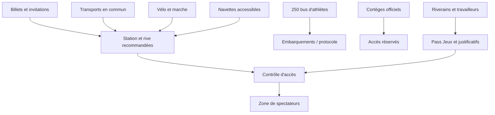
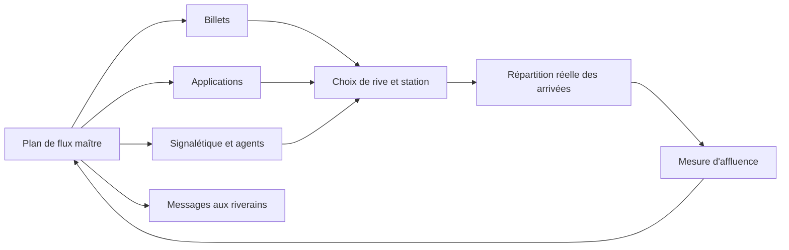

# Mobilités, accès, accessibilité et impacts urbains

Cette note étudie l’acheminement du public, des athlètes et des personnalités vers la cérémonie du 26 juillet 2024, ainsi que les effets des périmètres sur les habitants, salariés, commerces et voyageurs ordinaires. Elle complète les notes sur la [gouvernance](01-gouvernance-parties-prenantes.md), la [sécurité](03-securite-surete-secours.md) et le [système fluvial](04-meteo-seine-navigation-logistique.md). Les sources ont été consultées le 29 septembre 2026.

## 1. Le problème de mobilité à résoudre

La Préfecture de police prévoyait, entre 13 h et 18 h 30, l’arrivée d’environ **320 000 spectateurs**, de **250 bus d’athlètes** et de nombreux cortèges officiels vers un corridor de six kilomètres.[^1] Ces flux devaient coexister avec les départs en vacances et les déplacements ordinaires, alors que les impératifs de sécurité fermaient des ponts, stations, voies routières et accès aux quais.

Le projet ne consistait donc pas à maximiser uniformément la capacité du réseau. Il fallait :

- amener des populations distinctes vers des points d’accès assignés ;
- éviter la concentration dans des stations ou passages sous-dimensionnés ;
- séparer les flux des délégations, autorités, secours, riverains et spectateurs ;
- empêcher les traversées de Seine incompatibles avec la sécurisation ;
- évacuer progressivement le public après le spectacle ;
- maintenir un niveau acceptable de continuité urbaine ;
- proposer des solutions adaptées aux personnes en situation de handicap.

## 2. Planification à rebours depuis les jauges

La Cour des comptes décrit une méthode de modélisation des flux par site fondée sur :

1. les jauges, supposées saturées ;
2. les horaires des compétitions et événements ;
3. des lois d’arrivée et de départ maximisant les pics ;
4. le trafic ordinaire d’un été classique.[^2]

Les plans de la cérémonie faisaient partie des cas les plus sensibles. Leur finalisation a été confiée au début de 2024 à la délégation interministérielle aux Jeux, après suivi dans la gouvernance des mobilités.[^2] Cela suggère un renforcement de pilotage sur une interface critique ; le rapport ne permet pas d’en déduire un échec préalable ni une méthode interne particulière.

Pour la cérémonie, l’affectation de stations et de rives constituait une mesure de **gestion de la demande**. Le dossier de juin précisait que les stations recommandées seraient indiquées sur le billet et que le spectateur devait arriver par la rive correspondant à sa place, puisque les ponts ne resteraient pas traversants.[^3]

Ce choix transforme le billet en instrument logistique : il ne donne pas seulement un droit d’entrée ; il répartit le trafic. Une erreur d’information, un billet mal lu ou une station fermée tardivement peut donc déplacer le risque vers un autre point du réseau.

## 3. Périmètres, horaires et contrôle des accès

### 3.1 Avant le 26 juillet

À partir du 18 juillet, un périmètre de protection autour de la Seine limitait l’accès. Les personnes de plus de treize ans devaient justifier leur présence par un Pass Jeux dans les cas prévus. Les motifs pouvaient inclure résidence, travail, livraison, dépannage, déménagement ou rendez-vous médical.[^4]

Le Conseil d’État a jugé le dispositif légal sous la réserve que les personnes résidant ou travaillant habituellement dans le périmètre ne soient pas soumises à l’enquête administrative prévue pour certaines demandes.[^5] Cette décision rappelle qu’un contrôle de risque doit rester proportionné et compatible avec les droits des personnes affectées.

### 3.2 Le jour de la cérémonie

À partir de 13 h, les périmètres rouge et gris étaient fermés à la circulation motorisée, sauf notamment véhicules de sécurité, de secours, d’accès des personnes à mobilité réduite et véhicules accrédités nécessaires à la cérémonie. Le rouge restait accessible aux piétons et cyclistes jusqu’aux restrictions spécifiques.[^1]

Pour entrer à pied dans le gris :

- le spectateur présentait billet et pièce d’identité ;
- le riverain permanent présentait Pass Jeux et identité ;
- l’invité d’un riverain ajoutait une lettre d’invitation ;
- le client d’hôtel, restaurant ou bar ajoutait sa réservation ;
- le travailleur permanent ajoutait une attestation d’emploi.[^1]

Les détenteurs de billets étaient invités à arriver dès 15 h 30 ; l’accès n’était plus autorisé après 18 h 30. Le public était soumis à fouille et palpation.[^1] Un créneau d’admission aussi défini réduit l’incertitude de flux mais crée un risque d’exclusion tardive, de files et de conflit si l’information n’est pas reçue.

## 4. Fermetures de stations et régulation dynamique

Le plan était évolutif selon l’heure, non une fermeture uniforme du réseau.

| Période du 26 juillet | Mesures principales documentées | Logique de risque |
|---|---|---|
| Matin avant 13 h | Ligne 6 partiellement fermée pour famille olympique et déminage ; ligne 9 fermée entre Miromesnil et Porte de Saint-Cloud ; adaptations des lignes 7 et 10[^3] | Libérer et inspecter les infrastructures proches du parcours |
| 13 h–18 h | Fermeture de stations proches ou peu capacitaires ; fermeture complète d’Invalides ; certaines stations maintenues pour les voyageurs ordinaires mais non recommandées aux spectateurs[^3] | Répartir les arrivées et éviter l’engorgement |
| 18 h–21 h 30 | Fermeture des viaducs des lignes 5 et 6 ; interruption de la traversée de Paris par le RER C ; service T3a réduit[^3] | Sécuriser le spectacle et les zones visibles/survolant le parcours |
| 21 h 30–23 h 15 | Réouverture progressive de certains viaducs et tronçons[^3] | Préparer la sortie sans tout rouvrir simultanément |
| Après 23 h 15 | Reprise partielle du RER C ; Invalides rouvert sous conditions ; certaines stations restent fermées[^3] | Évacuation contrôlée et retour graduel |
| Nuit | Lignes automatiques 1, 4 et 14 ouvertes, avec certaines stations seulement[^3] | Absorber les retours tardifs |

La fermeture d’une petite station peut sembler réduire la capacité globale. En réalité, une station sous-dimensionnée près d’une foule peut devenir un goulot dangereux. L’objectif est la capacité **du système**, pas l’ouverture maximale de chaque composant.

## 5. Mobilités actives

Le dossier de juin annonçait plus de **17 000 places vélo** dans un rayon d’un kilomètre : 4 800 arceaux temporaires, 1 700 places temporaires de vélos en libre-service sans station, 6 000 places Vélib’ et 5 000 arceaux existants.[^3]

La marche était recommandée lorsque la distance le permettait, avec une contrainte majeure : l’impossibilité de traverser la Seine pendant une partie de la journée.[^3] Cette restriction renforce l’importance du couple billet–rive–station.

Le vélo réduit la pression sur le réseau collectif et s’inscrit dans l’objectif environnemental. Il introduit toutefois ses propres risques : stockage saturé, batterie ou casque, cheminement coupé par le montage, interaction avec les piétons et impossibilité de franchir certains ponts. La capacité annoncée n’est pas une preuve du nombre de cyclistes effectivement accueillis.

## 6. Accessibilité

Le dossier de préparation prévoyait des navettes pour les personnes en situation de handicap depuis les gares parisiennes, avec des zones de dépose et reprise encore en définition en juin.[^3] Le communiqué de la Préfecture réservait aussi une exception d’accès motorisé aux véhicules facilitant l’accès des personnes à mobilité réduite.[^1]

Ces mesures établissent l’existence d’un traitement dédié mais ne suffisent pas à démontrer l’accessibilité de bout en bout. Une chaîne accessible comprend :

- information et réservation compréhensibles ;
- trajet jusqu’à la gare de départ ;
- station ou véhicule accessible ;
- correspondance et cheminement de surface ;
- contrôle compatible avec la personne et son équipement ;
- place adaptée et visibilité ;
- sanitaires et assistance ;
- sortie après le spectacle, éventuellement sous pluie ;
- solution en cas de panne d’ascenseur ou de rupture de service.

La documentation consultée ne donne pas, pour la seule cérémonie olympique, le nombre de navettes réservées, les temps d’attente, le taux de demandes servies, la répartition des places selon les handicaps ni les incidents rencontrés. Il faut donc classer l’**effectivité** détaillée comme inconnue, même si le dispositif est documenté.

## 7. Gares, routes et usagers non spectateurs

Les grandes gares parisiennes restaient ouvertes, mais leurs accès étaient modifiés. La gare d’Austerlitz n’était pas accessible par la route dans le périmètre rouge ; des déposes bus et taxis étaient prévues à proximité, avec dérogations possibles notamment pour les personnes à mobilité réduite. Les accès routiers à Lyon et Bercy étaient perturbés, et la gare routière de Bercy fermée le 26 juillet.[^3]

La Préfecture recommandait de ne plus utiliser la voiture dans Paris après 10 h et de privilégier l’A86 ou la Francilienne pour le transit régional. La journée était classée noire par Bison Futé.[^1]

Le plan cherchait aussi à réduire la demande ordinaire : les employeurs franciliens capables de le faire étaient encouragés à proposer du télétravail.[^3] C’est un traitement important du risque de saturation : l’offre n’est pas la seule variable ; on peut déplacer, différer ou supprimer certains déplacements.

## 8. Information voyageurs comme barrière de sécurité

Le dispositif reposait sur plusieurs canaux :

- informations portées sur le billet ;
- plateforme Anticiper les Jeux ;
- application Transport Public Paris 2024 ;
- application Île-de-France Mobilités ;
- outils routiers Bison Futé, Sytadin et services de navigation ;
- messages des opérateurs et signalétique humaine.[^1][^3]

Une information voyageur est une barrière active. Elle échoue si elle est tardive, contradictoire, inaccessible, non traduite ou ignorée. Plusieurs canaux sont utiles seulement s’ils partagent une donnée cohérente. Sinon, la redondance peut amplifier la confusion.

## 9. Risques induits pour la ville

| Population ou activité | Mesure liée à la cérémonie | Risque induit | Compensation ou réduction documentée |
|---|---|---|---|
| Riverains | Pass, contrôle et restrictions | Difficulté à rentrer ou recevoir un invité | Motifs d’accès et procédure ; décision du Conseil d’État[^4][^5] |
| Salariés | Attestation et réseau modifié | Retard, impossibilité d’accès | Télétravail recommandé ; information anticipée[^3] |
| Commerces/hôtels | Réservation et accès filtré | Perte de clientèle, livraison difficile | Accès justifié ; communication préalable[^1] |
| Voyageurs des gares | Routes et stations fermées | Correspondance manquée | Marges supplémentaires et zones de dépose[^3] |
| Automobilistes | Fermeture du centre et congestion régionale | Temps de trajet, report sur axes périphériques | Recommandations A86/A104 et information temps réel[^1] |
| Cyclistes/piétons | Ponts et cheminements interrompus | Détour, accumulation | Répartition par rive et stationnement vélo[^3] |
| Personnes handicapées | Chaîne d’accès complexe | Rupture d’accessibilité | Navettes et accès véhicules spécifiques[^1][^3] |

La réussite de la cérémonie peut donc coexister avec des coûts diffus pour des non-spectateurs. L’évaluation du projet ne doit pas les éliminer au motif qu’ils ne figurent pas dans le budget du COJOP.

## 10. Registre analytique des risques de mobilité

| ID | Événement redouté | Causes | Conséquences | Contrôles documentés | Résultat ou inconnue |
|---|---|---|---|---|---|
| MOB-01 | Une station proche est saturée | Arrivées simultanées, mauvaise station, capacité faible | Écrasement, retard, fermeture d’urgence | Affectation par billet, stations fermées, régulation et information[^3] | Données détaillées d’affluence du 26 non trouvées |
| MOB-02 | Des spectateurs arrivent sur la mauvaise rive | Ponts fermés, consigne mal comprise | Détour impossible, billet non utilisé, tension aux contrôles | Rive et station indiquées sur le billet[^3] | Taux d’erreur inconnu |
| MOB-03 | Un retard d’accès laisse du public dehors après 18 h 30 | Congestion, contrôle lent, transport perturbé | Insatisfaction, foule en attente | Arrivée recommandée dès 15 h 30, contrôle documentaire[^1] | Nombre de refus tardifs inconnu |
| MOB-04 | Les bus d’athlètes ou cortèges sont bloqués | Conflit avec public et trafic de vacances | Retard de parade ou protocole | Accès réservés, fermetures, planification de 250 bus[^1] | Performance horaire non publiée ici |
| MOB-05 | Une personne handicapée subit une rupture de chaîne | Navette saturée, station inaccessible, détour | Impossibilité d’assister ou sortie difficile | Navettes, zones de dépose et dérogation véhicule[^1][^3] | Effectivité et satisfaction non documentées |
| MOB-06 | L’information diffusée est incohérente | Versions multiples ou modification tardive | Mauvais itinéraire et surcharge déplacée | Applications officielles, billet, signalétique[^3] | Gouvernance de la donnée non publique |
| MOB-07 | Les restrictions paralysent l’activité urbaine | Périmètre vaste et montage progressif | Coût économique et rejet local | Maintien d’accès justifiés, phasage, télétravail[^1][^3] | Coût consolidé non trouvé |
| MOB-08 | La sortie produit un pic dangereux | Fin commune du spectacle, pluie, stations encore fermées | Files, chute, engorgement | Réouverture progressive et lignes automatiques nocturnes[^3] | Courbes de sortie non publiques |

## 11. Lecture par les méthodes du cours

### Approche système

Le plan de mobilité relie billet, station, rive, point de contrôle et place. Optimiser un élément isolé peut dégrader l’ensemble : ouvrir une petite station augmente la capacité locale mais peut créer une accumulation dangereuse en surface.

### Simulation dynamique

Les modèles de flux mentionnés par la Cour utilisent une hypothèse de saturation et des lois d’arrivée maximisant les pics.[^2] Pour une analyse pédagogique, les variables devraient inclure capacité de station, débit du contrôle, proportion arrivant par la mauvaise rive, temps de marche, panne d’ascenseur et rythme de sortie. Il serait abusif de présenter un modèle reconstruit comme celui réellement utilisé.

### Mode dégradé

Un plan robuste doit prévoir : station sautée, ligne interrompue, contrôle ralenti, pont fermé plus tôt, navette accessible indisponible, information mobile inaccessible et afflux après l’heure limite. Les sources publiques montrent des fermetures et réouvertures planifiées ; elles ne donnent pas tous les scénarios d’incident.

### Parties prenantes

La mobilité rend visible le conflit entre expérience spectateur, sûreté, continuité économique, droits des riverains et qualité de vie. Les critères de succès doivent donc inclure les publics qui ne participent pas à l’événement.

## 12. Faits, inférences et inconnus

### Directement documenté

- 320 000 spectateurs prévus, 250 bus d’athlètes et cortèges officiels sur un créneau commun ;[^1]
- accès différencié par billet, Pass et justificatifs ;[^1]
- séquencement horaire des fermetures et réouvertures ;[^3]
- affectation de la rive et de stations recommandées par le billet ;[^3]
- lignes 1, 4 et 14 ouvertes la nuit avec desserte partielle ;[^3]
- plus de 17 000 places vélo annoncées ;[^3]
- navettes accessibles prévues depuis les gares ;[^3]
- modélisation à partir des jauges, horaires, pics et trafic de fond.[^2]

### Analyse soutenue

- le billet constituait une composante du système de régulation ;
- la fermeture de stations peu capacitaires pouvait augmenter la sécurité globale ;
- le dispositif combinait augmentation d’offre et réduction de demande ;
- l’accessibilité doit être évaluée de bout en bout, pas par la seule présence d’une navette.

### Inconnu

- les volumes réellement empruntés par chaque station et mode pour la seule cérémonie ;
- les temps d’attente et files aux contrôles ;
- le nombre de personnes arrivées sur la mauvaise rive ;
- les ruptures d’accessibilité et leur résolution ;
- les effets économiques consolidés des restrictions ;
- les incidents et quasi-incidents de sortie ;
- le journal des adaptations en temps réel.

## 13. Enseignements de management de projet

1. **Planifier le parcours complet.** Le résultat n’est pas « un train circule », mais « la personne rejoint sa place et en repart ».
2. **Transformer les billets en objets logistiques maîtrisés.** Affectation de rive, station et horaire doivent partager une source de vérité.
3. **Concevoir pour le pic défavorable.** Une moyenne de fréquentation masque la situation critique de quelques minutes.
4. **Fermer peut protéger.** La disponibilité locale n’est pas toujours synonyme de capacité système.
5. **Agir sur la demande.** Télétravail, horaires et information réduisent la charge sans construire d’infrastructure.
6. **Mesurer l’accessibilité réelle.** Une mesure annoncée n’est pas une expérience réussie tant que la chaîne complète n’est pas évaluée.
7. **Inclure les tiers.** Riverains, travailleurs et voyageurs ordinaires supportent une partie du risque et du coût.
8. **Préparer la sortie aussi précisément que l’entrée.** La fin simultanée d’un spectacle sous pluie peut devenir le principal pic.

## Notes

[^1]: Préfecture de police, « Conditions de circulation particulièrement difficiles le 26 juillet 2024 », communiqué du 24 juillet 2024, p. 1-2, [PDF](https://cdn.paris.fr/paris/2024/07/26/cp_pp_24072024_conditions_de_circulation_particulierement_difficiles_le_26_juillet_2024-SGMS.pdf). Consulté le 29 septembre 2026.
[^2]: Cour des comptes, *Bilan des transports et des mobilités pendant les Jeux olympiques et paralympiques de Paris 2024*, septembre 2025, section sur la préparation des plans de transport et la modélisation des flux, [PDF officiel](https://www.ccomptes.fr/sites/default/files/2025-09/20250929-S2025-1151-Bilan-transports-mobilites-dans-transports-durant-JOP2024_0.pdf). Consulté le 29 septembre 2026.
[^3]: Ministère chargé des Transports, Région Île-de-France, Île-de-France Mobilités, Ville de Paris et partenaires, *Plan transport de la cérémonie d’ouverture des Jeux olympiques*, dossier de presse du 13 juin 2024, notamment p. 12-22, [PDF](https://www.ecologie.gouv.fr/sites/default/files/documents/20240613_dp_mobilites_jop24.pdf). Consulté le 29 septembre 2026. Les mesures y sont présentées avant l’événement et doivent être lues comme planifiées.
[^4]: Préfecture de la région d’Île-de-France, « Le Pass Jeux JOP 2024 », section sur le périmètre gris de la cérémonie, [page officielle](https://www.prefectures-regions.gouv.fr/ile-de-france/Region-et-institutions/L-action-de-l-Etat/Jeux-olympiques-et-paralympiques-de-Paris-2024-JOP-2024/Le-Pass-Jeux-JOP-2024). Consulté le 29 septembre 2026.
[^5]: Conseil d’État, décision no 494485, 15 juillet 2024, points 4 à 7 et dispositif, [Légifrance](https://www.legifrance.gouv.fr/ceta/id/CETATEXT000050045949). Consulté le 29 septembre 2026.
